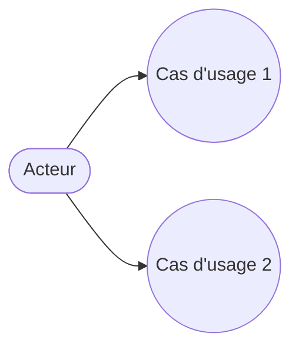
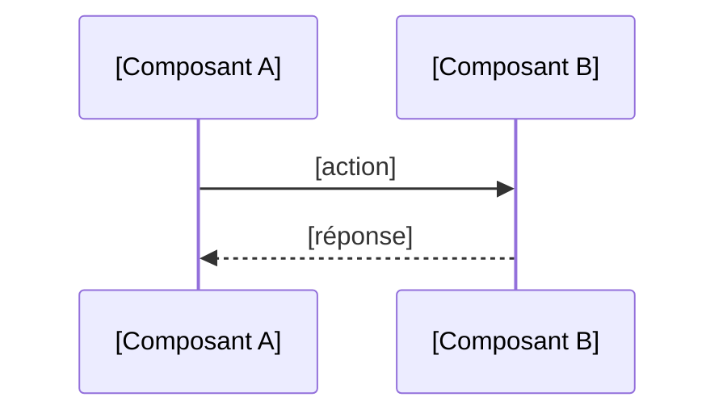

# Gabarit de documentation locale de mission

> À copier dans `kitty-specs/NNN-slug/docs/` et à découper en 3 fichiers séparés :
> `use-case.md`, `architecture-notes.md`, `sequence.md`. Rempli par l'Agent
> Documentaliste juste après `/spec-kitty.plan`, affiné après merge.
>
> **Règle de génération des diagrammes, non négociable** : les diagrammes de
> `use-case.md` et `sequence.md` doivent être générés pour **chaque mission**,
> dès qu'ils sont pertinents au regard de ce que la mission introduit. La
> question de nécessité posée dans chacun des trois fichiers ne sert plus à
> sauter la génération du diagramme par commodité ou par défaut : elle sert
> uniquement à juger si le fichier lui-même apporte une valeur réelle. Pour
> une mission qui introduit un cas d'usage utilisateur ou une interaction
> entre composants, même minime, le diagramme correspondant doit exister,
> quitte à être simple (deux nœuds, un seul échange). Ne réponds "Non" à la
> question de nécessité que si la mission n'introduit littéralement aucun cas
> d'usage nouveau ni aucune interaction représentable (ex: mission purement
> de configuration d'infrastructure, sans comportement utilisateur ni appel
> inter-composant).
>
> **Pour les diagrammes de `use-case.md` et `sequence.md`** : lis d'abord
> `.docmeta/diagram-style-routing.md` avant de générer quoi que ce soit — il
> indique le skill externe à utiliser, la règle de police, et la règle de
> validation visuelle. Les blocs Mermaid ci-dessous restent le repli si aucun
> skill de routage n'est installé.

---
## FICHIER : use-case.md

# Cas d'usage — mission [NNN-slug]

## Cas d'usage propres à cette mission

## Lien avec la synthèse globale
Contribue à : `docs/02-use-case-diagram.md`, section "[nom du domaine]"

> **Règle stricte, non négociable** : référence toujours un **nom de domaine
> stable** (ex: "Gérer ses candidatures"), jamais un identifiant numérique de
> cas d'usage (ex: "UC8"). Un ID numérique se casse silencieusement à la
> première fusion ou restructuration du diagramme global — le nom de domaine
> survit aux réorganisations tant que le domaine métier lui-même n'a pas
> disparu. Cette règle a été violée en pratique sur un projet réel malgré ce
> même gabarit qui la recommandait déjà : ne la traite pas comme une
> suggestion.

## Nécessaire pour cette mission ? [Oui/Non + justification — voir règle en tête de gabarit : "Non" seulement si aucun cas d'usage n'est introduit]
## Complet ? [Oui/Non + ce qui manque]
## Validé par : [nom] le [date]

---
## FICHIER : architecture-notes.md

# Notes d'architecture — mission [NNN-slug]

## Composant(s) introduit(s) ou modifié(s) par cette mission
- [Nom du conteneur/service] : [rôle, technologie]

## Décisions d'architecture prises dans cette mission
| Décision | Justification | Alternative envisagée |
|---|---|---|
| | | |

## Lien avec la synthèse globale
Contribue à : `docs/04-architecture-diagram.md`, table "Décisions notables"

## Nécessaire pour cette mission ? [Oui/Non + justification]
## Complet ? [Oui/Non + ce qui manque]
## Validé par : [nom] le [date]

---
## FICHIER : sequence.md

# Séquences — mission [NNN-slug]

## Flux internes propres à cette mission

## Flux transverses auxquels cette mission participe (référence, pas dupliqué)
Voir `docs/05-sequence-diagrams.md`, flux : [nom du flux global concerné]

## Nécessaire pour cette mission ? [Oui/Non + justification — voir règle en tête de gabarit : "Non" seulement si aucune interaction inter-composant n'est introduite, même minime]
## Complet ? [Oui/Non + ce qui manque]
## Validé par : [nom] le [date]
