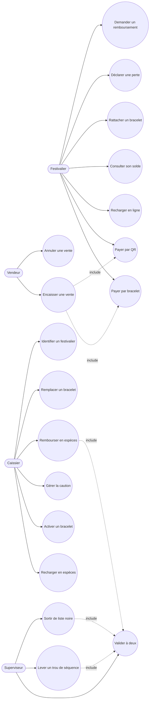
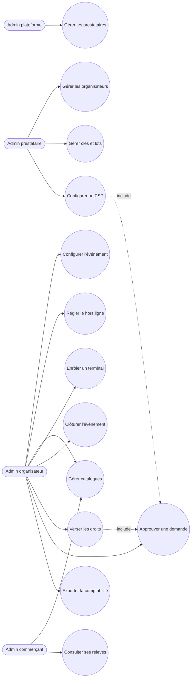

# Diagramme de cas d'utilisation — synthèse globale

> Statut de complétude : voir `06-docs-status.md`. Mermaid n'a pas de notation UML
> "cas d'utilisation" native — on la simule avec un flowchart : acteurs en
> rectangles arrondis (stadium), cas d'usage en ellipses, relations "include" en
> pointillés. Rendu en repli Mermaid (skill `/illustre` non installé).
> Dernière mise à jour : initialisation du 07/10/2026. Cas d'usage tirés de `SPECIFICATION.md` §3.2, §7, §8, §11, §12.

## Vue d'ensemble — terrain (festivalier, vendeur, guichet)

## Vue d'ensemble — administration (back-office)

## Détail par mission

| Mission | Cas d'usage propres | Lien vers détail local |
|---|---|---|
| (aucune mission lancée à ce jour) | — | — |

## Questions de nécessité/complétude posées lors de la dernière révision
- Nécessaire pour ce projet ? Voir `06-docs-status.md`.
- Complet au vu des missions mergées à ce jour ? Voir `06-docs-status.md`.
- Validé par : en attente.
