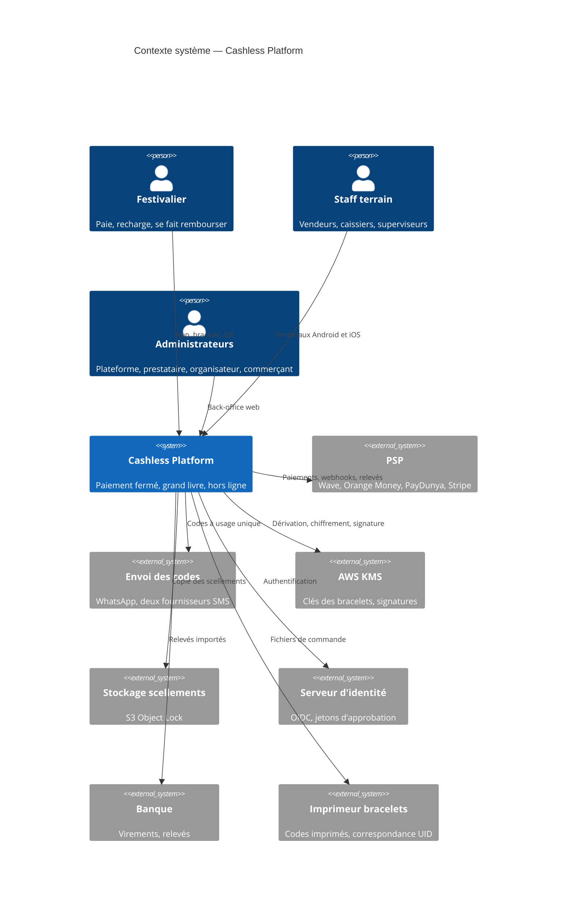

# Diagramme de contexte statique

> Statut de complétude : voir `06-docs-status.md`. Notation C4 "Contexte" (niveau 1),
> supportée nativement par Mermaid (`C4Context`). Rendu en repli Mermaid (`excalidraw-diagram-skill` non installé).
> Dernière mise à jour : initialisation du 07/10/2026 (`SPECIFICATION.md` §1.2, §3, §11, §13 ; `PRD.md` §4).

## Vue d'ensemble

## Acteurs et systèmes externes (tableau de référence)

| Acteur / système | Type | Rôle vis-à-vis du système |
|---|---|---|
| Festivalier | Personne | Charge un portefeuille, paie par bracelet NFC (Android) ou QR, récupère son solde ; anonyme ou avec compte |
| Staff terrain (`VENDOR`, `CASHIER`, `SUPERVISOR`) | Personne | Encaisse, recharge, gère cautions et bracelets, valide en seconde personne |
| Administrateurs (`PLATFORM_ADMIN`, `OPERATOR_ADMIN`, `ORGANIZER_ADMIN`, `MERCHANT_ADMIN`) | Personne | Configurent, supervisent, clôturent, versent, consultent les relevés |
| PSP (Wave Business, Orange Money, PayDunya, Stripe) | Système externe | Encaissent les recharges ; webhooks signés ; relevés à rapprocher |
| Envoi des codes (WhatsApp, SMS principal, SMS de repli) | Système externe | Livrent les codes à usage unique (fournisseurs à choisir, ADR-66) |
| AWS KMS | Système externe | Dérivation des mots de passe des bracelets, chiffrement enveloppe, signature des snapshots |
| AWS Secrets Manager | Système externe | Identifiants PSP et secrets de webhooks, rattachés au détenteur des fonds |
| S3 Object Lock (compte AWS distinct) | Système externe | Copie en écriture unique des scellements du journal |
| Serveur d'identité OIDC | Système externe | Jetons des personnes et jetons d'approbation sur place |
| Banque | Système externe | Virements des versements (hors système en V1), relevés importés |
| Imprimeur de bracelets | Système externe | Reçoit les codes de rattachement ; renvoie la correspondance code ↔ UID s'il encode les puces |

La passerelle locale (mini-PC sur site) fait partie du système : elle figure dans `04-architecture-diagram.md`.

## Questions de nécessité/complétude posées lors de la dernière révision
- Nécessaire pour ce projet ? Voir `06-docs-status.md`.
- Complet au vu des systèmes externes réellement intégrés à ce jour ? Voir `06-docs-status.md`.
- Validé par : en attente.
