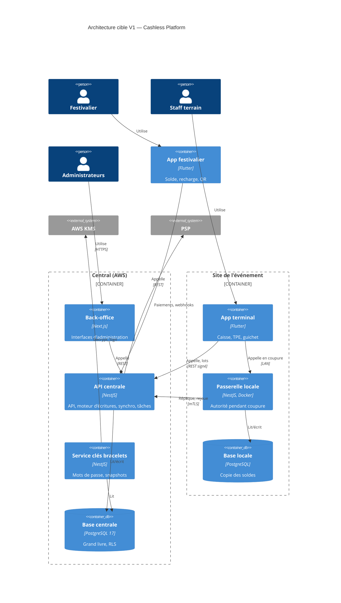

# Diagramme d'architecture globale

> Statut de complétude : voir `06-docs-status.md`. Notation C4 "Conteneur"
> (niveau 2), supportée nativement par Mermaid (`C4Container`). Rendu en repli Mermaid (`excalidraw-diagram-skill` non installé).
> Dernière mise à jour : initialisation du 07/10/2026. **Architecture cible** (`SPECIFICATION.md` §1.2, §2) :
> aucun conteneur n'est encore déployé.

## Vue d'ensemble (cible V1)

## Organisation du code (monorepo imposé, §2.1)

| Dossier | Contenu |
|---|---|
| `apps/api` | NestJS : API publique, API terminaux, moteur d'écritures, synchronisation, tâches |
| `apps/gateway` | Passerelle locale (réutilise les modules de l'API) |
| `apps/backoffice` | Next.js : plateforme, prestataire, organisateur, commerçant |
| `apps/terminal` | Flutter : caisse catalogue, TPE clavier, recharge |
| `apps/customer` | Flutter : app festivalier |
| `packages/contracts` | `openapi.yaml` et types générés (TypeScript, Dart) |
| `packages/ledger-sql` | Schéma, migrations, tests pgTAP et générateurs |
| `packages/tag-format` | Format B, CRC, dérivation, vecteurs de test (TypeScript et Dart) |
| `tools/nfc-bench` | Banc de mesure NFC (prototype) |

## Détail par mission

| Mission | Conteneur(s) concerné(s) | Lien vers détail local |
|---|---|---|
| `fondations-grand-livre-01M4AY8M` (✅ mergée le 08/10/2026) | API centrale (`apps/api` : squelette, moteur d'écritures), base de données (migrations `packages/ledger-sql`), `packages/contracts` (types générés), CI, base locale (`tools/dev-db`) | [`kitty-specs/fondations-grand-livre-01M4AY8M/docs/architecture-notes.md`](../kitty-specs/fondations-grand-livre-01M4AY8M/docs/architecture-notes.md) |
| `identite-roles-double-validation-01M4DNDN` (🚧 plan finalisé) | API centrale (`identity/`, `approval/`, `audit/`), base de données (migrations `0003`-`0005`, `post-roles.sql`), contrat (`openapi.yaml`), serveur d'identité OIDC (externe) | [`kitty-specs/identite-roles-double-validation-01M4DNDN/docs/architecture-notes.md`](../kitty-specs/identite-roles-double-validation-01M4DNDN/docs/architecture-notes.md) |

## Pile logicielle

Logiciels, versions et choix d'implémentation : [`08-pile-logicielle.md`](./08-pile-logicielle.md), référence
arrêtée le 09/10/2026 (ADR-78 : l'existant prime). Redis, Fastify, Prisma et Nginx, proposés par le porteur, sont
écartés ; WAF, `@nestjs/throttler`, pino et OpenTelemetry s'ajouteront avec les missions concernées.

## Décisions d'architecture notables
(Décisions déjà prises dans `DECISIONS_ADR.md`, avant toute mission.)

| Décision | Justification | Mission source |
|---|---|---|
| Seule la fonction SQL `post_transaction` écrit le grand livre ; règles métier des bracelets, lots et cautions en fonctions SQL | Un seul point de contrôle des invariants (§2.2) | Spécification (avant missions) |
| Isolation par prestataire via RLS forcée et `set_config('app.operator_id', …, true)` par transaction | Pas de fuite entre requêtes d'un pool de connexions (§2.2, §13.1) | Spécification |
| Comptes chauds sans solde en cache ; comptes commerçants chauds par défaut | Pas d'attente entre ventes simultanées (ADR-62) | Spécification |
| Mot de passe des bracelets dérivé une fois par KMS, stocké chiffré ; terminaux sans clé maître | Pas d'appel KMS par passage ; vol de terminal borné (§7.3, §7.4) | Spécification |
| Une seule autorité de débit par grand livre (central ou passerelle), bascule par époque | Pas de double dépense pendant une coupure (§9.7) | Spécification |
| Scellement chaîné du journal toutes les 5 min, copié hors base | Détection de toute altération (ADR-46) | Spécification |
| Types partagés générés depuis `openapi.yaml` | Pas de divergence entre clients et serveur (§2.2) | Spécification |
| Accès base uniquement par `TenantTx.run` (pool `pg` en `cashless_app` non exporté, sans ORM, `int8` → `BigInt`) ; seule exception `ping()` pour la santé | `set_config` transactionnel garanti, SQLSTATE visibles, aucun flottant ; test d'architecture | `fondations-grand-livre-01M4AY8M` |
| Idempotence applicative en deux transactions (réserver ; travail + réponse ensemble, via `IdempotentTx`) ; 4xx enregistrées, 5xx relâchées ; clé `COMPLETED` jamais réutilisée | Aucune écriture validée sans réponse enregistrée ; requête concurrente → `409 IDEMPOTENCY_KEY_IN_PROGRESS` | `fondations-grand-livre-01M4AY8M` |
| Moteur : idempotence vérifiée **avant** la matrice des statuts et les soldes (verrou consultatif par clé, empreinte de commande dans les métadonnées) ; un seul appel d'écriture par commande | Un rejeu reste un rejeu après la clôture ou un changement de soldes (second rejeu du scénario sur grand livre `LOCKED` : 0 transaction) | `fondations-grand-livre-01M4AY8M` |
| Constructeurs d'écritures purs ; 5 types délégués aux fonctions SQL de la base | Testables sans base ; §5.4 respecté | `fondations-grand-livre-01M4AY8M` |
| Migrations SQL pures (0001 = schéma de référence lu tel quel), `roles.sql` rejoué après chaque série | Pas de dérive avec le schéma normatif ; droits des tables nouvelles alignés | `fondations-grand-livre-01M4AY8M` |
| Base de test locale : cluster PostgreSQL 17 privé (port 5433) avec pgTAP | Ni Docker ni droits admin sur le poste Windows | `fondations-grand-livre-01M4AY8M` |
| Personnes : jeton OIDC vérifié par `jose`, prestataire et rôles lus en base (`identify_person`) | Retrait de rôle immédiat, prestataire jamais tiré du jeton | `identite-roles-double-validation-01M4DNDN` (plan) |
| Approbation : décision et exécution dans une seule transaction (échec dans un point de sauvegarde) | Aucune demande orpheline ni écriture partielle | `identite-roles-double-validation-01M4DNDN` (plan) |
| Journal d'audit chaîné par prestataire et scellé ; `post-roles.sql` après `roles.sql` | Altération détectable ; droits trop larges retirés sans modifier le kit | `identite-roles-double-validation-01M4DNDN` (plan) |

## Questions de nécessité/complétude posées lors de la dernière révision
- Nécessaire pour ce projet ? Voir `06-docs-status.md`.
- Complet au vu de tous les conteneurs réellement déployés à ce jour ? Voir `06-docs-status.md`.
- Validé par : en attente.
