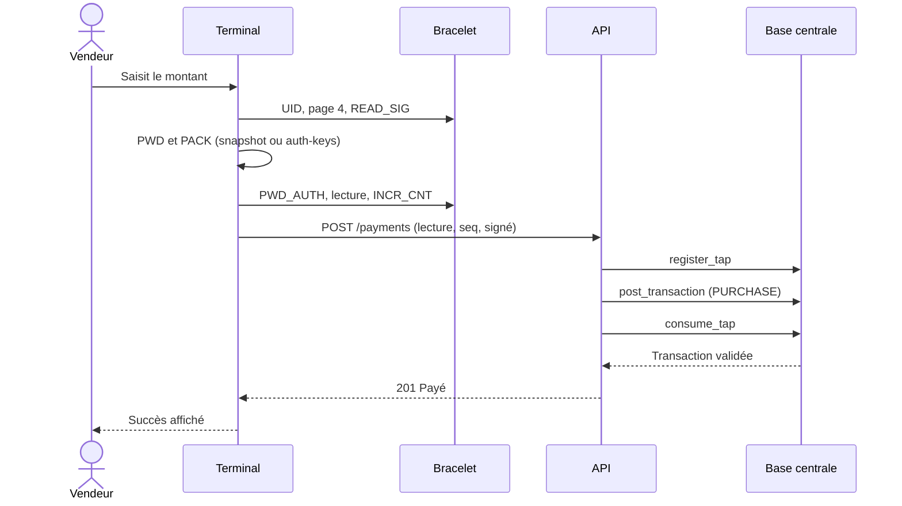
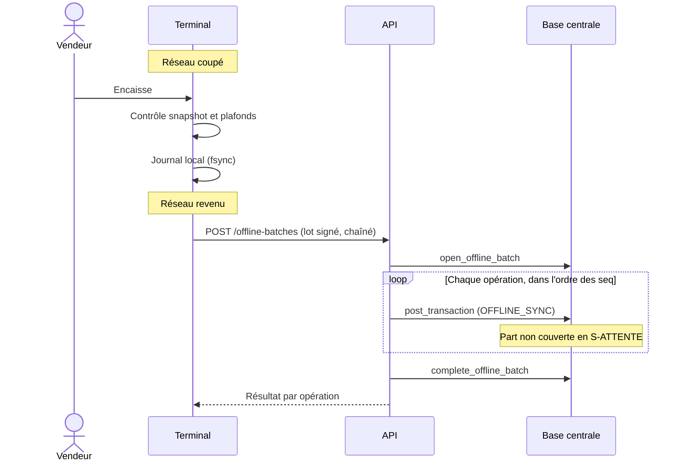
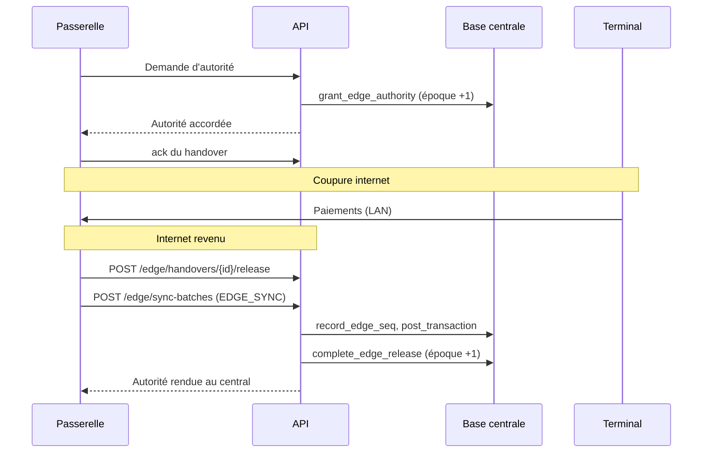
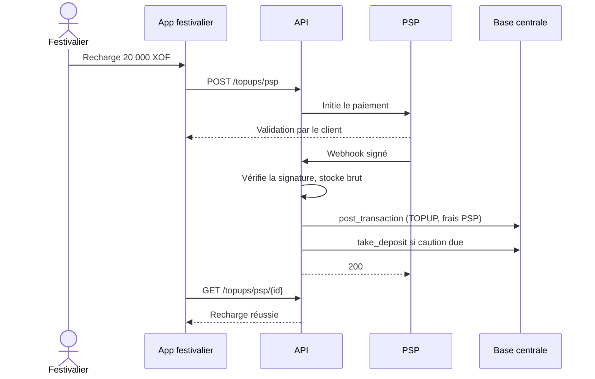
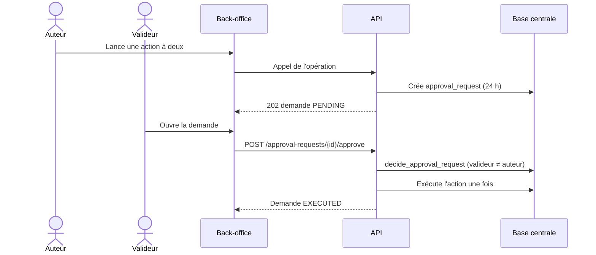
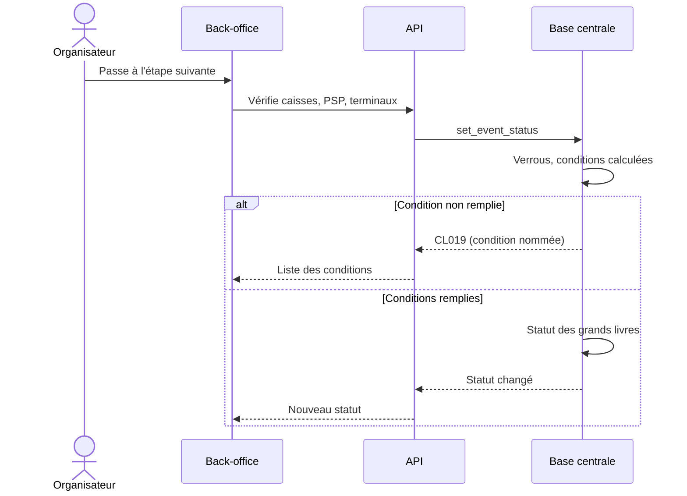

# Diagrammes de séquence (message) — flux transverses clés

> Statut de complétude : voir `06-docs-status.md`. Un diagramme par flux critique
> qui traverse plusieurs composants (les flux internes à un seul composant vivent
> dans le détail local de la mission concernée). Rendu en repli Mermaid (skill `/illustre` non installé).
> Dernière mise à jour : initialisation du 07/10/2026. Flux **cibles**, tirés de `SPECIFICATION.md` et `sync_protocol.md`.

## Flux : Paiement en ligne par bracelet (un seul aller-retour, §7.6)

## Flux : Vente hors ligne puis synchronisation (§9.3 à §9.6)

## Flux : Bascule vers la passerelle et retour (§9.7)

## Flux : Recharge mobile money (§8.5, §11.1)

## Flux : Double validation au back-office (§3.2)

## Flux : Clôture d'un événement (§12.1)

## Index des flux couverts

| Flux | Domaines traversés | Mission(s) source |
|---|---|---|
| Paiement en ligne par bracelet | Terminal, bracelets, API, grand livre | à définir |
| Vente hors ligne puis synchronisation | Terminal, synchronisation, grand livre | à définir |
| Bascule vers la passerelle et retour | Passerelle, API, grand livre | à définir |
| Recharge mobile money | App festivalier, PSP, API, grand livre | à définir |
| Double validation au back-office | Back-office, API, base | à définir |
| Clôture d'un événement | Back-office, API, base | `fondations-grand-livre-01M4AY8M` (passages de statut exercés par le rejeu du scénario, tous acceptés sans `CL019` ; pas encore de back-office) |

## Questions de nécessité/complétude posées lors de la dernière révision
- Nécessaire pour ce projet ? Voir `06-docs-status.md`.
- Complet au vu des flux transverses réellement implémentés à ce jour ? Voir `06-docs-status.md`.
- Validé par : en attente.
