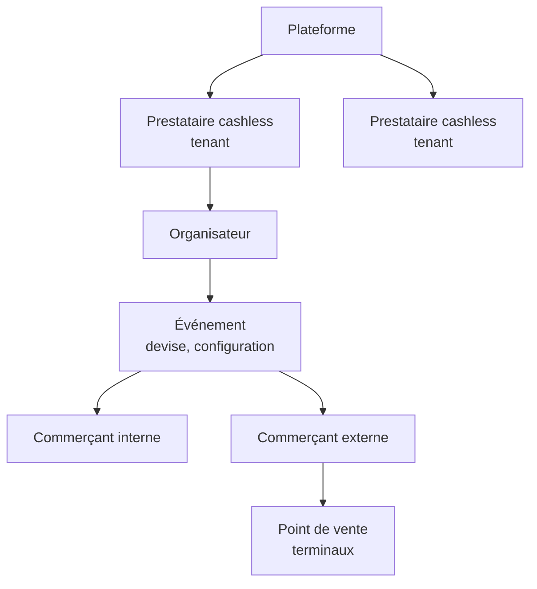
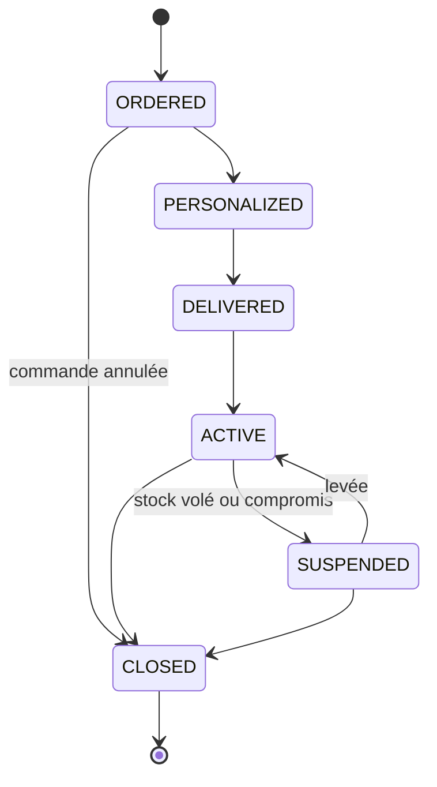
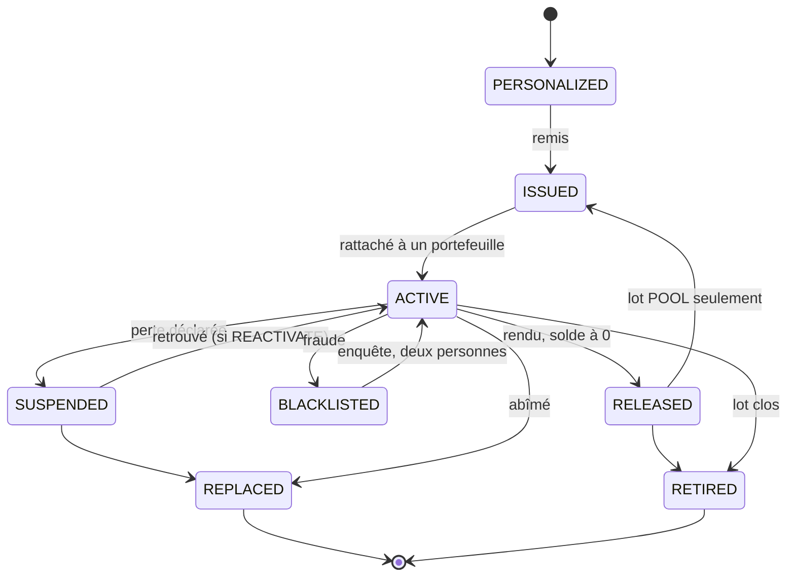
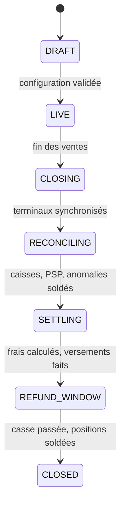

# Spécification normative — système cashless multi-tenant (V1)

| | |
|---|---|
| Statut | Normatif. Ce document dit ce que l'agent DOIT implémenter. Il ne contient ni historique ni justification : les raisons sont dans `DECISIONS_ADR.md`, les questions non tranchées dans `POINTS_OUVERTS.md`. |
| Version | 1.2 — 2 octobre 2026 |
| Langue du code | Identifiants, tables, types et codes d'erreur en anglais ; textes d'interface en français et en anglais. |

**Journal des modifications.**

| Version | Date | Changements |
|---|---|---|
| 1.0 | Septembre 2026 | Première version normative : grand livre, bracelets, hors ligne, passerelle, API. |
| 1.1 | 30 septembre 2026 | Corrections de la revue de cohérence n° 1. Décisions du 1er et du 2 octobre intégrées ensuite sous le même numéro (ADR-49 à ADR-70 : clôture, remboursements, passerelle, PSP, codes à usage unique, casse réversible). |
| 1.2 | 2 octobre 2026 | Corrections de la revue de cohérence n° 2 (`REVUE_COHERENCE_2.md`, ADR-71) : clôture par partie (§12.1), comptes de casse en négatif permis (§5.2), `consume_tap` et `SIGNATURE_MISSING` (§7.6), rendu des espèces dues (`refund_cash_due`, §8.5), caution qui suit le bracelet remplacé (§7.8), borne des numéros de séquence (§9.5), codes `CL020` à `CL022` (§5.7), scellement étendu (§13.7), §17 en deux tables. Questions Q1 à Q6 en attente (`POINTS_OUVERTS.md` §9). |
| 1.2 | 2 octobre 2026 (suite) | Q1 à Q6 tranchées (ADR-72 à ADR-77). Contestations carte (ADR-77, §11.1, §12.1). Remboursement vers un autre numéro (ADR-76, §8.5). Bornes des réclamations tardives en base (ADR-75, `CL024`). Double validation par l'API (ADR-74) : jeton d'approbation sur place au guichet, demande puis approbation au back-office (§3.2), table `approval_request` (§14.1), code `CL023` (§5.7) ; `approved_by` du corps ignoré. |

## 0. Comment utiliser ce document

### 0.1 Mots normatifs

| Mot | Sens |
|---|---|
| **DOIT** / **NE DOIT PAS** | Exigence absolue. Un écart est un défaut. |
| **DEVRAIT** / **NE DEVRAIT PAS** | Recommandation forte. S'en écarter exige une raison écrite dans le code ou la PR. |
| **PEUT** | Facultatif. |

### 0.2 Fichiers livrés avec ce document

L'agent DOIT traiter les fichiers normatifs comme faisant partie de la spécification. Ils sont exécutables ou vérifiables automatiquement. Le kit `kit_agent_cashless.zip` les range à leur place dans le monorepo (§2.1).

| Fichier | Emplacement dans le kit | Rôle | Statut |
|---|---|---|---|
| `schema_grand_livre_cashless.sql` | `packages/ledger-sql/` | Schéma PostgreSQL de référence : tables, contraintes, déclencheurs, fonctions, vues, RLS | Normatif. Point de départ des migrations ; toute évolution passe par une migration et garde les tests verts |
| `roles.sql` | `packages/ledger-sql/` | Rôle applicatif `cashless_app` : droits (écriture du grand livre et des registres seulement par les fonctions, colonnes protégées), durées de transaction | Normatif. Exécuté après le schéma, en CI comme en production |
| `tests_grand_livre_cashless.sql` | `packages/ledger-sql/` | 400 assertions pgTAP sur les règles du schéma | Normatif. DOIT passer en CI à chaque commit |
| `scenario_reference.json` | `packages/ledger-sql/` | Scénario de bout en bout : 48 transactions, soldes attendus en fin de festival et en fin de clôture, puis passage de l'événement en `CLOSED` et du grand livre en `LOCKED` | Normatif. **Source** du scénario |
| `scenario_reference_test.sql` | `packages/ledger-sql/` | Rejeu pgTAP du scénario (64 assertions, jusqu'à la clôture et au verrouillage), généré depuis le JSON | Normatif. DOIT passer en CI |
| `gen_tests.py`, `gen_golden.py` | `packages/ledger-sql/` | Générateurs des deux suites pgTAP | Modifier le générateur (ou le JSON), jamais le fichier généré |
| `moteur_ecritures_reference.py` | `packages/ledger-sql/` | Calculs de référence : arrondis, frais, taxes, partages (19 cas) | Normatif. Les mêmes cas DOIVENT exister en tests TypeScript |
| `openapi.yaml` | `packages/contracts/` | Contrat de l'API (OpenAPI 3.1 ; opérations V2 et webhooks sortants V2 marqués `x-release: V2`) | Normatif. Source des types partagés |
| `sync_protocol.md` | `docs/` | Protocole hors ligne, lots, passerelle locale, bascule d'autorité | Normatif |
| `vecteurs_test_bracelet.py` | `packages/tag-format/` | Vecteurs du format de bracelet, de la dérivation et du chiffrement | Normatif. Les implémentations TypeScript et Dart DOIVENT les reproduire |
| `ledger-tests.yml` | `.github/workflows/` | CI : charge le schéma et lance `pg_prove` sur les deux suites | Outil |
| `nfc-bench/` | `tools/` | Banc de mesure NFC (Kotlin, Flutter) et protocole de test terrain | Prototype, non testé sur appareil |
| `modele_comptable_cashless.xlsx` | `reference/` | Tableur illustratif ; `gen_golden.py --from-xlsx` peut en régénérer le JSON | Non normatif |

### 0.3 Règle de priorité en cas de contradiction

1. Les tests exécutables (pgTAP, cas du moteur, vecteurs) font foi.
2. Puis `schema_grand_livre_cashless.sql`, `openapi.yaml` et `sync_protocol.md`.
3. Puis ce document.

L'agent qui constate une contradiction NE DOIT PAS choisir en silence. Il DOIT la signaler (issue ou commentaire de PR) et appliquer la règle ci-dessus en attendant.

### 0.4 Points non tranchés

Chaque point ouvert a un identifiant dans `POINTS_OUVERTS.md` :

- **OP-Bn** : bloque le code d'un module. L'agent DOIT coder l'interface (port) et un faux pour les tests, mais NE DOIT PAS coder l'adaptateur réel avant la décision.
- **OP-Nn** : ne bloque pas le code. L'agent DOIT coder la valeur par défaut indiquée et la rendre paramétrable.
- **Q1 à Q6 (revue 2)** : questions de `REVUE_COHERENCE_2.md` ; toutes sont tranchées (ADR-72 à ADR-77) (`POINTS_OUVERTS.md` §9). Là où ce document écrit « en attente de Qx (revue 2) », l'agent NE DOIT PAS choisir de règle : il code ce qui n'en dépend pas et signale le reste.

## 1. Périmètre de la V1

### 1.1 Ce que le système fait

Un système de paiement fermé (cashless) pour des événements (festivals, concerts) et des lieux (cinémas, hôtels, supermarchés). Un festivalier charge de l'argent sur un portefeuille, paie avec un bracelet NFC ou un QR code, et récupère son solde à la fin. Le système tient la comptabilité en partie double de chaque réserve d'argent, calcule les frais de chaque intervenant et prépare les versements.

### 1.2 Composants à livrer

| Composant | Technologie | Contenu |
|---|---|---|
| API centrale | TypeScript, NestJS | API publique, API des terminaux, moteur d'écritures, synchronisation, tâches planifiées de contrôle |
| Base de données | PostgreSQL 17 au minimum (AWS RDS ; ADR-55) | Schéma de référence et migrations |
| Gestion des clés | AWS KMS | Dérivation des mots de passe des bracelets, chiffrement enveloppe, signature des snapshots |
| Back-office web | React, Next.js | Interfaces plateforme, prestataire, organisateur, commerçant |
| App terminal | Flutter (Android, iOS) | Caisse à catalogue, TPE clavier, caisse de recharge |
| App festivalier | Flutter (Android, iOS) | Seule interface festivalier en V1 (pas de portail web) |
| Passerelle locale | NestJS empaqueté en Docker | Même moteur d'écritures, base PostgreSQL locale |

### 1.3 Hors périmètre V1

- **Caisses tierces** (cinémas, hôtels, supermarchés équipés) : intentions de paiement, TPE associé (`PAIRED_TPE`), webhooks sortants et SDK de lecture sont reportés en V2 (ADR-43). Le contrat d'API correspondant reste dans `openapi.yaml`, marqué `x-release: V2`, et NE DOIT PAS être implémenté en V1.
- **Contrôle d'accès et billetterie.** Les bracelets servent exclusivement au paiement cashless : pas de bracelet-billet, pas de contrôle d'entrée, pas d'import de billets (ADR-41).
- Versements automatiques : en V1, le système calcule, exporte et enregistre ; le paiement est fait hors système par une personne (§11.4).
- Portail web festivalier.
- Paiement NFC sur iOS (QR uniquement).
- Puces anti-clonage cryptographiques (Ultralight AES, NTAG 424 DNA). Le champ de version du bracelet permet de les ajouter plus tard.
- Conversion de devises à l'intérieur d'un grand livre.

## 2. Architecture et organisation du code

### 2.1 Monorepo

Le dépôt DOIT suivre cette arborescence :

```text
/apps/api              NestJS : API publique, API terminaux, moteur d'écritures, synchronisation, tâches
/apps/gateway          Passerelle locale (réutilise les modules de l'API)
/apps/backoffice       Next.js : plateforme, prestataire, organisateur, commerçant
/apps/terminal         Flutter : caisse catalogue, TPE clavier, recharge (TPE associé : V2, ADR-43)
/apps/customer         Flutter : app festivalier
/packages/contracts    openapi.yaml et types générés (TypeScript, Dart)
/packages/ledger-sql   schéma, migrations, tests pgTAP et générateurs
/packages/tag-format   format B, CRC, dérivation, vecteurs de test (TypeScript et Dart)
/docs                  SPECIFICATION.md, DECISIONS_ADR.md, POINTS_OUVERTS.md, sync_protocol.md
/tools/nfc-bench       banc de mesure NFC (prototype)
/reference             tableur illustratif (non normatif)
/.github/workflows     CI
```

Éléments V2 (ADR-43), qui NE DOIVENT PAS être créés en V1 : `/packages/nfc-sdk` (SDK de lecture pour les caisses tierces) et le mode TPE associé de `/apps/terminal`.

### 2.2 Règles d'architecture

1. **Point d'écriture unique.** Seule la fonction SQL `post_transaction` écrit dans `journal_transaction`, `posting` et `account_balance`. Le rôle applicatif NE DOIT PAS avoir `INSERT`, `UPDATE` ni `DELETE` sur ces trois tables. Il écrit les autres tables métier sous RLS.
2. **Fonctions métier en base.** Les opérations sur les supports, lots et cautions DOIVENT passer par les fonctions SQL du schéma (`activate_media`, `release_media`, `take_deposit`, etc.). Le code NestJS les appelle ; il ne réimplémente pas leurs règles.
3. **Isolation par prestataire.** Chaque transaction SQL de l'application DOIT commencer par `SELECT set_config('app.operator_id', '<uuid>', true)` (portée : la transaction), avec le prestataire de l'utilisateur ou du terminal authentifié. Un `SET` de session est interdit : avec un pool de connexions, il fuirait d'une requête à l'autre. La RLS est forcée sur les tables métier. Les tâches de niveau plateforme (création des prestataires, profils de législation) utilisent un rôle de base distinct, réservé à ces tables.
4. **Idempotence partout.** Toute opération qui écrit DOIT porter une clé d'idempotence (§10.2).
5. **Types partagés.** Les types TypeScript et Dart DOIVENT être générés depuis `openapi.yaml`, jamais écrits à la main.
6. **Région paramétrable.** La région AWS DOIT être un paramètre de déploiement, par prestataire. Les sauvegardes DOIVENT être copiées dans une seconde région. Région retenue à titre provisoire : **Paris (`eu-west-3`)** (ADR-65), sous réserve de la mesure de latence depuis Dakar et de l'avis du juriste ; la seconde région des sauvegardes reste à choisir. Le code NE DOIT PAS supposer une région particulière.
7. **Horodatage.** Toutes les dates sont stockées en `timestamptz` UTC. L'affichage utilise `event.timezone`.

## 3. Acteurs, entités et droits

### 3.1 Hiérarchie



| Entité | Table | Rattachement | Rôle |
|---|---|---|---|
| Plateforme | `party` (`PLATFORM`) | Racine | Éditeur du logiciel ; perçoit une redevance sur chaque prestataire |
| Prestataire | `party` (`OPERATOR`) | Plateforme | **Unité d'isolation (tenant).** Fournit bracelets et terminaux ; perçoit ses frais |
| Organisateur | `party` (`ORGANIZER`) | Prestataire | Émetteur des crédits par défaut ; perçoit commissions, droits de place, frais festivaliers, casse |
| Événement | `event` | Organisateur | Porte la devise, la configuration, le détenteur des fonds |
| Commerçant | `party` (`MERCHANT`) | Prestataire | Participe à des événements via `merchant_participation` (`INTERNAL` ou `EXTERNAL`) |
| Point de vente | `point_of_sale` | Participation | Porte les terminaux |
| Terminal | `device` | Prestataire, affecté à un événement et un point de vente | Encaisse |
| Festivalier | `party` (`CUSTOMER`), facultatif | Prestataire | Titulaire d'un ou plusieurs portefeuilles |
| Portefeuille | `wallet` | Grand livre | Droit du festivalier ; séparé du support |
| Support | `media` | Portefeuille (via `media_assignment`) | Bracelet NFC, carte ou QR ; simple identifiant, sans montant |

Chaque ligne métier DOIT porter `operator_id`. Les conditions d'un commerçant (commission, droit de place) sont portées par sa participation, jamais par le commerçant.

### 3.2 Rôles humains

| Rôle | Peut |
|---|---|
| `PLATFORM_ADMIN` | Gérer les prestataires, les contrats plateforme–prestataire, la redevance, la supervision globale |
| `OPERATOR_ADMIN` | Gérer ses organisateurs, les contrats, les index de clés, les plafonds maximaux, les profils de législation |
| `ORGANIZER_ADMIN` | Gérer ses événements, commerçants, catalogues, terminaux, politique hors ligne ; valider les versements ; consulter les relevés |
| `SUPERVISOR` | Sur un événement : lever un trou de séquence, valider une annulation hors délai, sortir un bracelet de la liste noire (avec un second valideur) |
| `CASHIER` | Au guichet : recharges en espèces, cautions, restitutions, remplacements, remboursements en espèces, identification d'un festivalier (KYC, §6.3) |
| `MERCHANT_ADMIN` | Consulter ses ventes et relevés, gérer ses vendeurs et, si l'organisateur l'autorise, son catalogue |
| `VENDOR` | Encaisser sur un terminal, connecté par code PIN |
| `CUSTOMER` | App festivalier : solde, historique, recharge, paiement QR, perte, remboursement |

**Double validation.** Les actions suivantes DOIVENT être validées par une seconde personne, distincte de l'auteur, et journalisées (auteur, valideur, date, avant, après) :

- versement (initiation) et confirmation manuelle d'un versement (`payout.approved_by`, distinct de `initiated_by`) ;
- écriture manuelle (`source = BACKOFFICE` : `ADJUSTMENT`, `ANOMALY_RESOLUTION`, indemnisation d'un commerçant) ; la base exige `approved_by` différent de `created_by` ;
- réclamation tardive après la casse (`BREAKAGE_REVERSAL`, `ADJUSTMENT`, `WALLET_REFUND` en back-office sur un grand livre verrouillé, §12.1, ADR-67) ; bornes contrôlées par la base (ADR-75) ;
- changement de plafond hors ligne ou réglementaire ;
- création, rotation ou retrait d'une clé ;
- activation d'une configuration PSP (S26, auteur et valideur) ;
- sortie de liste noire (`reinstate_media`, refusée par la base si auteur = valideur) ;
- levée d'un trou de séquence (`waive_seq_gap`, opération `waiveSeqGap` ; contrainte du registre) ;
- reprise forcée de l'autorité de débit (`force_central_authority`) ;
- approbation d'un remboursement (`refund_request`, valideur distinct du demandeur) ;
- remboursement en espèces au guichet au-delà de `event.cash_refund_single_max` (§8.5), y compris le rendu des espèces dues (`refund_cash_due`, contrôlé par la base).

**Transport de la seconde validation par l'API (ADR-74).** Le valideur vient toujours d'une authentification de la seconde personne. L'API NE DOIT JAMAIS prendre le valideur dans le corps de la requête : un champ `approved_by` reçu est ignoré. La base exige toujours valideur ≠ auteur (contraintes existantes). Deux mécanismes, selon le lieu :

1. **Au guichet : jeton d'approbation sur place** (immédiat, les deux personnes sont présentes). La seconde personne saisit son code personnel sur le même terminal ; le serveur d'identité (OIDC, authentification renforcée) délivre un jeton d'approbation :
   - durée de vie 5 min, usage unique (`jti` mémorisé jusqu'à l'expiration) ;
   - lié à l'action précise : `sub` = valideur, `act` = nom de l'opération (`operationId`), `act_hash` = SHA-256 de la requête canonique (méthode, chemin, corps en JSON canonique JCS, RFC 8785, sans le jeton) ;
   - envoyé dans l'en-tête `X-Approval-Token`.
   
   Le serveur DOIT vérifier la signature, l'expiration, que le `jti` n'a pas servi, `act` et `act_hash`, `sub` ≠ appelant et le rôle du valideur ; le valideur transmis à la base est le `sub` du jeton. Jeton absent alors qu'il est requis : `403 APPROVAL_REQUIRED`. Jeton invalide, expiré, déjà utilisé, d'une autre action ou de la même personne : `403 APPROVAL_INVALID`. Opérations concernées :
   - remboursement en espèces au guichet au-delà de `event.cash_refund_single_max` (§8.5) : `releaseMedia` avec solde rendu en espèces, `refundCashDue` (`refund_cash_due`) ;
   - sortie de liste noire faite sur place au guichet (`reinstate_media`, rôle `SUPERVISOR`), quand l'opération sera ajoutée au contrat.
2. **Au back-office : demande puis approbation** (asynchrone). L'appel d'une opération à deux personnes ne l'exécute pas : il crée une demande (`approval_request`, schéma section 18h : action, objet visé, paramètres exacts figés, auteur, expiration 24 h) et répond `202 Accepted` avec la demande `PENDING`. Une seconde personne connectée l'approuve (`POST /approval-requests/{id}/approve`) ou la refuse (`POST /approval-requests/{id}/reject`, note obligatoire). À l'approbation, le serveur appelle `decide_approval_request(demande, sub de SA session, true, note)`, puis exécute l'action une seule fois, avec ce valideur et les paramètres figés ; la demande passe `EXECUTED` (avec le résultat) ou `FAILED` (avec la raison). Demande expirée, déjà décidée ou décidée par son auteur : `CL023`, `409 APPROVAL_INVALID`. Le valideur DOIT avoir le rôle exigé pour l'action, sur la même portée (sinon `403 FORBIDDEN`). Actions (`approval_request.action`) :

| Action | Opération | Rôle exigé (auteur et valideur) |
|---|---|---|
| `PAYOUT` | Versement : initiation et confirmation manuelle | `ORGANIZER_ADMIN` |
| `ADJUSTMENT`, `ANOMALY_RESOLUTION` | Écriture manuelle (`source = BACKOFFICE`), indemnisation d'un commerçant | Rôle de l'opération (back-office, à ajouter au contrat) |
| `LATE_CLAIM` | Réclamation tardive (`postLateClaim`) | Rôle de l'opération (back-office) |
| `LATE_CHARGEBACK` | Écriture d'une contestation carte reçue après le verrouillage (ADR-77) | Rôle de l'opération (back-office) |
| `WALLET_REFUND` | Approbation d'un remboursement (`approveRefundRequest`) | Rôle de l'opération (back-office) ; valideur ≠ personne qui a saisi la demande |
| `PSP_CONFIGURATION` | Activation d'une configuration PSP (S26) | Rôle de l'opération (back-office) |
| `EVENT_PSP_SELECTION` | Changement de configuration PSP d'un événement pendant `LIVE` (S26b) | `ORGANIZER_ADMIN` |
| `REINSTATE_MEDIA` | Sortie de liste noire depuis le back-office (`reinstate_media`) | `SUPERVISOR` |
| `WAIVE_SEQ_GAP` | Levée d'un trou de séquence (`waiveSeqGap`) | `SUPERVISOR` |
| `DEVICE_JOURNAL_IMPORT` | Import du journal d'un terminal révoqué (`importDeviceJournal`) | `SUPERVISOR` |
| `FORCE_CENTRAL_AUTHORITY` | Reprise forcée de l'autorité de débit (`requestDebitAuthorityChange`, `force = true`) | `OPERATOR_ADMIN` |
| `KYC_REVOCATION` | Révocation d'une identification (`revokeKycVerification`) | `OPERATOR_ADMIN` ou `ORGANIZER_ADMIN` |

Le changement de plafond hors ligne ou réglementaire et les opérations sur les clés suivent le même flux de back-office ; leur nom d'action DOIT être ajouté à la liste de `approval_request.action` par migration, avec l'opération correspondante.

**Services techniques et droits KMS** (rôles IAM distincts, §7.4, §13.2) :

| Service | Droits sur les clés des bracelets |
|---|---|
| API publique | Aucun (ni `kms:Decrypt` ni `kms:GenerateMac`) |
| Service des clés de bracelet : sert `POST /media/auth-keys` et construit les snapshots | `kms:Decrypt` sur la clé d'emballage (déchiffrement de la DEK) |
| Service de personnalisation | `kms:GenerateMac` sur la clé de dérivation ; `kms:GenerateDataKey` sur la clé d'emballage |
| Service du contrôle quotidien (échantillon, §7.4) | `kms:GenerateMac` sur la clé de dérivation et `kms:Decrypt` sur la clé d'emballage, pour recalculer et comparer |
| Service de signature | Signature des snapshots (`kms:Sign`) |

Les tables d'utilisateurs, de rôles et de journal d'audit sont à créer (§14.2).

## 4. Configuration

### 4.1 Cascade

La configuration se résout du plus général au plus précis : **plateforme → prestataire → organisateur → événement → participation du commerçant**. La valeur la plus précise l'emporte. Chaque niveau est versionné (`config_version` : `scope_type`, `scope_id`, `version`, `valid_from`, `settings`).

Le **profil de législation** (`jurisdiction_profile`, par pays et versionné) fixe des bornes que la cascade NE DOIT PAS franchir. Une configuration qui les viole DOIT être refusée à l'enregistrement, avec un message qui cite la règle. Exemple : si la loi impose un délai de remboursement d'au moins 90 jours, un événement réglé à 30 jours est refusé.

Chaque transaction DOIT enregistrer la version de configuration qui a servi à la calculer (paramètre `p_config_version` de `post_transaction`, stocké dans `journal_transaction.config_version_id`) ; chaque ligne de frais DOIT enregistrer sa règle (champ `fee_rule_id` de la ligne, stocké dans `posting.fee_rule_id`).

### 4.2 Paramètres

| Paramètre | Niveau | Valeurs | Défaut | Effet |
|---|---|---|---|---|
| `wallet_scope` | Organisateur ou événement | `EVENT`, `ORGANIZER` | `EVENT` | Périmètre du grand livre : un par événement, ou un par organisateur (lieu permanent) |
| `funds_holder` | Événement | `ORGANIZER`, `OPERATOR`, `THIRD_PARTY` | **Aucun : choix obligatoire** | Titulaire des comptes d'argent (`A-*`), donc qui verse. La colonne `event.funds_holder` fait foi ; ce n'est pas un réglage de la cascade (§4.4) |
| `issuer` | Événement | `ORGANIZER`, `OPERATOR` | `ORGANIZER` | Qui doit les crédits aux festivaliers ; détermine le régime légal |
| `identity_mode` | Événement | `ANONYMOUS_ALLOWED`, `ACCOUNT_REQUIRED` | `ANONYMOUS_ALLOWED` | Compte festivalier facultatif ou obligatoire dès l'activation |
| `activation_modes` | Événement | Sous-ensemble de `DESK`, `SELF_APP`, `FIRST_TOPUP` | `{DESK}` | Modes d'activation autorisés (§7.8) |
| `lost_media_policy` | Événement | `END_OF_LIFE`, `REACTIVATE` | `END_OF_LIFE` | Sort d'un bracelet perdu puis retrouvé |
| `cash_refund_single_max` | Événement (colonne `event.cash_refund_single_max`) ; réglé par l'organisateur, dans la limite d'un maximum fixé par le prestataire | Montant ≥ 0 (unités mineures) | 50 000 XOF | Remboursement en espèces au guichet et rendu des espèces dues : une seule personne jusqu'à ce montant, deux au-delà (§8.5, ADR-53) |
| `tap_replay_window_seconds` | Événement | 0 à 600 s (0 = désactivé) | 120 s | Délai dans lequel un renvoi réseau de la même lecture est reconnu (§7.6, ADR-50) |
| `spend_order` | Événement | `PROMO_FIRST`, `PAID_FIRST` | `PROMO_FIRST` | Ordre de débit entre crédits offerts et payés |
| `refund_policy` | Événement, borné par la loi | Ouvert ou fermé, délai, frais, minimum, canaux | Ouvert, délai = `refund_deadline` | Remboursements et date de la casse |
| `refund_deadline` | Événement (colonne `event.refund_deadline`), réglé par l'organisateur | Date | Si la colonne est vide : fin de l'événement (`event.ends_at`) + 30 jours (défaut proposé, à confirmer, §17.2). Jamais moins que `ends_at` + `jurisdiction_profile.min_refund_window_days` | Date limite de remboursement ; fin de `REFUND_WINDOW` et date de la casse (§12.1) |
| `sync_deadline_hours` | Événement (prestataire) | Heures, 1 à 720 | 72 | Date limite de synchronisation = fin de l'événement (`ends_at`, à défaut passage en `CLOSING`) + ce délai (`event_sync_deadline`, ADR-73, §12.1) |
| `refund_new_number_max` | Événement (prestataire) | Montant | 50 000 | Remboursement mobile vers un autre numéro : au-delà, vérification d'identité avant approbation (ADR-76, §8.5) |
| `refund_new_number_hold_hours` | Événement (prestataire) | Heures, 0 à 168 | 48 | Attente de la réponse du numéro vérifié avant traitement (ADR-76, §8.5) |
| `card_topup_daily_max_per_card` | Événement (prestataire) | Montant | 100 000 | Recharge par carte : plafond par carte et par jour (ADR-77, §11.1) |
| `card_alert_cards_per_wallet` | Événement (prestataire) | Nombre, 2 à 20 | 3 | Alerte `CARD_VELOCITY` à partir de ce nombre de cartes sur un portefeuille (ADR-77) |
| `psp_fee_bearer` | Événement | `ORGANIZER`, `OPERATOR`, `CUSTOMER` | `ORGANIZER` | Compte débité par les frais du prestataire de paiement |
| `breakage_destination` | Législation | `ORGANIZER`, `OPERATOR`, `LEGAL_ACCOUNT`, `NONE` | Selon le profil | Destination de la casse. `ORGANIZER` ou `OPERATOR` : partage selon le contrat ; `LEGAL_ACCOUNT` : compte `L-LEGAL-CASSE` ; `NONE` : pas de casse, les soldes restent dus |
| `inactivity_breakage_days` | Organisateur (si `wallet_scope = ORGANIZER`) | Jours | Aucun | Casse des portefeuilles durables inactifs |
| `offline_policy` | Organisateur, événement, terminal | §9.3 | Hors ligne interdit | Autorisation et plafonds du hors ligne |
| Plafonds réglementaires | Législation | §6.3 | Provisoires, §6.5 et §17.2 | Refus des recharges au-delà |
| `late_claim_years` | Législation | 0 à 10 ans (0 = casse définitive) | 5 | Durée des réclamations tardives après la casse (ADR-67) |
| Taxes et arrondis | Législation (`rules`) | Taux en points de base, mode d'arrondi | 18 %, arrondi §5.5 (OP-N3) | Lignes de taxe |
| Durée de conservation des données | Législation (`rules`) | Jours | Voir OP-N12 | Purge ou anonymisation (§13.5) |

### 4.3 Contrats

| Contrat (`contract.kind`) | Champs obligatoires | Effet |
|---|---|---|
| `PLATFORM_OPERATOR` | `platform_fee_mode` (`IN_POOL` : prélevée dans le pool par écriture `PLATFORM_FEE` ; `INVOICED` : facturée hors grand livre) | Redevance de la plateforme |
| `OPERATOR_ORGANIZER` | `offline_loss_bearer`, `cash_diff_bearer` (`ORGANIZER` ou `OPERATOR`), `breakage_organizer_bps` (0 à 10 000) ; `operator_fee_basis` (`GROSS` par défaut, ou `NET_OF_REFUNDS`) ; `chargeback_bearer` (`ORGANIZER` par défaut, ou `OPERATOR`) | Qui supporte les pertes hors ligne et les écarts de caisse ; part de la casse revenant à l'organisateur, le reste au prestataire ; assiette des frais du prestataire assis sur les recharges (§5.6, ADR-68) ; qui supporte les contestations carte non couvertes par le solde (ADR-77) |

Les contrats sont versionnés (`version`, `valid_from`). Un contrat ne se modifie pas : on en crée une nouvelle version.

### 4.4 Détenteur des fonds

| `funds_holder` | Titulaire des comptes `A-*` | Qui peut initier un versement |
|---|---|---|
| `OPERATOR` | Prestataire | Prestataire, qui se paie en premier |
| `THIRD_PARTY` | Compte cantonné ou établissement agréé, avec mandat (partie de type `THIRD_PARTY`) | Prestataire, selon le grand livre, avec validation de l'organisateur |
| `ORGANIZER` | Organisateur | Organisateur |

Le détenteur des fonds est la colonne `event.funds_holder`, qui fait foi ; aucune configuration de la cascade ne la remplace. Le modèle comptable est identique dans les trois cas. Seuls changent le titulaire des comptes d'argent et la personne autorisée à initier un versement. Un versement NE DOIT JAMAIS dépasser le droit net du bénéficiaire dans le grand livre. Les identifiants des comptes marchands chez les prestataires de paiement sont rattachés au détenteur des fonds (ADR-70).

## 5. Grand livre et moteur d'écritures

### 5.1 Invariants

Le système tient un grand livre en partie double par **pool de fonds** : une réserve d'argent réel dans une seule devise, avec la liste de tous ceux qui ont un droit sur cet argent.

| # | Invariant | Garanti par |
|---|---|---|
| G1 | Chaque transaction a au moins deux lignes et la somme de ses lignes signées vaut zéro (débit positif, crédit négatif) | `post_transaction` et déclencheur différé `check_balanced` |
| G2 | Un grand livre = un pool = une devise. Une transaction ne traverse jamais deux grands livres | Clés étrangères composites `(ledger_id, …)` |
| G3 | Argent détenu = somme des droits : la somme de tous les comptes d'un grand livre vaut zéro | Vue `ledger_invariant.must_be_zero` |
| G4 | Rien ne s'efface. Une erreur se corrige par une contre-passation (`REVERSAL`) liée à l'original | Déclencheurs `forbid_mutation` sur `posting` et `journal_transaction` |
| G5 | Une clé d'idempotence n'est écrite qu'une fois par grand livre ; la même clé avec un autre contenu est refusée | `UNIQUE (ledger_id, idempotency_key)` et `request_hash` |
| G6 | Montants entiers en unités mineures (`bigint`), jamais de flottant | Types SQL, §5.5 |
| G7 | Un compte non autorisé en négatif ne passe jamais du mauvais côté | Contrôle agrégé par compte dans `post_transaction` ; vue `hot_account_side_check` pour les comptes chauds |
| G8 | Solde en cache = recalcul | Vue `balance_drift` |

Unités mineures : exposant ISO 4217 de la devise (XOF 0, XAF 0, EUR 2, USD 2).

### 5.2 Plan de comptes

Le grand livre ne contient que des comptes d'**argent** (`ASSET`, solde normal débiteur), des comptes de **droits** (`CLAIM`) et un compte d'**attente** (`SUSPENSE`). Les produits et charges d'une partie sont des sous-comptes de ses droits, identifiés par leur `purpose`. Le droit net d'une partie est la somme de ses sous-comptes (vue `party_position`).

Chaque compte est une ligne `account` : `code`, `family`, `purpose`, `owner_party_id`, `wallet_id` (portefeuilles), `participation_id` (commerçants), `normal_side`, `allow_negative`, `hot`. Les comptes DOIVENT être créés à la demande (création du grand livre, activation d'un portefeuille, création d'une participation).

| Code (modèle) | `family` | `purpose` | Titulaire | Granularité | Solde normal | Négatif permis | Chaud |
|---|---|---|---|---|---|---|---|
| `A-PSP-<canal>` | ASSET | `PSP` | Détenteur des fonds | Un par canal (Wave, Orange Money, carte) | D | Non | Oui |
| `A-CAISSE-<n>` | ASSET | `CASH_DESK` | Détenteur des fonds | Un par caisse de recharge | D | Non | Non |
| `A-TRANSIT` | ASSET | `CASH_TRANSIT` | Détenteur des fonds | Espèces comptées, non déposées | D | Non | Non |
| `A-BANQUE` | ASSET | `BANK` | Détenteur des fonds | Compte bancaire du pool | D | Non | Non |
| `L-WAL-<id>-P` | CLAIM | `WALLET_PAID` | Festivalier, via `wallet_id` (`owner_party_id` reste NULL) | Un par portefeuille : crédits payés, remboursables | C | Non | **Jamais** |
| `L-WAL-<id>-X` | CLAIM | `WALLET_PROMO` | Festivalier, via `wallet_id` (`owner_party_id` reste NULL) | Un par portefeuille : crédits offerts, non remboursables | C | Non | **Jamais** |
| `L-MCH-<id>` | CLAIM | `MERCHANT` | Commerçant | Un par participation | C | Oui (droit de place supérieur aux ventes ; compte chaud). Posé par la base à la création | Oui, toujours par défaut (ADR-62) |
| `L-ORG-COM` | CLAIM | `ORG_COM` | Organisateur | Commissions (HT) | C | Non | Oui |
| `L-ORG-PLACE` | CLAIM | `ORG_PLACE` | Organisateur | Droits de place (HT) | C | Non | Non |
| `L-ORG-FFEST` | CLAIM | `ORG_FFEST` | Organisateur | Frais payés par les festivaliers (HT) | C | Non | Non |
| `L-ORG-TVA` | CLAIM | `ORG_TAX` | Organisateur | Taxe collectée, à reverser à l'État | C | Non | Oui |
| `L-ORG-CASSE` | CLAIM | `ORG_CASSE` | Organisateur | Part de casse de l'organisateur | C | Oui (annulation de casse tardive, ADR-67) | Non |
| `L-ORG-CAUTION` | CLAIM | `ORG_DEPOSIT` | Organisateur | Cautions détenues, dues aux détenteurs | C | Non | Non |
| `L-ORG-CAUTION-ACQ` | CLAIM | `ORG_DEPOSIT_FORFEIT` | Organisateur | Cautions acquises (bracelets non rendus) | C | Non | Non |
| `L-ORG-PROMO` | CLAIM (contrepartie) | `ORG_PROMO` | Organisateur | Financement des crédits offerts | D | Oui | Non |
| `L-ORG-FPSP` | CLAIM (contrepartie) | `ORG_FPSP` | Organisateur | Frais PSP supportés | D | Oui | Oui |
| `L-ORG-FPREST` | CLAIM (contrepartie) | `ORG_FPREST` | Organisateur | Frais du prestataire (TTC) | D | Oui | Non |
| `L-ORG-PERTES` | CLAIM (contrepartie) | `ORG_PERTES` | Organisateur | Pertes : fraude, écarts de caisse | D | Oui | Non |
| `L-ORG-CREANCES` | CLAIM (contrepartie) | `ORG_RECEIVABLE` | Organisateur | Dettes de commerçants transférées à l'organisateur, recouvrées hors système | D | Oui | Non |
| `L-ORG-VERS` | CLAIM (contrepartie) | `ORG_VERS` | Organisateur | Versements initiés vers l'organisateur | D | Oui | Non |
| `L-OPE-FRAIS` | CLAIM | `OPE_FRAIS` | Prestataire | Frais facturés (HT) | C | Non | Non |
| `L-OPE-TVA` | CLAIM | `OPE_TAX` | Prestataire | Taxe collectée | C | Non | Non |
| `L-OPE-CASSE` | CLAIM | `OPE_CASSE` | Prestataire | Part de casse du prestataire | C | Oui (annulation de casse tardive, ADR-67) | Non |
| `L-OPE-FPSP` | CLAIM (contrepartie) | `OPE_FPSP` | Prestataire | Frais PSP supportés, si `psp_fee_bearer = OPERATOR` | D | Oui | Oui |
| `L-OPE-PERTES` | CLAIM (contrepartie) | `OPE_PERTES` | Prestataire | Pertes supportées (hors ligne, écarts de caisse), selon le contrat | D | Oui | Non |
| `L-OPE-REDEV` | CLAIM (contrepartie) | `OPE_REDEV` | Prestataire | Redevance due à la plateforme | D | Oui | Non |
| `L-OPE-VERS` | CLAIM (contrepartie) | `OPE_VERS` | Prestataire | Versements initiés vers le prestataire | D | Oui | Non |
| `L-PLT-REDEV` | CLAIM | `PLT_REDEV` | Plateforme | Redevance (HT) | C | Non | Non |
| `L-PLT-TVA` | CLAIM | `PLT_TAX` | Plateforme | Taxe collectée | C | Non | Non |
| `L-PLT-VERS` | CLAIM (contrepartie) | `PLT_VERS` | Plateforme | Versements initiés vers la plateforme | D | Oui | Non |
| `L-ESP-A-RENDRE` | CLAIM | `CUSTOMER_CASH_DUE` | Festivaliers (par bracelet, via l'anomalie) | Espèces encaissées hors ligne au-delà d'un plafond réglementaire, dues au client (ADR-63) | C | Non | Non |
| `L-LEGAL-CASSE` | CLAIM | `LEGAL_BREAKAGE` | Aucun (destination légale) | Casse due à un compte légal, si `breakage_destination = LEGAL_ACCOUNT` | C | Oui (annulation de casse tardive, ADR-67) | Non |
| `L-VERS-ENCOURS` | CLAIM | `PAYOUT_PENDING` | Aucun (transit) | Versements initiés, non confirmés | C | Non | Non |
| `S-ATTENTE` | SUSPENSE | `SUSPENSE` | Aucun | Anomalies en cours d'analyse | D | Oui ; DOIT revenir à 0 avant `SETTLING` | Non |

`allow_negative` des comptes `MERCHANT`, `ORG_CASSE`, `OPE_CASSE` et `LEGAL_BREAKAGE` est posé par le déclencheur de création des comptes (`account_merchant_hot`), quelle que soit la valeur demandée. La colonne « Titulaire » donne `owner_party_id` : les comptes « Aucun » (et les portefeuilles) sont contrôlés compte par compte à la clôture, les autres par partie (§12.1).

**Comptes chauds.** Un compte `hot` n'a ni solde en cache ni verrou : son solde se calcule à la lecture et son sens est contrôlé périodiquement (vue `hot_account_side_check`). Un portefeuille NE DOIT JAMAIS être chaud (contrainte de la base). Un compte chaud doit être autorisé en négatif, sauf les comptes d'argent et les comptes `ORG_*`, `OPE_*`, `PLT_*` (contrainte de la base). Changer `hot` après coup est permis : en passant de chaud à froid, le solde en cache est recalculé depuis les lignes ; de froid à chaud, il est supprimé (déclencheur `account_hot_switch`). Un stand à très fort volume PEUT avoir un compte commerçant par terminal, agrégés dans les rapports.

### 5.3 Types de transaction

`journal_transaction.type` est une **liste fermée**, imposée par une contrainte `CHECK`. Ajouter un type exige une migration, un schéma d'écriture dans ce tableau et des tests.

| Type | Quand | Débit | Crédit | Règles |
|---|---|---|---|---|
| `TOPUP` | Recharge mobile money ou carte confirmée par le PSP | `A-PSP-<canal>` (brut) | `L-WAL-P` | Source `PSP_WEBHOOK`. Même transaction : ligne de frais PSP, débit du payeur (`L-ORG-FPSP` ou `L-OPE-FPSP`), crédit `A-PSP-<canal>`. Si `psp_fee_bearer = CUSTOMER` : crédit `L-WAL-P` du net, crédit `L-ORG-FFEST` + `L-ORG-TVA` des frais |
| `TOPUP_CASH` | Recharge en espèces | `A-CAISSE-<n>` | `L-WAL-P` ; hors ligne au-delà d'un plafond : `L-WAL-P` jusqu'à la marge de recharge, `L-ESP-A-RENDRE` pour le reste (ADR-63) | Rattachée à une session de caisse. **Marge de recharge** = `wallet_topup_headroom(portefeuille, occurred_at)` : montant qu'une recharge peut encore créditer au regard du plafond de solde et du plafond mensuel (NULL = aucun plafond). `occurred_at` est obligatoire (hors ligne : date corrigée). La fonction verrouille le solde du portefeuille jusqu'à la fin de la transaction : elle DOIT être appelée dans la même transaction que l'écriture découpée. Le reste ouvre une anomalie `CASH_TOPUP_OVER_LIMIT` qui DOIT porter `media_id` et `amount` (part créditée sur `L-ESP-A-RENDRE`) |
| `PROMO_CREDIT` | Crédits offerts (staff, invités, lot préchargé) | `L-ORG-PROMO` | `L-WAL-X` | Financés dès l'émission. Préchargement d'un lot : une transaction par bracelet, à son activation, clé `preload:<bracelet>:<n° de rattachement>` (§7.7) |
| `PROMO_EXPIRY` | Crédits offerts non utilisés à l'échéance | `L-WAL-X` | `L-ORG-PROMO` | Solde intégral du compte offert |
| `ACTIVATION_FEE` | Activation d'un support, si l'événement a un frais | `L-WAL-P` | `L-ORG-FFEST` (HT) + `L-ORG-TVA` | Une caution n'est pas un frais (voir `DEPOSIT_*`) |
| `DEPOSIT_TAKEN` | Caution encaissée | Mode C : `L-WAL-P` ; mode D : `A-CAISSE-<n>` ou `A-PSP-<canal>` | `L-ORG-CAUTION` | Écrite par `take_deposit` ; mode C avec solde insuffisant : statut `DUE`, aucune écriture |
| `DEPOSIT_REFUNDED` | Bracelet rendu | `L-ORG-CAUTION` | Mode C : `L-WAL-P` ; mode D : `A-CAISSE` ou `A-PSP` | Écrite par `refund_deposit` |
| `DEPOSIT_FORFEITED` | Lot clos, bracelet jamais rendu | `L-ORG-CAUTION` | `L-ORG-CAUTION-ACQ` | Écrite par `forfeit_deposit` |
| `PURCHASE` | Vente (en ligne, hors ligne synchronisée, passerelle) | `L-WAL-X` puis `L-WAL-P` selon `spend_order` ; hors ligne, part non couverte en `S-ATTENTE` | `L-MCH` | Même transaction : commission, débit `L-MCH` (TTC), crédit `L-ORG-COM` (HT) + `L-ORG-TVA`. Aucune ligne de commission si le taux vaut 0 |
| `REVERSAL` | Annulation d'une transaction | Inverse exact des lignes d'origine | | `reverses_id` obligatoire (contrainte). Jamais de recalcul. Non soumise au plafond de solde (§6.3) |
| `PITCH_FEE` | Droit de place, à la clôture | `L-MCH` (TTC) | `L-ORG-PLACE` (HT) + `L-ORG-TVA` | Selon `merchant_participation.pitch_fee_mode` (§12.1) : montant total (`DEDUCT_OR_DEBT`), plafonné au solde du commerçant (`DEDUCT_CAPPED`), ou aucune écriture (`PREPAID`) |
| `MERCHANT_DEBT_TRANSFER` | Clôture, commerçant en solde négatif (droit de place supérieur aux ventes, mode `DEDUCT_OR_DEBT`) | `L-ORG-CREANCES` | `L-MCH` | Ramène le commerçant à 0 ; la dette devient une créance de l'organisateur, recouvrée hors système ; relevé « reste dû » envoyé au commerçant |
| `OPERATOR_FEE` | Frais du prestataire | `L-ORG-FPREST` (TTC) | `L-OPE-FRAIS` (HT) + `L-OPE-TVA` | En temps réel ou à la clôture selon la règle. Avec `NET_OF_REFUNDS` : régularisation de sens inverse avant `CLOSED` (§5.6) |
| `PLATFORM_FEE` | Redevance de la plateforme, si `IN_POOL` | `L-OPE-REDEV` (TTC) | `L-PLT-REDEV` (HT) + `L-PLT-TVA` | Assiette : frais HT du prestataire |
| `ANOMALY_RESOLUTION` | Décision sur une anomalie | `L-ORG-PERTES` ou `L-OPE-PERTES`, selon `offline_loss_bearer` | `S-ATTENTE` | Source `BACKOFFICE` obligatoire (contrainte), deux personnes |
| `CASH_CLOSE` | Fermeture d'une session de caisse | `A-TRANSIT` (compté) + `L-ORG-PERTES` ou `L-OPE-PERTES` si manque | `A-CAISSE-<n>` (théorique) | Surplus : sens inverse. Payeur selon `cash_diff_bearer` |
| `CASH_DEPOSIT` | Dépôt des espèces en banque | `A-BANQUE` | `A-TRANSIT` | |
| `PSP_SETTLEMENT` | Versement net d'un PSP sur le compte bancaire | `A-BANQUE` | `A-PSP-<canal>` | Rapproché avec le relevé du PSP |
| `CHARGEBACK` | Contestation d'une recharge par carte | `L-WAL-P` (jusqu'au solde) + compte de pertes de la partie désignée par `contract.chargeback_bearer` (`L-ORG-PERTES` par défaut, ou `L-OPE-PERTES`) pour le reste | `A-PSP-<canal>` | Portefeuille bloqué si le solde ne suffit pas (ADR-77). Après le verrouillage : back-office, demande d'approbation `LATE_CHARGEBACK`, bornes `check_late_claim` |
| `WALLET_REFUND` | Remboursement du solde payé, ou rendu des espèces dues | `L-WAL-P` ; espèces dues : `L-ESP-A-RENDRE` | `A-BANQUE` ou `A-PSP` ou `A-CAISSE` ; espèces dues : `A-CAISSE` seulement ; frais : `L-ORG-FFEST` + `L-ORG-TVA` | Seuls les crédits payés sont remboursables. Le rendu des espèces dues est écrit par `refund_cash_due` (§8.5), qui clôt les anomalies `CASH_TOPUP_OVER_LIMIT` du bracelet |
| `BREAKAGE_REVERSAL` | Réclamation tardive après la casse (ADR-67) | Chaque bénéficiaire de la casse, en proportion de sa part de la casse initiale : `L-ORG-CASSE` + `L-OPE-CASSE`, ou `L-LEGAL-CASSE` | `L-WAL-P` | Source `BACKOFFICE`, deux personnes ; accepté seulement après une casse sur le même portefeuille, jusqu'à `late_claims_until` une fois le grand livre verrouillé. Bornes (ADR-75) : un seul portefeuille crédité, comptes de casse débités au prorata de la casse d'origine (± 1), total ≤ casse prise ; sinon `CL024` |
| `BREAKAGE` | Fin du délai de remboursement | `L-WAL-P`, `L-ESP-A-RENDRE` | `L-ORG-CASSE` + `L-OPE-CASSE`, ou `L-LEGAL-CASSE` | Partage selon `breakage_organizer_bps` (§5.5) ; destination bornée par la loi |
| `PAYOUT_INITIATED` | Ordre de versement | `L-MCH`, `L-*-VERS` ou `L-LEGAL-CASSE` | `L-VERS-ENCOURS` | Montant ≤ droit net ; le droit est gelé |
| `PAYOUT_CONFIRMED` | Confirmation de la banque ou du PSP | `L-VERS-ENCOURS` | `A-BANQUE` ou `A-PSP` | L'argent ne quitte le pool qu'ici |
| `PAYOUT_FAILED` | Échec du versement | `L-VERS-ENCOURS` | Compte d'origine | Le droit est recrédité |
| `ADJUSTMENT` | Correction manuelle | Libre | Libre | Source `BACKOFFICE` obligatoire (contrainte), deux personnes, motif |

Sources (`journal_transaction.source`) : `ONLINE`, `OFFLINE_SYNC`, `EDGE_SYNC`, `PSP_WEBHOOK`, `BATCH`, `BACKOFFICE`. Une écriture `BACKOFFICE` DOIT avoir un auteur `created_by` non nul et un valideur `approved_by` non nul et différent de l'auteur (contrainte). `ANOMALY_RESOLUTION` et `ADJUSTMENT` sont toujours de source `BACKOFFICE` (contrainte).

**Exemple normatif.** Vente de 6 000 XOF chez un commerçant externe, commission 12 % TTC, taxe 18 % : une transaction de cinq lignes.

| Compte | Montant signé |
|---|---|
| `L-WAL-W01-P` | +6 000 |
| `L-MCH-FOOD` | −6 000 |
| `L-MCH-FOOD` | +720 |
| `L-ORG-COM` | −610 |
| `L-ORG-TVA` | −110 |

### 5.4 Moteur d'écritures : ordre de traitement

Le moteur d'écritures est un module NestJS. Il a un **constructeur par type** qui transforme une commande métier en lignes, puis il appelle `post_transaction`. Aucun autre code NestJS ne construit de lignes.

Exceptions : cinq fonctions SQL construisent elles-mêmes leurs lignes et appellent `post_transaction`. Elles sont les constructeurs de leurs types, avec des clés d'idempotence internes (sauf `refund_cash_due`, qui reçoit la clé de la requête). L'API enregistre la clé `Idempotency-Key` de la requête dans son magasin d'idempotence (§14, S21) et appelle la fonction une fois.

| Fonction | Type | Clé interne |
|---|---|---|
| `take_deposit` | `DEPOSIT_TAKEN` | `deposit:<bracelet>:<n° de rattachement>` |
| `refund_deposit` | `DEPOSIT_REFUNDED` | `deposit-refund:<bracelet>:<n>` |
| `forfeit_deposit` | `DEPOSIT_FORFEITED` | `deposit-forfeit:<bracelet>:<n>` |
| `refund_cash_due` | `WALLET_REFUND` (espèces dues) | Clé fournie par l'appelant (`Idempotency-Key`) ; rejeu : même transaction |
| `preload_media` | `PROMO_CREDIT` | `preload:<bracelet>:<n>` |

1. **Recevoir la commande** : type, clé d'idempotence, heure réelle (`occurred_at`), source, terminal, support, montant brut, devise.
2. **Figer la configuration** en vigueur à `occurred_at` : règles de frais, taux de taxe, contrat, plafonds. Enregistrer `config_version_id`.
3. **Lire les soldes nécessaires**, seulement pour répartir un débit de portefeuille entre crédits offerts et payés, ou pour une vente hors ligne synchronisée.
4. **Calculer, dans cet ordre** : montant brut ; répartition offerts / payés ; frais TTC de chaque règle ; taxe extraite de chaque frais ; frais PSP.
5. **Appeler `post_transaction`** avec toutes les lignes. La fonction contrôle l'intégrité (liste ci-dessous). Elle NE contrôle PAS la répartition offerts / payés, les montants des frais ni l'exactitude d'une annulation : ces calculs relèvent du constructeur et de ses tests.
6. **Rendre le résultat** : identifiant de transaction (nouveau, ou existant si rejeu identique), ou erreur métier stable (§5.7).

Signature : `post_transaction(p_ledger, p_type, p_key, p_occurred, p_source, p_lines, p_event, p_reverses, p_created_by, p_approved_by, p_config_version, p_device, p_media, p_metadata)`. Les huit derniers paramètres sont facultatifs. `p_metadata` (JSON) porte notamment `device_occurred_at` (§9.6) ; une écriture `EDGE_SYNC` DOIT y porter `origin_key`, `origin_occurred_at` et `origin_mode` (`ONLINE_EDGE` ou `OFFLINE`), pour garder la source et l'heure d'origine. Elle fait, dans l'ordre :

```text
0. assert_tenant(ledger)                          le grand livre appartient au prestataire de la session
1. lignes : au moins 2, somme = 0, aucun montant nul        sinon VALIDATION_FAILED
   h = sha256 hex(type | event | reverses | device | media | lignes)   empreinte du contenu (request_hash)
2. verrou PARTAGÉ d'autorité de débit (pg_advisory_xact_lock_shared, par grand livre)
3. INSERT journal_transaction … ON CONFLICT (ledger, key) DO NOTHING
     conflit, même h      -> renvoyer la transaction existante
     conflit, h différent -> IDEMPOTENCY_KEY_REUSED
4. grand livre LOCKED -> LEDGER_LOCKED ; CLOSING et source ONLINE et type TOPUP/TOPUP_CASH/PURCHASE -> EVENT_CLOSING
   occurred_at <= locked_until -> PERIOD_CLOSED
   debit_authority = EDGE et débit de portefeuille hors EDGE_SYNC -> DEBIT_AUTHORITY_EDGE
5. chaque compte : de ce grand livre et actif        sinon VALIDATION_FAILED
6. verrouiller les soldes en cache (comptes non chauds) dans l'ordre des identifiants
7. par compte : solde + somme de SES lignes du bon côté, sauf allow_negative   sinon INSUFFICIENT_FUNDS
8. INSERT posting (line_no dans l'ordre reçu) ; mise à jour des caches
9. check_wallet_limits (plafonds réglementaires, §6.3)
10. au COMMIT : déclencheur différé check_balanced
```

### 5.5 Calculs : arrondis, frais, taxes, partages

- **Unités** : entiers `bigint` en unités mineures. Aucun flottant, ni en TypeScript (utiliser `bigint`) ni en Dart (`int`).
- **Taux** : en points de base (`rate_bps` : 1 200 = 12 %).
- **Arrondi** : au plus proche, la moitié s'éloignant de zéro (100,5 → 101 ; −100,5 → −101).
- **Un arrondi par frais** : chaque frais est calculé et arrondi une fois, sur sa propre base.
- **Frais** : `frais = arrondi(base × rate_bps / 10 000) + fixed_amount`, puis borné par `min_amount` puis `max_amount`.
- **Taxe extraite du TTC, une fois par transaction et par bénéficiaire** : dans une transaction, on additionne les frais TTC qui vont au même compte bénéficiaire avec le même taux, puis `taxe = arrondi(somme TTC × taux / (10 000 + taux))` (taux en points de base) et `HT = somme TTC − taxe`. Une ligne HT et une ligne de taxe par bénéficiaire. Une taxe nulle n'écrit pas de ligne. Exemples : cas 2 et 18.
- **Partage** (casse, frais croisés) : `part1 = arrondi(total × bps / 10 000)` ; `part2 = total − part1`.
- **Annulation** : lignes exactement opposées, jamais recalculées.
- **Frais agrégés à la clôture** (pourcentage des recharges) : un seul arrondi, sur la base totale de la période.

**Table de cas normative** (18 cas et un cas d'erreur, reproduits par `moteur_ecritures_reference.py` ; l'implémentation TypeScript DOIT avoir les mêmes tests) :

| # | Cas | Résultat attendu |
|---|---|---|
| 1 | Commission 12 % sur une vente de 6 000 XOF, taxe 18 % | 720 TTC : 610 HT + 110 taxe |
| 2 | Frais d'activation de 5 bracelets à 1 000 XOF TTC dans une transaction, taxe 18 % | Taxe extraite une fois sur 5 000 : 4 237 HT + 763 taxe |
| 3 | Frais Wave 1 % sur 20 000 XOF | 200 |
| 4 | Frais Orange Money 1,5 % sur 15 000 XOF | 225 |
| 5 | 10 % de 1 005 XOF (moitié exacte) | 101 |
| 6 | Moitié négative −100,5 | −101 |
| 7 | Commission 12 % sur 9,99 EUR, taxe 20 % | 120 centimes : 100 HT + 20 taxe |
| 8 | 3 % de 1 000 avec minimum 100 | 100 |
| 9 | 3 % de 1 000 000 avec maximum 20 000 | 20 000 |
| 10 | Taxe à 0 % sur 720 | 720 HT, aucune ligne de taxe |
| 11 | Casse 20 000, organisateur 80 % | 16 000 organisateur + 4 000 prestataire |
| 12 | Casse 999, organisateur 33,33 % | 333 + 666 |
| 13 | Vente 1 000 ; 400 offerts et 5 000 payés ; offerts d'abord ; sans commission | `L-WAL-X` +400, `L-WAL-P` +600, `L-MCH` −1 000 |
| 14 | Vente hors ligne 9 000 synchronisée, solde 6 000, commission 12 %, taxe 18 % | `L-WAL-P` +6 000, `S-ATTENTE` +3 000, `L-MCH` −9 000 et +1 080, `L-ORG-COM` −915, `L-ORG-TVA` −165 |
| 15 | Frais du prestataire 3 % sur 100 000 de recharges payées | 3 000, un seul arrondi |
| 16 | Redevance 20 % des frais HT 5 085, taxe 18 % | 1 017 TTC : 862 HT + 155 taxe |
| 17 | Vente en ligne 7 000 avec 5 400 disponibles | Refus `INSUFFICIENT_FUNDS`, aucune écriture |
| 18 | Deux droits de place 15 000 + 10 000 TTC dans une transaction, taxe 18 % | Taxe extraite une fois sur 25 000 : 21 186 HT + 3 814 taxe |
| 19 | Vente hors ligne 9 000 synchronisée ; 2 000 offerts et 5 000 payés ; offerts d'abord ; sans commission | `L-WAL-X` +2 000, `L-WAL-P` +5 000, `S-ATTENTE` +2 000, `L-MCH` −9 000 |

### 5.6 Règles de frais

Tous les frais utilisent la table `fee_rule`, pour les quatre flux : plateforme → prestataire, prestataire → organisateur, organisateur → commerçant, frais festivalier.

| Champ | Rôle |
|---|---|
| `scope_type`, `scope_id` | `PLATFORM_CONTRACT`, `OPERATOR_CONTRACT`, `EVENT`, `PARTICIPATION` |
| `payer_purpose`, `beneficiary_purpose` | Comptes débité et crédité, par exemple `ORG_FPREST` → `OPE_FRAIS` |
| `basis` | `TOPUP_AMOUNT`, `SALE_AMOUNT`, `PER_MEDIA`, `PER_TERMINAL_DAY`, `PER_REFUND`, `FIXED`, `FEE_AMOUNT` (redevance calculée sur des frais) |
| `rate_bps`, `fixed_amount`, `min_amount`, `max_amount` | Calcul (§5.5) |
| `tax_code`, `tax_inclusive` | Code de taxe du profil de législation ; `true` = montant calculé TTC (défaut) |
| `trigger` | `REALTIME` (lignes dans la transaction déclencheuse) ou `CLOSING` (calcul à la clôture) |
| `valid_from`, `valid_to`, `version` | Une règle ne se modifie pas ; elle se remplace |

L'assiette `TOPUP_AMOUNT` compte les recharges **payées** (`TOPUP`, `TOPUP_CASH`), jamais les crédits offerts. Déduire ou non les remboursements se règle dans chaque contrat prestataire–organisateur, par le seul champ `contract.operator_fee_basis` (ADR-68) :

- `GROSS` (défaut) : recharges payées brutes ;
- `NET_OF_REFUNDS` : recharges payées moins les remboursements `WALLET_REFUND` de la période. Les frais sont d'abord calculés au règlement (`SETTLING`), sur les remboursements connus à cette date. À la fin de la fenêtre de remboursement, avant `CLOSED`, une régularisation est écrite : `OPERATOR_FEE` de sens inverse, du montant des frais sur les remboursements faits depuis. Le contrôle par partie de `CLOSED` (§12.1) oblige à solder cette régularisation.

La taxe sur les ventes des commerçants eux-mêmes ne passe pas par le pool : chaque commerçant la déclare à partir de son relevé.

### 5.7 Erreurs métier du moteur

Chaque refus de la base a un SQLSTATE propre. L'API DOIT traduire le SQLSTATE (jamais le texte du message) en code stable `ProblemCode` (RFC 9457), et NE DOIT JAMAIS renvoyer le message SQL brut.

| Situation | SQLSTATE | `ProblemCode` | Effet |
|---|---|---|---|
| Même clé, même contenu | aucun | aucun | Renvoie la transaction existante (en-tête `Idempotency-Replayed: true`) |
| Toute donnée invalide refusée par la base : lignes (moins de deux, montant nul, déséquilibre, y compris au `COMMIT` par `check_balanced`), compte inconnu, inactif ou d'un autre grand livre, en-tête de snapshot invalide, lot incomplet ou déjà rejeté, empreinte invalide, délai négatif | `CL001` | `VALIDATION_FAILED` | Refus ; erreur de programmation, alerte |
| Même clé, autre contenu | `CL002` | `IDEMPOTENCY_KEY_REUSED` | Refus et alerte |
| Grand livre verrouillé (hors réclamations tardives, ADR-67) | `CL003` | `LEDGER_LOCKED` | Refus |
| Grand livre en clôture, recharge ou vente en ligne | `CL004` | `EVENT_CLOSING` | Refus |
| Date dans une période close | `CL005` | `PERIOD_CLOSED` | Refus |
| Débit central pendant l'autorité de la passerelle | `CL006` | `DEBIT_AUTHORITY_EDGE` | Refus ; le terminal se tourne vers la passerelle |
| Solde insuffisant (compte du mauvais côté) | `CL007` | `INSUFFICIENT_FUNDS` | Refus en ligne ; hors ligne, la part non couverte va en `S-ATTENTE` |
| Plafond de solde dépassé (`TOPUP`, `TOPUP_CASH`, `ADJUSTMENT`) | `CL008` | `WALLET_LIMIT_EXCEEDED` | Refus |
| Plafond mensuel de recharge dépassé | `CL009` | `MONTHLY_TOPUP_LIMIT_EXCEEDED` | Refus |
| Lot hors ligne déjà en cours pour ce terminal (un lot resté `PROCESSING` plus de 15 min est d'abord passé `REJECTED`, raison `ABANDONED`) ; levée d'un trou couvert par un lot en cours | `CL010` | `BATCH_IN_PROGRESS` | Refus ; le terminal attend le résultat du lot en cours |
| Lot vide ou de plus de 500 opérations | `CL011` | `BATCH_TOO_LARGE` | Refus |
| Levée d'un numéro qui n'est pas un trou | `CL012` | `SEQ_GAP_NOT_FOUND` | Refus |
| Bascule d'autorité dans un état qui ne permet pas l'action | `CL013` | `HANDOVER_INVALID_STATE` | Refus |
| Passerelle en retard (filigrane non atteint, `edge_seq` manquants) | `CL014` | `EDGE_NOT_CAUGHT_UP` | Refus ; la passerelle continue de répliquer ou de vider sa file |
| Époque d'autorité différente de l'époque courante | `CL015` | `STALE_AUTHORITY_EPOCH` | Refus ; l'émetteur cesse de débiter |
| `edge_seq` qui n'est pas le suivant attendu | `CL016` | `SEQ_OUT_OF_ORDER` | Refus |
| Lot d'un terminal dont les numéros ne sont pas continus (contrôle de l'API, avant la base) | aucun | `SEQ_OUT_OF_ORDER` | Refus `400` |
| Chaîne de la passerelle différente de celle calculée par le central | `CL017` | `CHAIN_BROKEN` | Refus et alerte ; examen manuel |
| Terminal révoqué (`device.status = REVOKED`) | `42501` (`insufficient_privilege`) | `DEVICE_REVOKED` | Refus ; le journal du terminal est importé par le back-office (§8.2) |
| Passage de statut d'événement non prévu, ou changement de statut hors de `set_event_status` | `CL018` | `EVENT_TRANSITION_INVALID` | Refus |
| Condition de clôture calculable non remplie (autorité de débit encore à la passerelle à partir de `RECONCILING`, compte d'attente, droits nets, versements en cours, positions non soldées), ou verrouillage d'un grand livre dont l'événement n'est pas `CLOSED` | `CL019` | `CLOSING_CONDITION_NOT_MET` | Refus ; le détail nomme la condition |
| Bracelet, lot ou caution dans un état qui ne permet pas l'action (restitution avec caution ou espèces dues, remplacement par un bracelet non neuf, lot sans préchargement, plus de 500 cautions à la clôture d'un lot, aucune espèce due…) | `CL020` | `MEDIA_STATE_INVALID` | Refus ; le détail nomme l'état |
| Numéro de séquence ou lot au-delà de `contiguous_acked_seq + max_seq_jump()` (10 000) | `CL021` | `SEQ_OUT_OF_RANGE` | Refus, sans anomalie ; terminal défaillant ou message forgé, alerte |
| Passage (`tap_id`) déjà utilisé par une autre écriture, ou écriture `ONLINE` plus de `tap_replay_window_seconds` après la lecture | `CL022` | `TAP_UNUSABLE` | Refus ; le terminal relit le bracelet |
| Demande d'approbation expirée, déjà décidée, ou décidée par son auteur ; passage d'état ou modification interdits (`decide_approval_request`, garde de `approval_request`) | `CL023` | `APPROVAL_INVALID` (409) | Refus ; une demande expirée passe `EXPIRED` (la fonction renvoie NULL, l'API répond 409) ; l'auteur refait une demande si besoin |
| Annulation de casse ou réclamation tardive hors bornes (`check_late_claim`, ADR-75) | `CL024` | `LATE_CLAIM_INVALID` (409) | Refus ; corriger les lignes (prorata, portefeuille, montant) |
| Objet d'un autre prestataire, ou inexistant | `P0002` (`no_data_found`) | `NOT_FOUND` | Même réponse dans les deux cas, sans détail |
| Écriture manuelle sans seconde personne, type inconnu, contre-passation sans original | `23514` (`check_violation`) | `FORBIDDEN` ou `VALIDATION_FAILED` selon la contrainte | Refus |

Les fonctions de bracelet, de lot et de caution lèvent `CL020` quand l'état ne permet pas l'action, et `CL001` pour une donnée invalide. Les déclencheurs de transition des bracelets et des lots (`check_media_transition`, `check_batch_transition`), `recover_media` et les contrôles de clé (`check_batch_key`, `check_media_batch_key`, `retire_dedicated_key`) lèvent aussi `CL020`. Restent en code générique `P0001` les gardes d'ajout seul (journal, scellements, identifications) : ce sont des erreurs de programmation, traduites en `INTERNAL_ERROR` (500).

Un lot hors ligne dont la chaîne est rompue n'est pas une erreur SQL : `open_offline_batch` l'enregistre `REJECTED` (`CHAIN_BROKEN`) avec une anomalie, et l'API répond `409 CHAIN_BROKEN`.

### 5.8 Scénario de référence

`scenario_reference.json` décrit un événement complet : 48 transactions (recharges Wave, Orange Money et carte, espèces, crédits offerts, frais d'activation, ventes, annulation, vente hors ligne avec dépassement, cautions en mode C et D, clôture de caisse, résolution d'anomalie, dépôts, versements PSP, droits de place, frais, redevance, versements dont un échec, remboursements, casse partagée, expiration des crédits offerts, versements finaux). Il donne les soldes attendus de chaque compte après la transaction 23 (fin du festival) et après la dernière (fin de clôture). Le rejeu pgTAP mène ensuite l'événement jusqu'à `CLOSED` et le grand livre jusqu'à `LOCKED` : des comptes d'une même partie restent non nuls (par exemple `L-ORG-COM` à −4 745 et `L-ORG-VERS` à +39 225), mais le droit net de chaque partie vaut 0 (§12.1).

L'API DOIT le rejouer par ses propres endpoints ou constructeurs, dans un test d'intégration, et obtenir exactement ces soldes. Le rejouer une seconde fois NE DOIT créer aucune transaction.

## 6. Portefeuilles

### 6.1 Portefeuille et support

Le portefeuille (`wallet`) porte les droits du festivalier ; le support (`media`) n'est qu'un identifiant. Un support perdu se bloque et un nouveau support est rattaché au même portefeuille, **sans écriture comptable** : ni préchargement du nouveau support, ni contrôle des modes d'activation ; la caution suit le nouveau support (§7.8, `replace_media`).

Un portefeuille a deux comptes : `WALLET_PAID` (remboursable) et `WALLET_PROMO` (non remboursable). Solde disponible = somme des deux (`wallet_spendable`). Statuts : `ACTIVE`, `BLOCKED`, `CLOSED`. L'API DOIT refuser tout débit en ligne d'un portefeuille `BLOCKED` ou `CLOSED` (`WALLET_BLOCKED`) ; ce contrôle est applicatif, `post_transaction` ne le fait pas.

### 6.2 Ordre de consommation

`spend_order = PROMO_FIRST` (défaut) : les crédits offerts sont consommés d'abord. `PAID_FIRST` : l'inverse. La répartition est calculée par le constructeur `PURCHASE` sur les soldes lus à l'étape 3 (§5.4). `post_transaction` garantit seulement qu'aucun des deux comptes ne passe en négatif. La même règle s'applique aux ventes hors ligne synchronisées (cas 19).

### 6.3 Plafonds réglementaires

Le profil de législation porte, tous optionnels :

| Champ | Portée |
|---|---|
| `unidentified_max_balance` | Solde payé maximal d'un portefeuille non identifié |
| `max_wallet_balance` | Solde payé maximal d'un portefeuille identifié |
| `unidentified_monthly_limit` | Total des recharges du mois civil UTC, non identifié |
| `identified_monthly_limit` | Total des recharges du mois civil UTC, identifié |

Le niveau d'identification (`NONE` ou `VERIFIED`) est **calculé**, jamais stocké (ADR-54) : `wallet_kyc_level(portefeuille, date)` vaut `VERIFIED` si le portefeuille a un client et que ce client a, à cette date, une identification déjà faite (`verified_at` ≤ date), pas encore révoquée, et dont la pièce n'est pas expirée ; sinon `NONE` (portefeuille anonyme compris). `post_transaction` appelle `check_wallet_limits` après toute écriture qui crédite un portefeuille payé. Le plafond de solde ne s'applique qu'aux apports d'argent nouveau (`TOPUP`, `TOPUP_CASH`, `ADJUSTMENT`) : une annulation ou une caution rendue restitue un solde et n'est jamais refusée pour ce motif. Le plafond mensuel ne compte que `TOPUP` et `TOPUP_CASH`. Le profil appliqué est celui de l'événement, à défaut le dernier profil du pays de l'émetteur.

Les montants à configurer pour le Sénégal restent à confirmer par le juriste (§6.5, ADR-48). En attendant, les valeurs de §17.2 sont provisoires et NE DOIVENT PAS être présentées comme validées.

**Identification d'un festivalier** (ADR-38, ADR-54). L'identification est portée par le **client** ; en V1 elle se fait au guichet :

1. Le festivalier a un compte avec un numéro de téléphone vérifié.
2. Un agent (`CASHIER` ou `ORGANIZER_ADMIN`) contrôle une pièce d'identité et saisit : type de pièce, pays d'émission, **4 derniers caractères** du numéro, date d'expiration. Ni photo, ni numéro complet, sauf si le profil de législation l'exige (`rules.kyc_storage`).
3. Le passage est enregistré dans `kyc_verification` (schéma de référence, en ajout seul) : client, portefeuille présenté, méthode (`DESK` en V1 ; `ONLINE` réservé pour un futur service de vérification en ligne), agent, date, données de la pièce, statut (`VERIFIED`, `REVOKED`).
4. Un agent NE PEUT PAS identifier un portefeuille dont il est titulaire.
5. Un administrateur PEUT révoquer une identification, avec son identité et un motif (seule modification permise) ; les plafonds non identifiés s'appliquent alors aux opérations suivantes de tous les portefeuilles du client.
6. Tous les portefeuilles du client (événements, devises) sont `VERIFIED` tant qu'une identification est valide et sa pièce non expirée ; à l'expiration, ils redeviennent `NONE` sans tâche planifiée, puisque le niveau est calculé à chaque recharge (`check_wallet_limits`, à la date de l'opération).

L'interface DOIT prévoir la vérification en ligne (méthode `ONLINE`, fournisseur derrière une interface) sans l'implémenter en V1.

### 6.4 Plusieurs devises

Un grand livre reste mono-devise. Un organisateur PEUT avoir des événements dans plusieurs devises ; un même bracelet porte alors un portefeuille par devise :

- `media_assignment.currency` : au plus un rattachement ouvert par bracelet et par devise (index unique) ;
- `media_wallet(bracelet, devise)` retrouve le portefeuille ; un terminal ne voit que la devise de son événement ;
- `attach_wallet` ajoute un portefeuille d'une autre devise à un bracelet actif ;
- `release_media` exige que **tous** les portefeuilles du bracelet soient soldés ; `replace_media` les transfère tous.

Une redevance facturée hors grand livre est totalisée par devise. Aucune conversion n'est faite dans le système.

### 6.5 Réseau limité (ADR-48)

Le système est conçu pour que les crédits restent un **instrument à usage limité** : utilisables seulement dans le réseau d'un organisateur. C'est l'hypothèse réglementaire retenue, à confirmer par un juriste avant le premier événement réel. Le code DOIT respecter les règles suivantes, qui fondent cette qualification ; toute exception est une décision du porteur du projet, avec une fiche ADR.

1. **Un réseau = un émetteur.** Les crédits d'un portefeuille ne paient que les commerçants participant aux événements de l'organisateur émetteur (un grand livre par événement ou par organisateur, §5). Aucun paiement entre organisateurs, ni chez un tiers hors du réseau.
2. **Pas de transfert entre festivaliers.** Aucune API, aucun écran ne permet de transférer un solde d'un portefeuille à un autre, sauf le rattachement d'un bracelet de remplacement au même portefeuille (§7.8).
3. **Pas de retrait.** Aucun retrait d'espèces ni de mobile money depuis un portefeuille, sauf le **remboursement du solde restant** (`WALLET_REFUND`, §8.5, §11.4), vers un numéro vérifié du titulaire, par virement bancaire au back-office, ou en espèces au guichet, y compris pour un bracelet anonyme présenté au guichet (§8.5, ADR-53).
4. **Pas de rémunération ni de crédit.** Un solde ne produit aucun intérêt ; un portefeuille ne passe jamais en négatif (hors part non couverte du hors ligne, portée par le compte d'attente).
5. **Durée limitée.** La validité des crédits suit `refund_deadline` et la casse (§12) ; les portefeuilles durables (`wallet_scope = ORGANIZER`) suivent `inactivity_breakage_days`.
6. **Plafonds paramétrables** par profil de législation (§6.3), sans valeur codée en dur.
7. **Réversibilité.** Si le juriste conclut que l'exemption ne s'applique pas, le détenteur des fonds (§4.4, ADR-11) DOIT pouvoir être un établissement agréé partenaire sans changer le grand livre ni les API.

## 7. Bracelets NFC

### 7.1 Puce et principe

Les bracelets sont des MIFARE Ultralight EV1 **MF0UL11** (48 octets utilisateur, pages 4 à 15). Le bracelet ne porte **aucun montant**, seulement une identité opaque. Le grand livre central est l'unique vérité sur les soldes.

Le serveur ne stocke jamais l'identité en clair : il stocke `media.token_hash = SHA-256(identité)`.

### 7.2 Format B, version 1.0

28 octets, pages 4 à 10. La page 4 est lisible sans mot de passe ; les pages 5 à 10 sont protégées en lecture et en écriture.

| Page | Octets | Champ | Contenu | Accès |
|---|---|---|---|---|
| 4 | 0 | Version majeure | `1`. Un terminal DOIT refuser un majeur inconnu | Libre |
| 4 | 1 | Version mineure | `0`. Un terminal DOIT accepter un mineur plus récent | Libre |
| 4 | 2–3 | Index de clé | 0 à 65 535, big-endian | Libre |
| 5–8 | 4–19 | Identité | 16 octets d'un générateur cryptographique, sans lien avec l'UID ni la personne | Mot de passe |
| 9 | 20 | Drapeaux | `0` en version 1.0 | Mot de passe |
| 9 | 21–23 | Réservé | Zéros | Mot de passe |
| 10 | 24–27 | CRC | CRC-32/ISO-HDLC (zlib) des octets 0 à 23, big-endian | Mot de passe |

L'emplacement et le sens de la page 4 sont gelés pour toutes les versions futures. Le CRC détecte une lecture ou une écriture ratée, pas une falsification. Contrôle : CRC de « 123456789 » = `CBF43926`.

Vecteur de test (index de clé 1) :

```text
Page 4  : 01 00 00 01
Pages 5-8 : 3f9a1c7e 5b2d48e0 a6c4f1d2 9b7e0c53   (identité)
Page 9  : 00 00 00 00
Page 10 : 67 2f 43 29                          (CRC)
```

Réglages de protection de la puce : `AUTH0 = 5`, `PROT = 1` (lecture et écriture protégées), `AUTHLIM = 0` (pas de blocage après échecs).

### 7.3 Dérivation du mot de passe

Chaque bracelet a son propre mot de passe (`PWD`, 4 octets) et son accusé (`PACK`, 2 octets), dérivés par une KDF **NIST SP 800-108 en mode compteur**, PRF HMAC-SHA256, calculée par un seul appel AWS KMS `GenerateMac` sur une clé `HMAC_256` qui ne sort jamais du KMS :

```text
message = 00000001                                  compteur (4 octets)
       || "CASHLESS/UL-EV1/PWD/v1"                  label (22 octets ASCII)
       || 00
       || operator_id (16 octets) || key_index (2 octets, big-endian) || UID (7 octets)
       || 00000030                                  longueur voulue : 48 bits
okm  = GenerateMac(KeyId = tag_key[operator_id, key_index].kms_key_ref, HMAC_SHA_256, message)
PWD  = okm[0..3]      PACK = okm[4..5]
```

Vecteur (clé de test `00 01 … 1f`, `operator_id = 00000000-0000-0000-0000-000000000002`, index 1, UID `04 a1 b2 c3 d4 e5 f6`) : `PWD = 28 3e 8c 48`, `PACK = 42 8c`.

Table `tag_key` : une clé par (prestataire, index), `status` `ACTIVE` / `DECRYPT_ONLY` / `RETIRED`, `scope` `SHARED` ou `DEDICATED`. Une nouvelle série de bracelets utilise un nouvel index ; les anciennes clés passent en `DECRYPT_ONLY`.

Les terminaux NE DOIVENT JAMAIS détenir de clé maître. Seuls les postes de personnalisation, dans un environnement contrôlé, et le service du contrôle quotidien (§7.4) appellent `GenerateMac`.

### 7.4 Stockage chiffré de PWD et PACK

`PWD || PACK` est dérivé **une seule fois**, à la personnalisation, puis stocké chiffré dans `media.pwd_pack_enc` (chiffrement enveloppe). Le KMS n'est pas appelé bracelet par bracelet pendant l'exploitation.

| Clé KMS | Type | Usage | Table |
|---|---|---|---|
| Clé de dérivation | `HMAC_256` | `GenerateMac` | `tag_key.kms_key_ref` |
| Clé d'emballage | `SYMMETRIC_DEFAULT` | Chiffre la clé de données (`GenerateDataKey`, `Decrypt`) | `tag_data_key.wrapping_kms_key_ref` |

- La clé de données (DEK, AES-256) est stockée uniquement chiffrée (`tag_data_key.encrypted_dek`). Une seule DEK active par (prestataire, index) (index unique).
- Chiffrement : AES-256-GCM, nonce aléatoire de 12 octets. Valeur stockée : `nonce (12) || chiffré (6) || tag (16)` = 34 octets, avec `media.pwd_pack_dek_id`.
- AAD : `"CASHLESS/PWDPACK/v1" || media.id (16) || operator_id (16) || key_index (2) || nfc_uid (7)`.
- La base refuse un bracelet NFC personnalisé sans chiffré, ou un chiffré de mauvaise longueur.
- Construction d'un snapshot : un seul `Decrypt` de la DEK, déchiffrement local, effacement de la DEK en mémoire à la fin.
- Contrôle quotidien : recalculer par `GenerateMac` un échantillon de 100 bracelets et comparer ; alerte en cas d'écart.
- Rotation de DEK : nouvelle version `ACTIVE`, ancienne en `DECRYPT_ONLY`, rechiffrement en tâche de fond.
- Droits IAM (tableau des services, §3.2) : le **service des clés de bracelet**, qui sert `POST /media/auth-keys` et construit les snapshots, a `kms:Decrypt` sur la clé d'emballage ; seuls le service de personnalisation et le service du contrôle quotidien ont `kms:GenerateMac` sur la clé de dérivation. Le rôle de l'API publique n'a aucun de ces droits.

Vecteur (valeurs de test) : DEK `10 11 … 2f`, nonce `00 01 … 0b`, `media.id = 40000000-0000-0000-0000-000000000001`, clair `28 3e 8c 48 42 8c` → `pwd_pack_enc = 000102030405060708090a0bf282e1ec76777dd9d1a82c60ad37fdcb0c2afc4a80b2`.

### 7.5 Personnalisation

1. Lire l'UID (7 octets) et la signature d'originalité NXP (`READ_SIG`, `3Ch`) ; refuser une puce dont la signature est invalide. Enregistrer le résultat (`media.signature_ok`).
2. Générer l'identité (16 octets aléatoires), prendre l'index de clé actif du lot, écrire les pages 4 à 10, relire et vérifier le CRC.
3. Obtenir `PWD` et `PACK` du KMS ; écrire `PWD` (page `0x12`) et `PACK` (page `0x13`), puis `AUTH0 = 5`, `PROT = 1`, `AUTHLIM = 0`. S'authentifier avec le nouveau mot de passe avant toute relecture de contrôle.
4. Enregistrer côté serveur : `token_hash`, `nfc_uid`, version, `key_index`, `signature_ok`, `originality_sig_sha256` (SHA-256 de la signature lue, ADR-59), `pwd_pack_enc`, `pwd_pack_dek_id`, `personalized_at`, `batch_id`, statut `PERSONALIZED`.
5. Verrouiller selon la politique de réutilisation du lot. `SINGLE_USE` et `PERSONAL` : pages 4 à 8 et configuration. `POOL` : page 4 et configuration seulement (l'identité sera réécrite). Pages 9 et 10 jamais verrouillées. **Le verrouillage est irréversible** : l'outil DOIT demander une confirmation avant la première série.

### 7.6 Lecture à chaque passage (Android)

Le terminal DOIT utiliser le mode lecteur Android (`NfcA.transceive`, sans vérification NDEF) et envoyer les commandes brutes :

1. UID, puis `FAST_READ` (`3Ah`) de la page 4 : version et index. Refuser un majeur inconnu.
1 bis. `READ_SIG` (`3Ch`) à **chaque passage** (ADR-59) : vérifier la signature d'originalité NXP pour l'UID lu (clé publique NXP embarquée) et refuser une signature invalide ; hors ligne, comparer aussi son empreinte à `originality_sig_sha256` du snapshot. `GET_VERSION` n'est pas utilisé au paiement.
2. `PWD` et `PACK` pour (index, UID) : depuis le snapshot local, ou en ligne par `POST /media/auth-keys`. Hors ligne et absent du snapshot : refuser. Un terminal sans droit au hors ligne (politique effective `offline_enabled = false`, dont tout téléphone personnel) n'est pas tenu d'avoir un snapshot : il obtient `PWD` et `PACK` par `POST /media/auth-keys`.
3. `PWD_AUTH` (`1Bh`) ; vérifier que le `PACK` renvoyé est celui attendu.
4. `FAST_READ` des pages 5 à 10 ; vérifier le CRC sur les pages 4 à 9.
5. `INCR_CNT` (`A5h`) puis `READ_CNT` (`39h`) sur le compteur 2 (celui des vecteurs du banc de mesure) ; la valeur lue accompagne l'opération.
6. Envoyer au serveur `token_hash`, UID, compteur, signature d'originalité (`originality_signature`, obligatoire), montant et clé d'idempotence, dans une requête signée par la clé du terminal.

Le serveur appelle `register_tap`, puis `post_transaction`, puis `consume_tap`. `register_tap` contrôle : terminal du même prestataire que le bracelet ; identité ; liaison avec l'UID ; signature identique à celle de la personnalisation ; validité du lot et de l'événement ; unicité du compteur. Elle renvoie `TABLE(result text, tap_id bigint)` : le résultat et l'identifiant du passage enregistré (`tap_id` est NULL quand aucun passage n'est enregistré, par exemple sur un refus avant trace).

**Un passage sert à une seule écriture** (`consume_tap(tap_id, transaction_id)`). L'écriture rattache son passage par `consume_tap`, dans la même transaction SQL que `post_transaction`. La fonction est idempotente pour la même écriture. Elle refuse avec `CL022 TAP_UNUSABLE` un passage déjà utilisé par une autre écriture, ou une écriture `ONLINE` qui arrive plus de `tap_replay_window_seconds` après la réception de la lecture. Une opération de lot hors ligne consomme son passage quel que soit le délai de synchronisation. Avec `tap_replay_window_seconds = 0`, la base garde un délai d'une seconde : le parcours en deux temps (`POST /taps`, puis paiement) n'est alors plus utilisable en pratique, seul le parcours en un aller-retour reste possible.

**Frontières de transaction SQL** (paiement en ligne) :

1. **Lecture seule** (`POST /taps`) : `register_tap` dans sa propre transaction, validée. Le passage est enregistré et son `tap_id` est renvoyé. Le paiement qui suit (`POST /payments` avec `tap_id`) ne rappelle pas `register_tap` ; il appelle `consume_tap` dans la transaction de l'écriture.
2. **Lecture embarquée dans le paiement** : `register_tap`, `post_transaction` et `consume_tap` DOIVENT être dans la **même** transaction SQL. Si le paiement est refusé (solde insuffisant, bracelet bloqué…), tout est annulé : le passage n'est pas enregistré, et un nouvel essai avec la même lecture reste possible.
3. **Effets de sécurité** : quand `register_tap` renvoie `CLONE_SUSPECTED`, `UID_MISMATCH` ou `SIGNATURE_MISMATCH`, la mise en liste noire et l'anomalie DOIVENT être validées dans une transaction séparée, même si le paiement échoue.
4. Un nouvel essai avec **une nouvelle lecture** (nouveau compteur) est toujours sûr.

Les mots de passe déchiffrés NE DOIVENT exister qu'en mémoire, le temps d'une authentification, puis être effacés.

Réponses de `register_tap` (champ `result`) : `OK`, `UNKNOWN`, `NOT_ACTIVATED`, `BLOCKED`, `REPLACED`, `RELEASED`, `RETIRED`, `UID_MISMATCH`, `SIGNATURE_MISMATCH`, `SIGNATURE_MISSING`, `CLONE_SUSPECTED`, `WRONG_EVENT`, `BATCH_INACTIVE`. `POST /taps` les renvoie telles quelles dans le champ `result`, avec le statut HTTP 200, et renvoie `tap_id` quand il existe. Les opérations d'écriture (paiement, activation…) les traduisent en erreurs `MEDIA_UNKNOWN`, `MEDIA_NOT_ACTIVATED`, `MEDIA_BLOCKED`, `MEDIA_REPLACED`, `MEDIA_RELEASED`, `MEDIA_RETIRED`, `MEDIA_UID_MISMATCH`, `MEDIA_SIGNATURE_MISMATCH`, `MEDIA_SIGNATURE_MISSING`, `MEDIA_CLONE_SUSPECTED`, `MEDIA_WRONG_EVENT`, `MEDIA_BATCH_INACTIVE`.

Détection de copie :

- UID différent de celui enregistré : `UID_MISMATCH`, bracelet en liste noire, anomalie.
- Signature lue différente de celle de la personnalisation : `SIGNATURE_MISMATCH`, bracelet en liste noire, anomalie `SIGNATURE_MISMATCH`.
- Signature absente alors que la puce a une signature enregistrée : en ligne, `SIGNATURE_MISSING` (le terminal relit le bracelet ; ni liste noire, ni anomalie) ; hors ligne (opération de lot), l'opération déjà faite est gardée et une anomalie `SIGNATURE_MISMATCH` est ouverte.
- Même valeur de compteur vue deux fois : `CLONE_SUSPECTED`, liste noire, anomalie `COUNTER_DUPLICATE`. **Exceptions (même lecture, ADR-50, ADR-71)** : si la lecture vient du **même terminal**, avec le **même UID** et le même compteur, c'est la même lecture, et `register_tap` renvoie le même résultat et le même `tap_id`, sans anomalie ni nouvel enregistrement :
  - quel que soit le délai, si cette lecture n'a encore servi à aucune écriture (un lot hors ligne qui ne cite pas `online_tap_id` ne met donc pas le bracelet en liste noire) ;
  - si elle a déjà servi à une écriture, seulement dans `tap_replay_window_seconds` (événement du terminal, défaut 120 s) après sa réception (renvoi réseau).

  Dans les deux cas, `consume_tap` garantit qu'un renvoi ne permet pas d'écriture supplémentaire. Une opération de lot hors ligne PEUT aussi citer la lecture enregistrée en ligne (`online_tap_id`, paramètre `p_online_tap`) : elle la réutilise si c'est le même bracelet, le même compteur, le même UID, le même terminal et qu'elle n'a servi à aucune écriture, quel que soit le délai.
- Compteur plus petit sur un passage plus récent (tolérance 2 min) : vue `counter_time_inversion`, enquête.
- Un saut du compteur vers l'avant est normal et NE DOIT PAS être signalé.

Les commandes `INCR_CNT` et `READ_CNT` et le comportement de la puce après un refus DOIVENT être vérifiés sur de vrais bracelets avant le code de l'app terminal (ADR-39 ; action 1 de POINTS_OUVERTS §7).

### 7.7 Lots de bracelets

Les bracelets sont commandés, personnalisés et livrés par lots (`media_batch`). Un lot appartient à un organisateur ; il est réservé à un événement (`event_id`) ou réutilisable sur tous les événements de l'organisateur (`event_id` vide).

| Champ | Valeurs | Règle |
|---|---|---|
| `kind` | `PUBLIC`, `STAFF`, `VIP` | Les bracelets servent exclusivement au paiement cashless (ADR-41) |
| `quantity`, `key_index`, `print_order_ref` | | Taille, clé de dérivation, commande d'impression |
| `status` | `ORDERED`, `PERSONALIZED`, `DELIVERED`, `ACTIVE`, `SUSPENDED`, `CLOSED` | Seul un lot `ACTIVE` paie |
| `preload_promo_amount` | ≥ 0 | Crédits offerts posés sur chaque bracelet du lot à son activation |
| `deposit_amount`, `deposit_mode` | 0 ou montant ; `FROM_BALANCE` (C) ou `SEPARATE` (D) | Une caution a toujours un mode, et inversement |
| `key_mode` | `SHARED`, `DEDICATED` | Clé dédiée : lot réservé à un événement, usage unique |
| `reuse_policy` | `SINGLE_USE`, `PERSONAL`, `POOL` | Clés dédiées : `SINGLE_USE` imposé |

**Validité au passage** (`register_tap`, avant toute trace) : lot `ACTIVE`, sinon `BATCH_INACTIVE` ; organisateur du terminal = organisateur du lot, et si le lot est réservé, événement du terminal = événement du lot, sinon `WRONG_EVENT`. Hors ligne, le snapshot transmet `batch_event_id` et `batch_status` et le terminal applique la même règle.

**Préchargement.** Pour un lot à `preload_promo_amount` > 0, `activate_media` appelle `preload_media` : une transaction `PROMO_CREDIT` par bracelet et par rattachement (`L-ORG-PROMO` au débit, `L-WAL-X` au crédit), idempotente. Le portefeuille DOIT avoir un compte `WALLET_PROMO`. `preload_batch(lot, limite DEFAULT 500)` précharge en rattrapage, par tranches, au plus `limite` bracelets actifs du lot qui ne l'ont pas été, et renvoie leur nombre : l'appelant relance jusqu'à 0. Un lot sans préchargement est refusé (`CL020`).

**Clé dédiée.** Pour un grand événement, un lot PEUT utiliser une clé maître réservée à cet événement (`tag_key.scope = DEDICATED`, `dedicated_event_id`). La base impose la cohérence (clé dédiée seulement pour les lots de son événement ; un bracelet porte l'index de son lot ; une clé non active ne personnalise pas de nouveau lot). Après l'événement, `retire_dedicated_key` (possible quand tous les lots de la clé sont clos) passe la clé et sa DEK en `RETIRED`, efface les mots de passe stockés et retire les bracelets ; l'application DOIT ensuite désactiver la clé dans KMS (`DisableKey`, puis `ScheduleKeyDeletion`) et renseigner `kms_disabled_at`.

**Cycle de vie d'un lot** (passages usuels ; la table `media_batch_transition` fait foi ; tracés dans `media_batch_status_history`) :



`close_batch` retire les bracelets encore en circulation et acquiert les cautions non rendues (`DEPOSIT_FORFEITED`). Les portefeuilles restent remboursables. Pour un gros lot, les cautions s'acquièrent d'abord par tranches : `forfeit_batch_deposits(lot, limite DEFAULT 500)` renvoie le nombre de cautions restantes, et l'appelant relance jusqu'à 0. `close_batch` refuse (`CL020`) s'il reste plus de 500 cautions détenues.

**Inventaire** (vue `batch_inventory`) : commandés, enregistrés, en stock, remis, actifs, suspendus, en liste noire, remplacés, rendus, en fin de vie, manquants au registre. Le back-office DOIT l'afficher par lot.

### 7.8 Cycle de vie d'un bracelet

Le diagramme montre les passages usuels. La liste complète est la table `media_transition` du schéma, qui fait foi (elle inclut par exemple la mise en liste noire depuis `ISSUED` ou `SUSPENDED`, et `DESTROYED`). Chaque changement est tracé dans `media_status_history` (raison, auteur, valideur, date).



| Statut | Réponse à un passage en caisse |
|---|---|
| `PERSONALIZED`, `ISSUED` | `NOT_ACTIVATED` |
| `ACTIVE` | `OK` si le lot et l'événement sont valides |
| `SUSPENDED`, `BLACKLISTED` | `BLOCKED` (le passage est tracé) |
| `REPLACED` | `REPLACED` |
| `RELEASED` | `RELEASED` |
| `RETIRED`, `DESTROYED` | `RETIRED` |

**Politiques de réutilisation** (`media_batch.reuse_policy`) :

| Politique | Usage | Règles |
|---|---|---|
| `SINGLE_USE` (défaut) | Bracelets tissu, lots à clé dédiée | Un événement, une personne ; retiré à la clôture du lot |
| `PERSONAL` | Cartes de fidélité, abonnements | Une personne, plusieurs événements de l'organisateur ; jamais remis à un autre |
| `POOL` | Badges d'hôtel, bracelets silicone | Réattribuable après restitution ; **identité réécrite** à chaque réattribution |

**Opérations** (fonctions SQL, à exposer par l'API) :

| Fonction | Règle |
|---|---|
| `activate_media(bracelet, portefeuille)` | Remise puis rattachement ; ligne dans `media_assignment` (bracelet, portefeuille, devise, identité, dates) ; refuse un mode d'activation non autorisé par l'événement. Si le lot n'est réservé à aucun événement, l'événement DOIT être donné (sinon refus), pour que le mode soit toujours contrôlé |
| `release_media` | Restitution ; refusée (`CL020`) tant qu'un portefeuille du bracelet n'est pas soldé, que sa caution est détenue, ou qu'une anomalie `CASH_TOPUP_OVER_LIMIT` du bracelet est ouverte (espèces dues à rendre d'abord par `refund_cash_due`). Les soldes sont verrouillés pendant le contrôle |
| `reassign_pool_media(bracelet, empreinte de la nouvelle identité)` | Lots `POOL` seulement. Le terminal écrit la nouvelle identité (pages 5 à 8, puis CRC) et envoie son SHA-256. L'ancienne rejoint `media_identity_history` ; tout passage avec elle renvoie `CLONE_SUSPECTED` et ouvre une anomalie `RETIRED_IDENTITY` |
| `replace_media(ancien, nouveau)` | Ancien en `REPLACED` ; le nouveau reprend tous les portefeuilles, sans écriture comptable ; même organisateur. L'ancien DOIT être `ACTIVE` ou `SUSPENDED` ; le nouveau DOIT être neuf : `PERSONALIZED` ou `ISSUED`, sans portefeuille ni caution. **La caution suit le bracelet** : une caution `HELD` ou `DUE` passe au nouveau bracelet (l'ancien repasse à `NONE`) ; avec une caution `HELD`, le nouveau DOIT venir d'un lot de même mode de caution. Refus : `CL020`. Le rattachement du nouveau bracelet passe par un chemin interne : pas de préchargement (`preload_media` n'est pas appelé, les crédits offerts restent sur le portefeuille) et pas de contrôle des modes d'activation de l'événement |
| `recover_media` | Bracelet retrouvé : `RETIRED` si `lost_media_policy = END_OF_LIFE`, `ACTIVE` si `REACTIVATE` |
| `reinstate_media` | Sortie de liste noire ; refusée si auteur = valideur |
| `close_batch` | Clôture d'un lot (voir §7.7) |

**Modes d'activation** (`event.activation_modes`) :

| Mode | Déroulement |
|---|---|
| `DESK` | Par le staff, à l'entrée ou au guichet |
| `SELF_APP` | Par le festivalier dans l'app : scan du QR imprimé sur le bracelet, ou saisie du code imprimé sous le QR (voir « Code de rattachement » ci-dessous). L'app festivalier ne lit jamais la puce (ADR-42) |
| `FIRST_TOPUP` | Automatiquement à la première recharge |

**Code de rattachement imprimé** (ADR-36, ADR-56). Chaque bracelet d'un lot `PUBLIC` porte, imprimés, quels que soient les modes d'activation de l'événement (le code sert aussi au rattachement d'un bracelet activé au guichet et à la consultation anonyme du solde) ; les lots `STAFF` et `VIP` n'en portent pas :

- un **QR code** contenant `https://<domaine>/c/<code>` (ouvre l'app, ou la page de téléchargement si l'app est absente) ;
- le **même code en clair** sous le QR, pour la saisie manuelle.

Règles :

- Code : 10 caractères tirés d'un générateur cryptographique, alphabet de 32 caractères sans ambiguïté (`23456789ABCDEFGHJKLMNPQRSTUVWXYZ`, sans `0`, `1`, `I` ni `O`), soit 50 bits, affiché en deux groupes (`K7QM-4XH9RT`). La saisie ignore les tirets, les espaces et la casse.
- Le code est généré **à la commande du lot** (ADR-56), par un générateur cryptographique, indépendamment de l'identité de la puce et de l'UID. Le serveur l'envoie au fournisseur d'impression dans le fichier de commande, puis ne conserve que son empreinte. À la personnalisation, le poste scanne le QR imprimé sur le bracelet et associe le code à la puce (`claim_code_hash` du bracelet) ; si le fournisseur encode lui-même les puces, il renvoie le fichier de correspondance code ↔ UID, importé par le back-office. Un code non associé à une puce à la clôture du lot est invalidé.
- Un code sert une seule fois pour le rattachement (`claim_code_used_at`) ; avant cela, il permet aussi la consultation anonyme du solde en lecture seule (§8.5). Au plus 5 essais par compte et par heure, et 20 par appareil et par jour ; au-delà, blocage temporaire et alerte.
- Réponse identique pour un code inconnu et un code déjà utilisé (pas d'énumération possible).
- **Bracelet déjà approvisionné** (ADR-57). Si le portefeuille anonyme du bracelet a un solde disponible non nul, le rattachement dans l'app n'est pas fait : il crée une **demande en attente** (valable 24 h, 3 au plus par bracelet) et l'app affiche un code de confirmation à 6 chiffres. Le code imprimé n'est pas consommé. La demande est confirmée au guichet (`confirmMediaClaim`) : le terminal lit le bracelet (même bracelet que la demande) et l'agent saisit le code de confirmation (5 essais au plus). Le portefeuille est alors rattaché au client, sans mouvement d'argent ; le code imprimé est consommé et les autres demandes sont annulées. Un tiers qui a seulement vu le code ne peut donc rien faire d'un bracelet qui contient de l'argent. Un bracelet à solde nul se rattache directement.
- La consultation anonyme du solde par un tiers qui a vu le code (lecture seule, sans donnée personnelle, jusqu'au rattachement) est un risque accepté (ADR-57).
- Lots `POOL` : le code imprimé ne change pas à la réattribution, donc il est invalidé à la première utilisation ; les rattachements suivants se font par un terminal au guichet (l'app festivalier ne lit jamais la puce, ADR-42).

### 7.9 Caution

Facultative, définie par lot (`deposit_amount`, `deposit_mode`). Suivi par bracelet : `media.deposit_status` (`NONE`, `DUE`, `HELD`, `REFUNDED`, `FORFEITED`) et `deposit_held`.

| Mode | Encaissement | Retour du bracelet |
|---|---|---|
| C `FROM_BALANCE` | Prélevée sur le solde **payé** (les crédits offerts ne financent pas une caution). Solde payé insuffisant : `DUE` | Recréditée sur le portefeuille, puis remboursée avec le solde |
| D `SEPARATE` | Payée à part (espèces, mobile money) sur un compte d'argent | Rendue par le même canal |

**Caution due.** Après chaque écriture qui crédite le portefeuille payé d'un bracelet dont la caution est `DUE` (`TOPUP` reçu par webhook, `TOPUP_CASH`), l'API DOIT appeler `take_deposit`, dans une transaction distincte.

**Guichet de retour**, ordre imposé :

1. rendre la caution (`refund_deposit`) ;
2. expirer les crédits offerts restants de ce portefeuille (`PROMO_EXPIRY`, clé `promo-expiry:<portefeuille>:<n° de rattachement>`) ;
3. rembourser le solde payé (`WALLET_REFUND`) ;
4. rendre les espèces dues, s'il y en a (`refund_cash_due`, §8.5) ;
5. enregistrer la restitution (`release_media`), qui exige un solde nul, aucune caution détenue et aucune espèce due.

Le traitement fiscal d'une caution acquise est ouvert (OP-N3).

### 7.10 Exigences de sécurité propres aux bracelets

| Menace | Exigence |
|---|---|
| Lecture de l'identité par un téléphone | Pages 5 à 10 protégées (`AUTH0 = 5`, `PROT = 1`) ; seule la page 4 est lisible |
| Mot de passe intercepté pendant un paiement | Mot de passe propre à chaque bracelet (dérivé de l'UID) : la fraude reste limitée à un bracelet |
| Copie sur une puce à UID réinscriptible | Détection par l'UID lié et le compteur ; liste noire ; la perte est bornée par les plafonds hors ligne |
| Blocage par épuisement des essais | `AUTHLIM = 0` |
| Vandalisme (réécriture) | Protection en écriture et verrouillage après personnalisation |
| Incrément malveillant du compteur | Les sauts vers l'avant sont acceptés |
| Vol d'un terminal | Pas de clé maître sur le terminal ; mots de passe du seul événement, chiffrés par l'Android Keystore ; code PIN ; révocation à distance |
| Fuite d'une clé maître | Nouvel index pour les séries suivantes ; bracelets concernés identifiés par `media.key_index` |

## 8. Terminaux et encaissement

### 8.1 Modes du terminal

| Mode (`device.app_mode`) | Usage | Moyens acceptés | Hors ligne |
|---|---|---|---|
| `CATALOG_POS` | Caisse à catalogue d'articles | Bracelet NFC (Android), QR (Android et iOS) | Selon la politique, NFC seulement |
| `KEYPAD_TPE` | Saisie d'un montant | Bracelet NFC (Android), QR | Selon la politique, NFC seulement |
| `TOPUP_DESK` | Guichet de recharge et de remboursement | Espèces, Wave, Orange Money, carte ; caution ; restitution | Espèces seulement, si `cash_topup_offline` |
| `PAIRED_TPE` (V2) | TPE associé à une caisse tierce. Hors V1 : la base n'accepte pas ce mode, et toute création de code d'enrôlement ou tout enrôlement dans ce mode DOIT être refusé (`422 DEVICE_MODE_NOT_ALLOWED`) | — | — |

Le SDK tiers (`packages/nfc-sdk`) est reporté en V2 (ADR-43).

**Catalogue (mode `CATALOG_POS`).**

- Un catalogue par point de vente, avec des catégories et des articles à **prix TTC fixe**.
- Chaque article porte **son propre taux de taxe**, en points de base, et un libellé en français et en anglais.
- Pas de variantes, de remises ni de stock en V1.
- L'organisateur gère le catalogue ; il PEUT autoriser un commerçant à gérer le sien.
- Une vente reste une écriture `PURCHASE` du montant total. Le détail est enregistré dans `sale_line`, dans la même transaction SQL que l'écriture. Le prix et le taux sont **copiés** dans la ligne au moment de la vente, pour qu'une modification ultérieure du catalogue ne change pas l'historique.
- Les relevés commerçants DOIVENT pouvoir détailler les ventes par article et par taux de taxe.
- Le catalogue part au terminal avec sa configuration ; une modification prend effet à la synchronisation suivante.

### 8.2 Règles communes

- **iOS n'encaisse jamais en NFC** (contrainte `device`) : QR uniquement.
- Un terminal est fourni par la plateforme, le prestataire, l'organisateur ou le commerçant (`device.provided_by`). L'organisateur est responsable du déploiement de tous les terminaux de son événement.
- **Téléphone personnel** (`device.personal_phone`) : hors ligne interdit, pas de recharge, pas de remboursement, pas de caution ; encaissement en ligne seulement.
- **Enrôlement, sans MDM** (ADR-69). Le système n'utilise pas d'outil de gestion de flotte. L'app s'installe depuis le magasin d'applications (ou par distribution privée) ; le back-office affiche un code d'enrôlement à usage unique en QR, que l'app scanne (ou qu'on saisit), lié à l'événement, au point de vente et au mode. Les terminaux dédiés sont verrouillés sur l'app par l'épinglage d'écran d'Android. Sans effacement à distance, un terminal perdu ou volé est **révoqué** (`REVOKED`) : sa clé n'est plus acceptée, il ne reçoit plus de snapshot ni de clé de contenu, et son stockage local est chiffré (SQLCipher, clé dans le Keystore). À la première ouverture, l'app crée sa paire de clés de signature (ECDSA P-256) dans l'Android Keystore (StrongBox si disponible) ou la Secure Enclave, et une paire d'accord de clé (ECDH P-256) ; puis elle s'enregistre (`POST /device-enrollments`). Un `serial` NE DOIT JAMAIS être partagé par deux terminaux actifs : la base impose l'unicité du `serial` parmi les terminaux non révoqués, car un ré-enrôlement réutilise le `serial` de l'ancien terminal révoqué (`sync_protocol.md` §3.1). Pas d'intégration MDM (ADR-69) ; l'indicateur `device.personal_phone` reste obligatoire pour les téléphones personnels.
- **Vendeurs.** Connexion au terminal par code PIN ; chaque vente est attribuée au vendeur.
- **Révocation.** Un terminal `SUSPENDED` PEUT encore envoyer ses lots mais NE DOIT plus autoriser d'opération. Un terminal `REVOKED` est refusé ; son journal est importé par le back-office.
- **Stockage local.** Journal, snapshot, compteur de séquence et exposition dans une base SQLCipher dont la clé est enveloppée par une clé AES-GCM de l'Android Keystore ; `journal_mode = WAL`, `synchronous = FULL`.

### 8.3 Paiement par QR (toujours en ligne)

- **`MERCHANT_QR`** : le terminal affiche un QR dynamique (montant, jeton à usage unique, expiration 60 s). Le festivalier le scanne dans l'app et confirme par code PIN ou biométrie.
- **`CUSTOMER_QR`** : l'app affiche un QR à usage unique (60 s) que le terminal scanne. L'app NE DOIT PAS précharger de jetons : le téléphone du festivalier et le terminal DOIVENT être en ligne (ADR-64). Un festivalier qui ne peut pas payer par l'app paie avec son bracelet.
- Les deux sens sont toujours autorisés, sans réglage par événement (ADR-64).
- Le serveur ne stocke que le SHA-256 du jeton (`payment_request.nonce_hash`, unique). L'écriture est une `PURCHASE`, comme une vente NFC.

### 8.4 Caisses tierces : intentions de paiement (V2, hors périmètre V1)

Cette section décrit la cible V2 pour mémoire (ADR-43). Rien n'est à implémenter en V1.

La caisse tierce crée une intention (`POST /payment-intents` : montant, devise, point de vente ou terminal appairé, référence externe). Le `PAIRED_TPE` récupère les intentions en attente (`GET /device/payment-intents`), lit le bracelet et paie. Le résultat est notifié par webhook signé (HMAC) : `payment_intent.authorized`, `.succeeded`, `.cancelled`, `.expired`, `.failed`, `.reversed`. Le contrat en livre quatre (section `webhooks` d'`openapi.yaml`) : `payment_intent.succeeded`, `payment_intent.authorized` (capture `MANUAL`), `payment_intent.cancelled` (qui porte aussi `.expired` et `.failed`) et `payment_intent.reversed`.

Capture : en V1, seule la capture automatique (`AUTOMATIC`) existe : la vente est écrite dès que le festivalier paie. Une intention créée avec `capture_method = MANUAL` DOIT être refusée (`422 VALIDATION_FAILED`). Aucune réservation de fonds n'existe en V1 ; le solde disponible est le solde du grand livre (ADR-37).

### 8.5 Recharges, remboursements et identité du festivalier

- **Recharges** : Wave, Orange Money et carte (dans l'app ou au guichet), espèces au guichet. Une recharge PSP est d'abord une demande (`POST /topups/psp`) ; l'écriture `TOPUP` n'est passée qu'à la réception du webhook du PSP, signé et idempotent (source `PSP_WEBHOOK`, clé = identifiant de paiement du PSP). Wave et Orange Money en direct ; la carte passe par le PSP carte configuré pour l'organisateur (agrégateur local ou PSP international), §11.1, ADR-70.
- **Remboursement du solde payé** (ADR-53). Les crédits offerts ne sont jamais remboursables. Trois canaux, plus le rendu des espèces dues :
  - **Wave ou Orange Money** vers le numéro vérifié du titulaire (code à usage unique), traité manuellement en V1 : demande, approbation à deux, paiement hors système, confirmation. **Vers un autre numéro** (ADR-76) : la demande vient de l'application (bracelet ou compte) et joint un code à usage unique envoyé au nouveau numéro. Si le titulaire a un numéro vérifié, un code lui est aussi envoyé : il confirme ou bloque la demande ; sans réponse, elle part en traitement après `event.refund_new_number_hold_hours` (48 h par défaut), et le titulaire peut la bloquer jusque-là. Bracelet anonyme : code au nouveau numéro seulement. Au-delà de `event.refund_new_number_max` (50 000 par défaut), une vérification d'identité au guichet (bracelet présenté, pièce) ou par le back-office est exigée avant l'approbation. Les deux réglages sont faits par le prestataire pour chaque événement ;
  - **virement bancaire**, réservé aux demandes créées par le back-office (par exemple pour un gros montant), même circuit à deux ;
  - **espèces au guichet** : une seule personne (`CASHIER`) jusqu'à `event.cash_refund_single_max` (50 000 XOF par défaut, réglable par l'organisateur pour chaque événement, §4.2), une seconde personne au-delà (jeton d'approbation sur place, §3.2). Ouvert aux bracelets anonymes, sur présentation du bracelet lu par le terminal (lecture `POST /taps` valide) ; le solde remboursé est celui du portefeuille du bracelet. Le contrôle de la caisse à sa fermeture (`CASH_CLOSE`, écart) couvre ces remboursements.
  - **espèces dues après une recharge hors ligne au-delà d'un plafond** (ADR-63) : rendues au guichet, en espèces seulement, sur présentation du bracelet, par la fonction `refund_cash_due(bracelet, compte de caisse, clé, auteur, valideur DEFAULT NULL, terminal DEFAULT NULL)`. Le montant n'est jamais saisi : c'est la somme des anomalies `CASH_TOPUP_OVER_LIMIT` **ouvertes** du bracelet (le compte `L-ESP-A-RENDRE` est commun, ce contrôle par bracelet empêche de rendre à l'un ce qui est dû à un autre). Le compte de caisse DOIT être un compte `CASH_DESK` du même grand livre. Au-delà de `event.cash_refund_single_max`, une seconde personne, distincte de l'auteur, est obligatoire (contrôle de la base). La fonction écrit un `WALLET_REFUND` (`L-ESP-A-RENDRE` au débit, `A-CAISSE` au crédit) et clôt les anomalies. Même clé : même transaction. Tant qu'une de ces anomalies est ouverte, la restitution du bracelet est refusée (§7.8). Une anomalie d'espèces dues porte toujours `media_id` et `amount` > 0 (contrainte), et ne se clôt que par une écriture qui débite `L-ESP-A-RENDRE` (garde `anomaly_cash_due_guard`). Un montant non réclamé suit la règle de la casse à la clôture : l'écriture `BREAKAGE` qui débite `L-ESP-A-RENDRE` est donnée comme `resolution_tx_id` des anomalies, qui sont closes ; un rendu ultérieur passe par la réclamation tardive (ADR-67). Côté API, la seconde personne est prouvée par un jeton d'approbation sur place (§3.2) : sans jeton, `403 APPROVAL_REQUIRED` ; jeton refusé, `403 APPROVAL_INVALID`. Si la base refuse quand même faute de valideur (SQLSTATE 23514), l'erreur est `FORBIDDEN`.
  - **protection des codes à usage unique (OTP)** : 3 envois au plus par numéro sur 15 min, 10 demandes par adresse IP et par heure, 5 essais par code puis blocage de 30 min ; au-delà, `429 OTP_RATE_LIMITED` (contrat OpenAPI).
  
  Pas de remboursement par carte en V1.
- **Identité** (`event.identity_mode`) : bracelet anonyme autorisé avec rattachement facultatif à un compte, ou compte obligatoire dès l'activation.

**App festivalier** (ADR-42) :

- **Compte** : uniquement par numéro de téléphone (format E.164) vérifié par code à usage unique. Envoi (ADR-66) : WhatsApp d'abord ; si la livraison n'est pas confirmée en 10 s ou si le numéro n'a pas WhatsApp, le même code part par SMS, avec un fournisseur SMS principal et un fournisseur de repli (bascule si la livraison n'est pas confirmée en 20 s). L'app propose toujours « Recevoir par SMS ». Délais réglables par la plateforme ; un seul code valide par défi, quel que soit le canal. Pas de connexion par Google ou Apple. Changer de téléphone = se reconnecter avec le même numéro. Le numéro vérifié est aussi celui des remboursements mobile money.
- **Rattacher un bracelet** : par le QR ou le code imprimé (§7.8) ; si le bracelet contient déjà de l'argent, confirmation au guichet (ADR-57). L'app festivalier NE DOIT JAMAIS lire la puce ni demander le mot de passe d'un bracelet : le mot de passe n'est remis qu'aux terminaux enrôlés, sinon n'importe qui pourrait obtenir de quoi copier un bracelet en connaissant seulement son UID.
- **Bracelet perdu** : la déclaration dans l'app suspend le bracelet **immédiatement** (`SUSPENDED`, nouveau snapshot en moins de 5 s). L'app propose aussitôt de payer par QR client en attendant, si le téléphone a du réseau (ADR-64) ; sinon, le festivalier va au guichet pour un nouveau bracelet. Le nouveau bracelet, remis au guichet, reprend le même portefeuille (`replace_media`), sans écriture comptable. La déclaration reste possible au guichet.
- **Sans compte** (bracelet anonyme) : consultation en **lecture seule** du solde et des 10 derniers mouvements, en scannant le QR ou en saisissant le code imprimé (`POST /public/balance-lookups`). Aucune autre action : recharge en ligne, perte, remboursement et paiement QR exigent un compte, dont la création rattache le bracelet. Dès que le bracelet est rattaché à un compte, la consultation par code est refusée (même réponse qu'un code inconnu) : il faut se connecter. La consultation ne consomme pas le code de rattachement ; elle est limitée à 20 par code et 60 par adresse IP, par heure.

## 9. En ligne, hors ligne et passerelle locale

`sync_protocol.md` est normatif et détaille toutes les règles de cette section. En cas de doute, il fait foi.

### 9.1 Principe

En ligne, chaque vente est autorisée par le serveur, sur le solde réel. Hors ligne, le terminal autorise seul, à partir d'un **snapshot signé** reçu avant la coupure et dans des **plafonds** qui bornent la perte possible.

| Situation | Autorisation | Solde de référence | Perte maximale |
|---|---|---|---|
| En ligne | Serveur (`register_tap` puis `post_transaction`) | Grand livre | Aucune |
| Hors ligne | Terminal, sur son snapshot | Snapshot moins les ventes hors ligne de ce terminal | `max_per_media_per_device` × nombre de terminaux isolés, par bracelet ; somme des `max_total_per_device`, par événement |
| Passerelle active | Passerelle locale, seule autorité de débit | Copie des soldes répliquée | Aucune (une seule autorité), sauf le risque résiduel accepté d'une reprise forcée alors que la passerelle est encore vivante et isolée (`sync_protocol.md` §9.7, point 4) |

### 9.2 Invariants du protocole

1. Une opération de terminal est écrite **au plus une fois**, quel que soit le chemin.
2. Aucune opération n'est perdue en silence : chaque numéro de séquence aboutit à un résultat final, ou à une anomalie `SEQ_GAP` levée par deux personnes.
3. **Une seule autorité** débite les portefeuilles d'un grand livre à un instant donné.
4. Le commerçant est **garanti** pour toute vente hors ligne autorisée par un terminal conforme.
5. Le festivalier n'est **jamais débité au-delà de son solde** ni pour un usage postérieur au blocage de son bracelet : la part non couverte va en `S-ATTENTE` avec une anomalie.
6. Le risque d'un terminal isolé est **borné** par sa politique hors ligne effective.

### 9.3 Politique hors ligne

Réglée par l'organisateur **de manière générale, par événement ou par terminal** (`offline_policy`, portées `ORGANIZER`, `EVENT`, `DEVICE`). Un champ vide hérite du niveau au-dessus. Le prestataire fixe des plafonds maximaux (`OPERATOR_CEILING`). La fonction `effective_offline_policy(terminal)` calcule la politique effective et signale le rabotage d'un plafond de montant par le prestataire (`capped`).

| Champ | Valeur si rien n'est réglé |
|---|---|
| `offline_enabled` | **Faux** : sans décision explicite, un terminal coupé refuse les ventes |
| `max_per_sale` | 0 |
| `max_per_media_per_device` | 0 |
| `max_total_per_device` | 0 |
| `max_snapshot_age` (API : `max_snapshot_age_seconds`) | 15 min (900 s) |
| `cash_topup_offline` | Faux |

Une valeur 0 signifie **interdit**. La politique effective part avec chaque configuration ; une modification prend effet à la synchronisation suivante, jamais pendant une coupure. L'interface d'administration DOIT afficher à l'organisateur son risque maximal (somme des `max_total_per_device` de l'événement) quand il règle ses plafonds.

**Règle d'autorisation du terminal** (dans cet ordre, refus au premier échec ; détail en `sync_protocol.md` §5.2) : hors ligne autorisé ; snapshot présent, signé et frais ; lecture NFC réussie et `PACK` vérifié ; bracelet présent dans le snapshot avec le même UID et le même index ; bracelet et lot actifs, bon événement ; compteur supérieur au dernier vu ; montant ≤ `max_per_sale` ; montant ≤ disponible local ; exposition du bracelet + montant ≤ `max_per_media_per_device` ; exposition du terminal + montant ≤ `max_total_per_device` ; journal non plein. L'entrée DOIT être écrite durablement (fsync) avant d'afficher le succès.

**Jamais hors ligne** : paiement QR, recharge PSP, remboursement, activation, caution, restitution, remplacement. Une recharge en espèces hors ligne (si autorisée) ne devient dépensable sur les autres terminaux qu'après synchronisation ; le vendeur DOIT en avertir le festivalier (message affiché).

Un refus en ligne (4xx métier) est définitif : le terminal NE DOIT PAS le contourner par une autorisation hors ligne.

### 9.4 Snapshot

- Contenu par bracelet (vue `offline_snapshot_rows`, §14.1) : `token_hash`, `nfc_uid`, `key_index`, statut, `batch_event_id`, `batch_status`, `wallet_status`, solde disponible, dernier compteur (`last_counter`), empreinte de la signature d'originalité (`originality_sig_sha256`, ADR-59), `pwd_pack_enc` rechiffré pour le snapshot.
- Un terminal sans droit au hors ligne (politique effective `offline_enabled = false`, dont tout téléphone personnel) n'est pas tenu de recevoir ni de tenir un snapshot (§7.6, étape 2).
- En-tête signé : `format`, `kind` (`FULL` ou `DELTA`), `operator_id`, `ledger_id`, `event_id`, `currency`, `version`, `base_version`, `generated_at`, `valid_until`, `entries`, `removed`, `content_sha256`, `authority_epoch`, `key_id`. La signature porte sur la sérialisation canonique JSON (RFC 8785) de tout l'en-tête. Algorithme : `ECDSA_P256_SHA256` par défaut (OP-N13).
- Clé de signature : les snapshots du central sont signés par une clé du KMS, dont la clé privée ne sort pas. **Exception** : les snapshots de la passerelle sont signés par une clé propre à la passerelle, hors KMS (la passerelle coupée d'internet ne le joint pas), conservée dans son stockage matériel, avec un `key_id` distinct (`snapshot_signing_key.owner = EDGE`, sans `kms_key_ref`).
- Version strictement croissante par grand livre ; nouvelle version toutes les 60 s s'il y a un changement. Après un blocage (bracelet, lot, portefeuille) ou une perte déclarée, une nouvelle version DOIT être publiée en 5 s au plus.
- Deltas : appliqués seulement si `base_version` = version locale ; sinon, demande d'un snapshot complet.
- Le terminal DOIT rejeter un snapshot de signature invalide, de clé inconnue, d'un autre grand livre ou événement, de version inférieure ou égale à la sienne, ou d'époque d'autorité inférieure à la plus grande connue.
- Mots de passe du snapshot : AES-256-GCM avec une clé de contenu propre à la version, enveloppée pour chaque terminal par ECDH-ES P-256 sur sa clé d'accord. Un terminal révoqué ne reçoit plus de clé de contenu.
- Environ 6 Mo pour 50 000 bracelets (≈ 120 octets par entrée).

### 9.5 Numérotation et lots

- Chaque terminal tient un compteur `seq` unique, croissant de 1 en 1, **commun au mode en ligne et hors ligne**. Clé d'idempotence d'une opération : `<serial>:<seq>`, seq complété à gauche par des zéros jusqu'à 4 chiffres au moins, jamais tronqué (`TPE-FOOD-02:0087`, `TPE-FOOD-02:12345`).
- Un numéro est consommé pour toute opération qui porte un `Idempotency-Key`, avant tout envoi. Le numéro et l'entrée de journal sont écrits dans la même transaction locale. Un numéro n'est jamais réutilisé.
- Le serveur tient un **registre des numéros** par terminal (`device_seq_registry`, `record_device_seq`) ; `device.contiguous_acked_seq` = plus grand numéro N tel que 1..N ont tous un résultat final ; `device.last_seq` = plus grand numéro reçu.
- Un lot (`POST /offline-batches`) contient des numéros **continus**, y compris les opérations déjà confirmées en ligne (réponse `DUPLICATE`) et les numéros abandonnés (`VOID`) ; au plus 500 opérations et 1 Mio ; un seul lot en vol par terminal ; signé par la clé du terminal et chaîné (`chain_hash`).
- Le serveur traite un lot opération par opération, chacune dans sa transaction SQL, dans l'ordre des seq. Statuts : `ACCEPTED`, `DUPLICATE`, `ACCEPTED_WITH_SHORTFALL`, `REJECTED` (avec raison et `retryable`).
- Un trou de séquence ouvre une anomalie `SEQ_GAP` ; seul `waiveSeqGap` (deux personnes, fonction `waive_seq_gap`) le lève. La levée est refusée (`CL010`) si un lot en cours de traitement couvre le numéro. Un numéro renvoyé après coup clôt son anomalie.
- **Borne des numéros.** Un numéro, ou un lot dont le dernier numéro, dépasse `contiguous_acked_seq + max_seq_jump()` (10 000, valeur de plateforme) est refusé avec `CL021 SEQ_OUT_OF_RANGE`, sans anomalie `SEQ_GAP` en masse.
- **Lot abandonné.** Un lot resté `PROCESSING` plus de 15 min est passé `REJECTED` (raison `ABANDONED`) à l'ouverture du lot suivant du même terminal. Ses numéros déjà enregistrés restent ; les autres deviennent des trous, à renvoyer.
- Chaque opération autorisée hors ligne porte le `config_id` de la configuration détenue ; le serveur contrôle les plafonds de cette configuration (`policy_in_force`). Comme `snapshot_version`, `config_id` est un **champ d'état** de l'entrée du journal, pas un champ chaîné : il est posé au passage hors ligne et n'entre pas dans l'empreinte du contenu (`sync_protocol.md` §3.3). Une opération déjà écrite en ligne puis renvoyée dans un lot est donc reconnue comme doublon.
- Les opérations confirmées en ligne (`online_status = CONFIRMED`, par le central ou par la passerelle) sont **exemptées des contrôles de conformité** (`sync_protocol.md` §7.2) : elles n'ont ni `config_id` ni `snapshot_version`. Si le central ne les retrouve pas, il les traite selon `sync_protocol.md` §7.3 (commerçant garanti).

### 9.6 Conflits à la synchronisation

| Situation | Portefeuille débité | Compte d'attente | Statut |
|---|---|---|---|
| Passage `OK`, solde suffisant | Montant | 0 | `ACCEPTED` |
| Passage `OK`, solde insuffisant | Solde | Reste | `ACCEPTED_WITH_SHORTFALL` |
| Bracelet bloqué après la vente (à la tolérance d'horloge près) | Min(solde, montant) | Reste | `ACCEPTED` ou avec manque |
| Bracelet bloqué avant la vente, snapshot antérieur au blocage | 0 | Montant | `ACCEPTED_WITH_SHORTFALL` |
| Copie suspectée ou UID différent | 0 | Montant | `ACCEPTED_WITH_SHORTFALL` |
| Portefeuille bloqué ou clos | 0 | Montant | `ACCEPTED_WITH_SHORTFALL` |
| Bracelet inconnu, non activé ou d'un autre événement | — | — | `REJECTED` (terminal non conforme) |
| Plafonds de la configuration détenue dépassés, snapshot trop vieux, `PACK` non vérifié | — | — | `REJECTED` (pas de garantie) |

Une part en compte d'attente ouvre une anomalie `OFFLINE_SHORTFALL`. Les anomalies sont soldées par `ANOMALY_RESOLUTION` (deux personnes) au débit de la partie désignée par `contract.offline_loss_bearer`.

Une opération `REJECTED` pour non-conformité (plafonds dépassés, snapshot trop vieux, `PACK` non vérifié, bracelet inconnu) n'est **pas écrite** au grand livre et le commerçant n'est pas garanti. Une anomalie `NON_COMPLIANT_OPERATION` est ouverte. **Qui porte la perte** (ADR-58) dépend de qui a fourni le terminal (`device.provided_by`, obligatoire, `OPERATOR` par défaut) : plateforme ou prestataire → le prestataire ; organisateur → l'organisateur ; commerçant → le commerçant lui-même, sauf défaut du logiciel établi par l'enquête, auquel cas le prestataire. Quand la perte n'est pas portée par le commerçant, il est indemnisé par une écriture `ADJUSTMENT` validée à deux : crédit du commerçant, débit du compte de pertes de la partie désignée (`L-OPE-PERTES` ou `L-ORG-PERTES`). L'anomalie est close avec la référence de cette écriture, ou avec la décision « perte au commerçant ».

Horodatage : `occurred_at` est l'heure réelle, corrigée par l'heure de confiance du terminal ; une heure future ou antérieure au snapshot utilisé est ramenée à une borne, avec une anomalie `CLOCK_SKEW` et l'original conservé dans `metadata.device_occurred_at`. Tolérance d'horloge : 120 s.

### 9.7 Passerelle locale

Option d'infrastructure activée par événement : un mini-PC sur le site, sur le réseau local des terminaux.

- **Internet disponible** : elle relaie vers le central et garde une copie des soldes et des mots de passe des bracelets de l'événement (flux de réplication).
- **Internet coupé** : après bascule, elle devient **la seule autorité** qui débite les portefeuilles de l'événement (`ledger.debit_authority = EDGE`). Les terminaux restent « en ligne » sur elle, sans plafond hors ligne.
- Pendant `EDGE`, le central n'accepte que les **crédits** (recharges web, webhooks PSP) et refuse tout débit de portefeuille (`DEBIT_AUTHORITY_EDGE`).
- **Ce que sert la passerelle** (ADR-52) : ventes, annulations, recharges en espèces ; au guichet, activation d'un bracelet sans frais prélevés sur le solde et caution payée en espèces, transmises ensuite au central dans la file `EDGE_SYNC`. Restent indisponibles pendant `EDGE` : caution prélevée sur le solde, frais d'activation prélevés sur le solde, remboursement, restitution d'un bracelet, paiements par QR (détail : `sync_protocol.md` §9.6).
- **Bascule** : par les fonctions de bascule du schéma (S12, §14.1) : `grant_edge_authority`, `ack_edge_handover`, `fail_edge_grant`, `request_edge_release`, `complete_edge_release`, `force_central_authority`. Elles seules changent l'autorité, en appelant la fonction interne `set_debit_authority`, qui prend un verrou exclusif (les écritures prennent le même verrou en partagé), attend les écritures en vol et incrémente `authority_epoch`. L'application NE DOIT PAS appeler `set_debit_authority` (§13.1). L'état `RELEASING` du handover est posé par l'API à la réception de `POST /edge/handovers/{id}/release`, avant la vérification du rattrapage. Les requêtes de débit portent `X-Authority-Epoch` ; une passerelle qui voit une époque supérieure à la sienne DOIT cesser de débiter (`STALE_AUTHORITY_EPOCH`).
- **Retour** : la passerelle cesse de débiter, vide sa file vers le central (`POST /edge/sync-batches`, source `EDGE_SYNC`, clés d'origine des terminaux, et dans `metadata` : `origin_key`, `origin_occurred_at`, `origin_mode`, §5.4), puis le central reprend l'autorité. L'autorité DOIT être revenue au central avant le passage de l'événement en `RECONCILING` (`CL019`, §12.1).
- **Ordre de verrouillage** : les fonctions de bascule et `set_event_status` prennent d'abord les verrous consultatifs, puis les lignes (`FOR NO KEY UPDATE`), pour ne pas s'interbloquer avec les écritures.
- **Reprise forcée** (passerelle perdue) : deux personnes et constat physique ; les terminaux renvoient tout leur journal non acquitté au central.
- Sécurité : disque chiffré, certificat propre, révocation à distance, pas de clé maître. Onduleur. Wi-Fi dédié aux terminaux (5 GHz). Une seconde passerelle `STANDBY` NE DOIT PAS débiter sans promotion explicite.

### 9.8 Valeurs par défaut

Réglages de fonctionnement des terminaux (ADR-61) : colonnes de `event`, bornées par la base, envoyées dans `DeviceConfig.terminal_settings`. Ils sont réglés par le prestataire pour chaque événement, sauf la fenêtre d'annulation, réglée par l'organisateur. Une modification produit une nouvelle configuration servie (nouveau `config_id`) et s'applique au battement de cœur suivant.

| Paramètre | Défaut | Bornes | Colonne / réglé par |
|---|---|---|---|
| Délai d'une vente en ligne (connexion / total) avant repli | 2 s / 3 s | connexion 1 à 5 s ; total 2 à 6 s ; connexion < total | `online_connect_timeout_ms`, `online_total_timeout_ms` (prestataire) |
| Rejeux en ligne pendant l'interaction | 2, même clé | 0 à 3 | `online_retries` (prestataire) |
| Synchronisation des entrées en attente | 30 s | 10 à 300 s | `pending_sync_seconds` (prestataire) |
| Synchronisation de réconciliation, même en ligne | 5 min | 1 à 30 min | `reconcile_sync_seconds` (prestataire) |
| Battement de cœur | 60 s | 30 à 300 s | `heartbeat_seconds` (prestataire) |
| Fenêtre d'annulation par le terminal | 15 min | 0 à 60 min | `reversal_window_minutes` (organisateur) |
| Conservation locale après acquittement | 7 jours | 7 à 30 jours | `local_retention_days` (prestataire) |
| Délai de reconnaissance d'un renvoi de lecture | 120 s | 0 à 600 s | `tap_replay_window_seconds` (prestataire, ADR-50) |
| Validité d'un `tap_id` pour une écriture en ligne | = `tap_replay_window_seconds` (120 s) ; au moins 1 s | comme ce réglage | `consume_tap` (§7.6) |
| Tolérance d'horloge | 120 s | fixe | plateforme |
| Fraîcheur maximale du snapshot | 15 min | politique hors ligne (§9.3) | cascade, plafond du prestataire |
| Génération de snapshot | 60 s si changement ; ≤ 5 s après un blocage | fixe | plateforme |
| Taille de lot | 500 opérations ou 1 Mio | fixe | plateforme |
| Durée de vie d'un QR | 60 s | fixe | plateforme |

## 10. API

`openapi.yaml` est le contrat. Cette section fixe les règles transverses.

### 10.1 Conventions

- Préfixe `/v1`. JSON en UTF-8. Dates RFC 3339 en UTC.
- Montants : entiers en unités mineures, toujours accompagnés de la devise ISO 4217.
- Erreurs : `application/problem+json` (RFC 9457) avec un champ `code` pris dans l'énumération `ProblemCode`. Les codes sont stables : on en ajoute, on n'en change jamais le sens.
- Pagination par curseur (`cursor`, `limit`).
- `X-Request-Id` sur toutes les requêtes et réponses.
- Langue des messages : `Accept-Language` (`fr`, `en`). Cet en-tête est à ajouter aux paramètres communs du contrat.

### 10.2 Idempotence

- En-tête `Idempotency-Key` **obligatoire** sur toute opération qui écrit (`IDEMPOTENCY_KEY_REQUIRED` sinon).
- Terminaux : clé `<serial>:<seq>` (§9.5), écrite telle quelle dans `journal_transaction.idempotency_key`. Exception : la clé `Idempotency-Key` d'un lot (`POST /offline-batches`, `POST /edge/sync-batches`) est son `batch_id` ; chaque opération du lot garde sa propre clé. Webhooks PSP : `<psp>:<identifiant du paiement>` (par exemple `wave:WV-88121`). Autres clients : clé libre (UUID recommandé), que le serveur préfixe (`app:`, `pos:<client_id>:`, `bo:`).
- Même clé et même contenu : réponse d'origine, en-tête `Idempotency-Replayed: true`. Même clé et contenu différent : `IDEMPOTENCY_KEY_REUSED`. Requête encore en cours : `IDEMPOTENCY_KEY_IN_PROGRESS`.
- Les opérations qui n'écrivent pas au grand livre utilisent un magasin d'idempotence applicatif (§14.2).

### 10.3 Authentification

| Appelant | Schéma |
|---|---|
| Personnes (back-office, app festivalier) | Jeton porteur (JWT court + jeton de rafraîchissement) |
| Terminaux | Jeton d'appareil lié à la clé du Keystore, ou mTLS ; lots signés |
| Passerelle | mTLS avec certificat propre |
| Caisses tierces (V2) | Identifiants client (client credentials) |
| Webhooks entrants des PSP | Signature HMAC ou mécanisme du PSP, vérifiée avant tout traitement |
| Webhooks sortants (V2) | Signature HMAC par abonnement (`webhook_endpoint.secret`) |
| Seconde personne au guichet | Jeton d'approbation à usage unique, lié à l'action, en-tête `X-Approval-Token` (§3.2) |

Le prestataire de la session est déduit de l'identité authentifiée, jamais d'un paramètre de la requête.

### 10.4 Groupes d'opérations

| Groupe | Opérations principales |
|---|---|
| Terminaux | Codes d'enrôlement, enrôlement, rafraîchissement du jeton, configuration, battement de cœur |
| Bracelets | Mot de passe chiffré d'un bracelet, lecture (`/taps`), activation, consultation, caution, rendu de caution, rendu des espèces dues (`refund_cash_due`), restitution, remplacement |
| Paiements | Paiement (bracelet ou QR client), consultation, annulation |
| Recharges | Espèces, demande de recharge PSP, suivi |
| Webhooks PSP | Réception par fournisseur |
| Hors ligne | Snapshot courant ou delta, accusé, lots, résultat d'un lot, état des séquences, levée d'un trou |
| Intentions de paiement (V2) | Création, consultation, capture, annulation, intentions du terminal appairé |
| Webhooks sortants (V2) | Abonnements |
| QR commerçant | Création, consultation, paiement depuis l'app, annulation |
| App festivalier | Code à usage unique, jetons, profil, portefeuilles, historique, bracelets, rattachement, perte, QR client, remboursement |
| Remboursements (back-office) | Liste, approbation, refus |
| Demandes d'approbation (back-office) | Liste, consultation, approbation et exécution, refus (§3.2) |
| Passerelle | Autorité de débit, bascule, canal de contrôle, réplication, resynchronisation |

Les opérations qu'un terminal peut aussi appeler sur la passerelle portent l'extension `x-edge-available`.

Il manque au contrat, et l'agent DOIT ajouter : les endpoints du back-office (organisateurs, événements, participations, catalogues, lots, politiques hors ligne, clôture, versements, relevés, exports). Ils suivent les mêmes conventions.

## 11. Argent réel : encaissements, caisses, rapprochements, versements

### 11.1 Prestataires de paiement (PSP)

**Choix décidés** (ADR-70) :

- **Titulaire des comptes marchands** : le détenteur des fonds de l'événement (`event.funds_holder`, §4.4). Ses identifiants PSP sont rangés dans Secrets Manager, rattachés à lui ; ils ne sont jamais partagés entre détenteurs.
- **Mobile money en direct** : un adaptateur Wave (API Wave Business : encaissement, webhooks signés, relevés) et un adaptateur Orange Money, sans agrégateur.
- **Carte bancaire, configurée par organisateur** : le prestataire choisit pour chaque organisateur aucun PSP carte, un **agrégateur local** (adaptateur V1 : PayDunya) ou un **PSP international** (adaptateur V1 : Stripe). La configuration est versionnée (`psp_configuration`, §14.2, S26) ; le festivalier choisit seulement « carte ». Un autre agrégateur ou PSP s'ajoute par un nouvel adaptateur, sans changement du reste.
- **Protection contre les contestations carte** (ADR-77) : authentification 3-D Secure obligatoire (une recharge carte sans 3-D Secure réussi est refusée) ; au plus `event.card_topup_daily_max_per_card` (100 000 par défaut) rechargés par une même carte et par jour (empreinte de carte fournie par le PSP ; au-delà, `422 CARD_DAILY_LIMIT`) ; anomalie `CARD_VELOCITY` dès que `event.card_alert_cards_per_wallet` cartes différentes (3 par défaut) ont rechargé un même portefeuille.
- **Rattachement (ADR-72, Q1)** : les configurations appartiennent à l'organisateur ; un organisateur peut en avoir plusieurs par moyen (par exemple une à son nom et une au nom du prestataire). Chaque événement choisit, pour chaque moyen, l'une des configurations de son organisateur (`event_psp_selection`, S26b). Sans choix, l'événement prend la configuration **par défaut** de l'organisateur pour ce moyen. Le titulaire de la configuration DOIT être le détenteur des fonds de l'événement (`ledger.funds_holder_id`) : sinon la sélection est refusée, et une configuration par défaut qui ne convient pas oblige à choisir explicitement.

Règles communes :

- Chaque PSP est un adaptateur derrière une interface commune : initier un paiement, vérifier un webhook, interroger un statut, lire un relevé. L'adaptateur est choisi par la configuration PSP retenue pour l'événement (S26b, ou défaut de l'organisateur) au moment de la recharge, et enregistré sur la recharge (`psp_topup`).
- Un webhook DOIT être vérifié (signature), stocké brut, puis traité de façon idempotente. Un webhook inconnu ou invalide est conservé et signalé, jamais ignoré en silence.
- Une recharge dont le webhook n'arrive pas est interrogée auprès du PSP (tâche planifiée), puis marquée `EXPIRED` après le délai du PSP.
- Les frais PSP sont écrits dans la transaction `TOPUP`, au débit du payeur configuré (`psp_fee_bearer`) ; les taux de chaque PSP sont des règles de frais (`fee_rule`), par configuration.
- Avant d'activer un PSP pour un organisateur, le prestataire DOIT vérifier que le PSP peut servir un marchand établi au Sénégal (agrément BCEAO pour un acteur local, ouverture de compte et versement en XOF pour un PSP international). Les contestations de paiement par carte suivent ADR-77 (payeur selon le contrat, 3-D Secure, contestation tardive dans le grand livre verrouillé).

### 11.2 Caisses d'espèces

Une caisse de recharge (`A-CAISSE-<n>`) fonctionne par **session** : ouverture par un agent, opérations, fermeture avec comptage. À la fermeture, `CASH_CLOSE` met le compté en `A-TRANSIT` et passe l'écart au payeur désigné par `contract.cash_diff_bearer`. Un surplus s'écrit en sens inverse. Le dépôt en banque est un `CASH_DEPOSIT`. La table des sessions est à créer (§14.2).

### 11.3 Rapprochements

Chaque relevé PSP ou bancaire est importé dans `external_statement_line` et rapproché ligne à ligne avec une transaction (`matched_tx_id`). Un compte `A-*` est rapproché quand toutes ses lignes le sont et que les soldes concordent.

### 11.4 Versements (manuels en V1)

1. Le système calcule le droit net de chaque bénéficiaire (vue `party_position`).
2. Une personne prépare un lot de versements ; une seconde le valide. `PAYOUT_INITIATED` gèle le montant dans `L-VERS-ENCOURS`. Le montant NE DOIT PAS dépasser le droit net.
3. Le système exporte le lot (CSV : bénéficiaire, moyen, numéro ou IBAN, montant, référence).
4. Le paiement est fait hors système.
5. Une personne enregistre le résultat de chaque ligne : `PAYOUT_CONFIRMED` (l'argent sort du pool) ou `PAYOUT_FAILED` (le droit est recrédité ; un nouvel ordre suivra).

Table `payout` : bénéficiaire, montant, moyen (`method`, dont `ORANGE_MONEY`), date d'initiation (`initiated_at`), auteur (`initiated_by`) et valideur (`approved_by`, distinct de l'auteur), statut (`INITIATED`, `CONFIRMED`, `FAILED`), référence externe, transactions d'initiation et de règlement. Un versement initié depuis plus de 48 h (`initiated_at`) sans résultat DOIT déclencher une alerte.

Remboursements festivaliers : même circuit. Une demande est approuvée par une seconde personne, distincte du demandeur, qui écrit `WALLET_REFUND` ; le paiement est fait hors système ; une personne enregistre ensuite la confirmation (opération de confirmation) ou l'échec ; un échec contre-passe le `WALLET_REFUND` par un `REVERSAL` (le solde revient au portefeuille). Les clés d'idempotence du back-office portent le préfixe `bo:` (§10.2).

## 12. Cycle de l'événement, clôture et contrôles

### 12.1 Statuts de l'événement



**Qui applique quoi** (ADR-51, ADR-71). Le statut d'un événement ne change que par la fonction SQL `set_event_status(événement, statut, auteur)`. Toute autre modification est refusée (`CL018`) : le déclencheur de garde exige un marqueur de transaction **et** le rôle propriétaire de la table, ce que l'application ne peut pas obtenir par `set_config`. Dans la même transaction, la fonction :

1. vérifie que le passage est prévu (diagramme ci-dessus, sans retour en arrière ; sinon `CL018`) ;
2. prend d'abord le verrou consultatif exclusif d'autorité de chaque grand livre de l'événement (portée `EVENT`, dans l'ordre des identifiants), ce qui attend les écritures en vol, puis verrouille les lignes des grands livres en `FOR NO KEY UPDATE`. `grant_edge_authority` et `force_central_authority` suivent le même ordre (verrous consultatifs, puis lignes), pour éviter les interblocages ;
3. vérifie les conditions que la base sait calculer (sinon `CL019`, le message nomme la condition), voir ci-dessous ;
4. met à jour le statut des grands livres : `DRAFT` à `LIVE` → `OPEN` ; `CLOSING` à `REFUND_WINDOW` → `CLOSING` ; `CLOSED` → `LOCKED` par `lock_settled_ledger` si toutes les positions sont soldées, sinon `CLOSING` avec `locked_until` posé (voir « Clôture avec soldes restants ») ;
5. enregistre le passage dans `event_status_history` (auteur, date, total des soldes restants à la clôture).

Conditions calculées par la base :

- à partir de `RECONCILING` : l'autorité de débit de chaque grand livre DOIT être `CENTRAL` (une passerelle qui la détient encore doit la rendre d'abord) ;
- vers `SETTLING` et au-delà : compte d'attente `S-ATTENTE` à 0 ;
- vers `REFUND_WINDOW` et `CLOSED` : droit net nul des commerçants, du prestataire et de la plateforme (vue `party_position`), et `L-VERS-ENCOURS` à 0 ;
- vers `CLOSED` : **positions soldées**, hors soldes restants tolérés (règle ci-dessous).

**Règle des positions soldées** (fonction interne `ledger_unsettled(grand livre, usages tolérés)`, ADR-71). Les comptes d'une même partie se compensent : par exemple, en fin de scénario, `L-ORG-COM` vaut −4 745 et `L-ORG-VERS` +39 225, mais le droit net de l'organisateur vaut 0. On ne demande donc **pas** que chaque compte soit à zéro. On compte comme non soldée :

- chaque **partie titulaire** (`owner_party_id` renseigné) dont le **droit net** (somme de tous ses comptes de droits) n'est pas nul ;
- chaque **compte sans titulaire** (`owner_party_id` NULL : `S-ATTENTE`, `L-VERS-ENCOURS`, portefeuilles `L-WAL-*`, `L-ESP-A-RENDRE`, `L-LEGAL-CASSE`) dont le solde n'est pas nul.

Les comptes d'argent (`A-*`) ne sont pas comptés : leur total égale celui des droits (invariant G3). Soldes restants tolérés à `CLOSED` : `LEGAL_BREAKAGE` toujours ; en plus `WALLET_PAID` et `CUSTOMER_CASH_DUE` si `breakage_destination = NONE`. Les crédits offerts (`WALLET_PROMO`) ne sont jamais tolérés : ils DOIVENT avoir expiré (`PROMO_EXPIRY`).

```text
set_event_status(événement, CLOSED, auteur) — pour chaque grand livre de l'événement :
  autorité de débit <> CENTRAL                         -> CL019
  solde(S-ATTENTE) <> 0                                -> CL019
  droit net d'un commerçant, du prestataire ou de la plateforme <> 0   -> CL019
  solde(L-VERS-ENCOURS) <> 0                           -> CL019
  tolérés = {LEGAL_BREAKAGE} ; si casse NONE : + {WALLET_PAID, CUSTOMER_CASH_DUE}
  ledger_unsettled(grand livre, tolérés) > 0           -> CL019
  restants = total des soldes tolérés (enregistré dans event_status_history)
  si ledger_unsettled(grand livre, {}) = 0 : lock_settled_ledger(grand livre)   -> LOCKED, scellement final
  sinon : grand livre CLOSING, locked_until = maintenant

lock_settled_ledger(grand livre) — appelée aussi plus tard, quand les soldes restants sont à 0 :
  idempotente : déjà LOCKED -> rien
  verrou consultatif d'autorité, puis ligne du grand livre
  grand livre <> CLOSING, ou événement <> CLOSED       -> CL019
  ledger_unsettled(grand livre, {}) > 0                -> CL019
  LOCKED ; late_claims_until = maintenant + late_claim_years ; seal_ledger(grand livre, 0)
```

Les autres conditions (caisses comptées, PSP rapprochés, terminaux remontés) DOIVENT être contrôlées par le back-office avant l'appel. La base applique le statut du grand livre (§5.4, étape 4). Le moteur d'écritures DOIT en plus refuser tout type qui n'est pas dans la colonne « Types acceptés » du statut de l'événement (`VALIDATION_FAILED`), avant d'appeler `post_transaction`.

| Statut de l'événement | Grand livre | Types acceptés | Condition pour passer au suivant |
|---|---|---|---|
| `DRAFT` | `OPEN` | `PROMO_CREDIT` (préchargements), `DEPOSIT_*` en mode D si le guichet ouvre avant | Configuration complète et valide (détenteur des fonds, contrat, profil de législation) |
| `LIVE` | `OPEN` | Tous, sauf `BREAKAGE` | Décision de l'organisateur |
| `CLOSING` | `CLOSING` | Synchronisations (`OFFLINE_SYNC`, `EDGE_SYNC`), `REVERSAL`, `CASH_CLOSE`, `DEPOSIT_REFUNDED`, `WALLET_REFUND`, `PROMO_EXPIRY`, `CHARGEBACK`, crédits PSP en retard (`PSP_WEBHOOK`) ; la base refuse les recharges et ventes `ONLINE` | Ventes arrêtées ; la remontée des terminaux est contrôlée plus tard, au passage à `SETTLING` (ADR-73) |
| `RECONCILING` | `CLOSING` | Synchronisations (`OFFLINE_SYNC`, `EDGE_SYNC`) et leurs `REVERSAL`, `CASH_CLOSE`, `CASH_DEPOSIT`, `PSP_SETTLEMENT`, `ANOMALY_RESOLUTION`, `ADJUSTMENT`, `WALLET_REFUND`, `DEPOSIT_REFUNDED`, `PROMO_EXPIRY`, `CHARGEBACK` | Autorité de débit `CENTRAL` (base) ; caisses à 0 ; `A-PSP` rapprochés ; `S-ATTENTE` = 0 ; avant la date limite de synchronisation, tous les terminaux à jour (base, ADR-73) |
| `SETTLING` | `CLOSING` | `PITCH_FEE`, `MERCHANT_DEBT_TRANSFER`, `OPERATOR_FEE`, `PLATFORM_FEE`, `PAYOUT_*`, `WALLET_REFUND`, `DEPOSIT_REFUNDED`, `PROMO_EXPIRY`, `CHARGEBACK`, `ADJUSTMENT` | Droit net nul pour les commerçants, le prestataire et la plateforme ; `L-VERS-ENCOURS` = 0 |
| `REFUND_WINDOW` | `CLOSING` | `WALLET_REFUND`, `DEPOSIT_REFUNDED`, `PROMO_EXPIRY`, `CHARGEBACK`, puis à l'échéance `BREAKAGE`, `DEPOSIT_FORFEITED`, régularisation `OPERATOR_FEE` (`NET_OF_REFUNDS`, §5.6), `PAYOUT_*` finaux, `ADJUSTMENT` | `refund_deadline` atteinte (§4.2), casse passée ; positions soldées (règle ci-dessus), hors soldes restants tolérés ; argent du pool = total de ces soldes restants |
| `CLOSED` | `LOCKED` ; ou `CLOSING` s'il reste des soldes tolérés | `LOCKED` : seulement les réclamations tardives (ci-dessous). `CLOSING` : seulement `WALLET_REFUND` (dont le rendu des espèces dues, `refund_cash_due`) et `PAYOUT_*` depuis `L-LEGAL-CASSE` | — (`lock_settled_ledger` quand les soldes restants sont à 0) |

Si `wallet_scope = ORGANIZER`, un grand livre couvre plusieurs événements : il reste `OPEN`, et la matrice ci-dessus s'applique aux seules transactions portant l'`event_id` de l'événement concerné. Les portefeuilles ne passent pas en casse à la fin d'un événement ; la casse s'applique après `inactivity_breakage_days`.

**Droit de place** (ADR-40). Chaque participation d'un commerçant externe a un mode, choisi par l'organisateur (`merchant_participation.pitch_fee_mode`, défaut `DEDUCT_OR_DEBT`) :

| Mode | À la clôture |
|---|---|
| `DEDUCT_OR_DEBT` (défaut) | `PITCH_FEE` du montant total. Si le commerçant passe en négatif, `MERCHANT_DEBT_TRANSFER` le ramène à 0 : la dette devient une créance de l'organisateur (`L-ORG-CREANCES`), déduite de son versement final, et un relevé « reste dû » est envoyé au commerçant |
| `DEDUCT_CAPPED` | `PITCH_FEE` du minimum entre le droit de place et le solde du commerçant ; le reste est abandonné |
| `PREPAID` | Aucune écriture : le droit de place a été payé d'avance, hors système. Le back-office enregistre la référence du paiement |

**Synchronisations tardives** (ADR-49). Une vente hors ligne ou de la passerelle est écrite automatiquement tant que l'événement est en `CLOSING` ou `RECONCILING`. Le passage à `SETTLING` exige donc, en plus de ses conditions, que tous les terminaux et passerelles de l'événement aient remonté leur dernier numéro, ou que la date limite de synchronisation soit atteinte (ADR-73). La base le contrôle dans `set_event_status` : date limite = `event_sync_deadline(événement)` = fin de l'événement (`ends_at`, à défaut l'heure du passage en `CLOSING`) + `event.sync_deadline_hours` (72 h par défaut, réglé par le prestataire). Avant cette date, `SETTLING` est refusé (`CL019`) tant qu'un terminal n'est pas à jour au sens de `event_device_sync_status` : manifesté depuis le passage en `CLOSING` (`last_seen_at`), aucun trou de numéros, aucun lot en cours, aucune anomalie `SEQ_GAP` ouverte ; les terminaux révoqués (journal importé à part) et les téléphones personnels (jamais hors ligne) sont exclus. Dès le passage en `CLOSING`, chaque terminal DOIT remonter ses opérations en attente puis envoyer un signal de vie. Après la date limite, `SETTLING` est permis même si un terminal manque (perdu, cassé). À partir de `SETTLING`, une opération synchronisée est rejetée (`SYNC_DEADLINE_PASSED`, rien n'est écrit) et ouvre une anomalie `LATE_OFFLINE_SYNC`. Le commerçant reste garanti : le back-office DOIT écrire la vente par une écriture `ADJUSTMENT` validée à deux (crédit du commerçant ; débit du portefeuille dans la limite de son solde ; le reste au débit de la partie désignée par `contract.offline_loss_bearer`), puis compléter le versement du commerçant. Seules les ventes et leurs annulations sont rejetées ainsi. Une recharge ou une caution **en espèces** synchronisée après `SETTLING` est écrite (`ACCEPTED`) avec une anomalie `LATE_OFFLINE_SYNC` : l'argent est déjà dans la caisse, le refuser fausserait la caisse et priverait le festivalier de son solde (revue 2, sync_protocol §7.5). Un grand livre `LOCKED` refuse tout (`LEDGER_LOCKED`).

**Expiration des crédits offerts et contestations** (ADR-49). `PROMO_EXPIRY` (nécessaire à la restitution d'un bracelet) et `CHARGEBACK` (une contestation peut arriver à tout moment) sont acceptés dans tous les statuts de clôture, jusqu'à `CLOSED`. **Contestation tardive** (ADR-77) : reçue après le verrouillage, elle ouvre une anomalie `LATE_CHARGEBACK` et une demande d'approbation (action `LATE_CHARGEBACK`, ADR-74). Une fois approuvée, elle est écrite dans le grand livre verrouillé (source `BACKOFFICE`, jusqu'à `late_claims_until`) : compte PSP crédité ; portefeuille débité s'il reste un solde, le reste au compte de pertes de la partie désignée par `contract.chargeback_bearer`. Cette partie rapporte ensuite l'argent par un `ADJUSTMENT` (débit d'un compte d'argent, crédit de son compte de pertes), au plus ce qui a été débité sur ce compte depuis le verrouillage. La base contrôle ces bornes (`check_late_claim`, `CL024`). Reçue entre `CLOSED` et le verrouillage, elle est écrite normalement.

**Clôture avec soldes restants** (ADR-49). Si la casse est `NONE` (soldes des festivaliers toujours dus) ou `LEGAL_ACCOUNT` (casse due au compte légal non encore versée), l'événement PEUT passer en `CLOSED` alors que ces soldes ne sont pas nuls (soldes tolérés de la règle des positions soldées) ; toute autre position DOIT être soldée. Le back-office produit alors un **relevé des soldes restants** (par portefeuille ou pour le compte légal). Le grand livre ne passe pas en `LOCKED` : il reste en `CLOSING`, avec `locked_until` posé à la date de clôture, et n'accepte plus que `WALLET_REFUND` (remboursements du back-office et rendu des espèces dues par `refund_cash_due`) et `PAYOUT_*` depuis le compte légal. Le moteur d'écritures applique cette liste ; la base refuse seulement les écritures datées d'avant `locked_until`. Quand tous ces soldes sont à 0, le back-office appelle `lock_settled_ledger` : le grand livre passe en `LOCKED` et reçoit son scellement final (§13.7).

**Casse réversible** (ADR-67). La casse est enregistrée et partagée à la date limite de remboursement, mais un festivalier peut encore être remboursé pendant `late_claim_years` ans après le verrouillage du grand livre (profil de législation, 5 ans par défaut, hypothèse de la prescription OHADA ; 0 = casse définitive). Au verrouillage, `ledger.late_claims_until` est posé. Jusqu'à cette date, le grand livre verrouillé accepte, en back-office et à deux personnes, trois écritures et seulement elles : `BREAKAGE_REVERSAL`, `ADJUSTMENT` et `WALLET_REFUND`. Règle unique (ADR-67, ADR-71) :

1. `BREAKAGE_REVERSAL` débite chaque bénéficiaire de la casse (`L-ORG-CASSE`, `L-OPE-CASSE`, ou `L-LEGAL-CASSE`) en proportion de sa part de la casse initiale, et recrédite le portefeuille ;
2. le détenteur des fonds paie le remboursement au festivalier (`WALLET_REFUND`) ;
3. chaque bénéficiaire rapporte ensuite sa part (`ADJUSTMENT`).

Entre l'étape 1 et l'étape 3, les comptes de casse peuvent être débiteurs (négatif permis, §5.2) : le bénéficiaire doit alors l'argent. Bornes contrôlées par la base (ADR-75) : annulation de casse seulement après une casse sur le même portefeuille, qui crédite ce seul portefeuille et débite seulement les comptes de casse au prorata de la casse d'origine (à 1 unité près) ; total annulé ≤ casse prise sur ce portefeuille ; sur un grand livre verrouillé, `ADJUSTMENT` seulement pour l'apport d'un bénéficiaire (débit d'un compte d'argent, crédit de son compte de casse, au plus ce qui y a été annulé) et `WALLET_REFUND` seulement d'un portefeuille vers un compte d'argent (`check_late_claim`, `CL024`, ADR-75). Le festivalier prouve son droit par le bracelet ou par son compte. Une réserve pour ces réclamations PEUT être prévue par contrat. Le scellement continue de couvrir ces écritures.

Le passage d'un statut au suivant DOIT être refusé tant que ses conditions ne sont pas vérifiées ; le back-office affiche la liste des conditions et leur état.

Ordre de clôture de référence (celui du scénario) : fermeture des caisses, résolution des anomalies, dépôt des espèces, versements PSP, droits de place, frais du prestataire, redevance, versements, remboursements, casse, cautions acquises, expiration des crédits offerts, versement final à l'organisateur et au prestataire, passage en `CLOSED` et verrouillage (`LOCKED`). Avec `operator_fee_basis = NET_OF_REFUNDS`, la régularisation des frais (§5.6) s'écrit après les remboursements et avant le versement final.

### 12.2 Contrôles permanents

Tâches planifiées ; tout échec DOIT déclencher une alerte à l'exploitation.

| Contrôle | Source | Fréquence |
|---|---|---|
| Somme des comptes d'un grand livre = 0 | `ledger_invariant.must_be_zero` | 5 min pendant `LIVE` |
| Droits nets = argent détenu | `party_position` et comptes `A-*` | 5 min pendant `LIVE` |
| Solde en cache = recalcul | `balance_drift` vide | Horaire |
| Comptes chauds du bon côté | `hot_account_side_check` vide | Horaire |
| PSP : grand livre = relevé | `external_statement_line` non rapprochées | Quotidien et à la clôture |
| Caisse : compté = théorique | Session de caisse | À chaque fermeture |
| Versements initiés > 48 h | `payout.status = INITIATED` | Quotidien |
| Anomalies ouvertes | `anomaly.status = OPEN` | Continu |
| Scellement des grands livres, y compris `LOCKED` (réclamations tardives) | Vue `ledgers_to_seal`, puis `seal_ledger` (§13.7) | 5 min |
| Trous de séquence | Registre des numéros | À chaque synchronisation |
| Échantillon de mots de passe stockés = recalcul KMS | §7.4 | Quotidien |

**Types d'anomalie** (`anomaly.kind`). Liste fermée, imposée par une contrainte `CHECK` ; ajouter un type exige une migration, une ligne dans ce tableau et un test.

| Type | Sens |
|---|---|
| `OFFLINE_SHORTFALL` | Vente hors ligne synchronisée dont une part n'est pas couverte par le portefeuille ; la part va en `S-ATTENTE` (§9.6) |
| `COUNTER_DUPLICATE` | Même valeur de compteur vue deux fois pour un bracelet : copie suspectée (§7.6) |
| `COUNTER_TIME_INVERSION` | Compteur plus petit sur un passage plus récent, au-delà de la tolérance (§7.6) |
| `UID_MISMATCH` | UID lu différent de celui lié au bracelet (§7.6) |
| `RETIRED_IDENTITY` | Passage avec une ancienne identité d'un bracelet `POOL` réattribué (§7.8) |
| `SEQ_GAP` | Numéro de séquence d'un terminal sans résultat final ; levé par `waiveSeqGap` à deux (§9.5) |
| `CHAIN_BROKEN` | Chaîne d'un lot de terminal ou de la passerelle différente de celle calculée par le central (§5.7) |
| `CLOCK_SKEW` | Heure d'une opération hors bornes, ramenée à une borne ; original dans `metadata.device_occurred_at` (§9.6) |
| `VOID_CONFLICT` | Numéro transmis abandonné (`VOID`) par le terminal alors que la clé existe déjà au central (`sync_protocol.md`, cas limites) |
| `ONLINE_CONFIRMED_MISSING` | Opération confirmée en ligne (central ou passerelle) introuvable au central, traitée selon `sync_protocol.md` §7.3 (§9.5) |
| `IDEMPOTENCY_CONFLICT` | Dans un lot, même clé ou même numéro qu'une opération existante, avec un autre contenu |
| `NON_COMPLIANT_OPERATION` | Opération de lot rejetée pour non-conformité du terminal (`sync_protocol.md` §7.2), non garantie (§9.6) |
| `LATE_OFFLINE_SYNC` | Opération hors ligne ou de passerelle synchronisée après le début du règlement (`SETTLING`) : vente ou annulation non écrite, à écrire par le back-office ; recharge ou caution en espèces écrite et signalée (§12.1, synchronisations tardives) |
| `PSP_MISMATCH` | Notification PSP qui ne correspond pas à la recharge initiée (configuration, montant ou devise) : rien n'est écrit (§11.1) |
| `PSP_TOPUP_OVER_LIMIT` | Recharge carte ou mobile reçue mais refusée par un plafond réglementaire : non créditée, à rembourser au payeur (§11.1) |
| `EDGE_REPLAY_FAILED` | Activation ou caution en espèces décidée par la passerelle et impossible à rejouer au central : espèces au compte d'attente (sync_protocol §9.6) |
| `LATE_CHARGEBACK` | Contestation carte reçue après le verrouillage du grand livre : demande d'approbation, puis écriture tardive (§12.1, ADR-77) |
| `CARD_VELOCITY` | Plusieurs cartes différentes (au moins `event.card_alert_cards_per_wallet`) ont rechargé un même portefeuille (§11.1, ADR-77) |
| `SIGNATURE_MISMATCH` | Signature d'originalité lue différente de celle enregistrée à la personnalisation : une autre puce se fait passer pour le bracelet (§7.6, ADR-59). Aussi : opération hors ligne reçue sans signature pour une puce qui en a une enregistrée (opération gardée, sans liste noire) |
| `PERIOD_CLOSED_OPERATION` | Opération de lot rejetée parce que sa date est dans une période close ou que le grand livre est `LOCKED` ; le terminal n'est pas fautif, traitement manuel au back-office (`sync_protocol.md` §7.2, contrôles de période) |
| `CASH_DIFF` | Écart de caisse (compté différent du théorique) à la fermeture d'une session (§11.2) |
| `CASH_TOPUP_OVER_LIMIT` | Recharge en espèces hors ligne au-delà d'un plafond réglementaire : portefeuille crédité de la marge de recharge, reste en `L-ESP-A-RENDRE`, à rendre au client (ADR-63). L'anomalie DOIT porter `media_id` et `amount` (part créditée sur `L-ESP-A-RENDRE`) : `refund_cash_due` en tire le montant à rendre. Elle se clôt au rendu ; tant qu'elle est ouverte, la restitution du bracelet est refusée |

### 12.3 Relevés et exports

- **Commerçant** : ventes brutes, annulations, commissions, droit de place, versements, solde.
- **Festivalier** (dans l'app) : recharges, crédits offerts, frais, cautions, achats, remboursements, casse.
- **Organisateur** : ventes internes, commissions, droits de place, frais festivaliers, casse, cautions acquises, moins frais PSP, frais du prestataire, crédits offerts consommés et pertes ; cautions encore détenues.
- **Prestataire** : frais facturés, part de casse, moins la redevance. **Plateforme** : redevance par prestataire et par devise.
- **Export comptable** par entité, par la table `account_mapping` (entité, `purpose`, type de transaction → compte légal), qui DOIT être configurable et non codée. Correspondance indicative SYSCOHADA pour un organisateur émetteur et détenteur des fonds (à valider, OP-N3) :

| Opération | Débit | Crédit |
|---|---|---|
| Recharge mobile money ou carte | Créance sur PSP (classe 4) ou 585 | 4191 Clients, avances reçues |
| Recharge en espèces | 571 Caisse | 4191 |
| Vente chez un commerçant externe | 4191 | Compte de tiers « fonds à reverser » (classe 4) |
| Vente interne | 4191 | 701 / 706 + 443 |
| Commission, droit de place, frais festivalier | Tiers commerçant ou 4191 | 706 + 443 |
| Frais PSP | 631 | Créance sur PSP |
| Frais du prestataire | Classe 6 + 445 | 401 |
| Crédits offerts consommés | Charge selon la nature (classe 6) | 4191 |
| Casse | 4191 | Classe 7 (part organisateur) ; tiers (part prestataire) |
| Caution encaissée | 4191 (mode C) ou 571 / PSP (mode D) | Dépôts et cautionnements reçus (classe 4) |
| Caution acquise | Dépôts et cautionnements reçus | Classe 7 |
| Versement à un commerçant | Tiers commerçant | 521 |

La recharge n'est pas du chiffre d'affaires, ni les ventes des commerçants externes. Si le prestataire est émetteur, c'est lui qui porte 4191 et les comptes de tiers.

## 13. Sécurité et données personnelles

### 13.1 Isolation

- RLS forcée sur toutes les tables métier, filtrée sur `app.operator_id`.
- Toute fonction `SECURITY DEFINER` exposée au rôle applicatif et qui reçoit un identifiant DOIT appeler `assert_tenant(tenant_of_<objet>(id))` en premier. Un objet d'un autre prestataire renvoie la même erreur qu'un objet inexistant, sans détail.
- Les fonctions internes, appelées seulement par des fonctions déjà gardées, DOIVENT être retirées au rôle applicatif : `set_debit_authority` (seules les fonctions de bascule de S12 l'appellent, §9.7), `check_wallet_limits`, `wallet_currency`, `ledger_jurisdiction`, `deposit_accounts`, `advance_device_seq`, `advance_device_chain`, `ledger_purpose_balance`, `ledger_unsettled` et les fonctions `tenant_of_*`. Le schéma de référence fait `REVOKE EXECUTE … FROM PUBLIC` sur chacune (le droit par défaut de `PUBLIC` suffirait sinon à les appeler) ; une migration NE DOIT PAS le rendre au rôle applicatif.
- La table `party` est sous RLS : un prestataire voit ses parties, sa propre fiche et la plateforme. Les configurations et règles de frais de niveau plateforme (`operator_id` NULL) sont lisibles par tous les prestataires, jamais modifiables par eux.
- Les vues sont en `security_invoker = true`.
- Un test DOIT échouer si `assert_tenant` est neutralisé (le test existe dans la suite pgTAP ; il DOIT être conservé).

### 13.2 Clés et secrets

- Clés maîtres et clés de signature dans AWS KMS ; jamais dans le code, les variables d'environnement ou la base en clair.
- Rôles IAM séparés (§3.2) : API publique (sans `kms:Decrypt` ni `kms:GenerateMac` sur les clés des bracelets) ; service des clés de bracelet (`/media/auth-keys` et snapshots, `kms:Decrypt`) ; service de personnalisation ; service du contrôle quotidien ; service de signature.
- Exception : la clé de signature des snapshots de la passerelle n'est pas dans le KMS (§9.4).
- Secrets applicatifs (identifiants PSP, secrets de webhooks) dans AWS Secrets Manager, rattachés au détenteur des fonds.
- Clés des terminaux dans l'Android Keystore (non exportables) ; données locales chiffrées (SQLCipher).

### 13.3 Journal d'audit

Toute action d'administration et toute action à double validation DOIT être écrite dans un journal d'audit en ajout seul : acteur, rôle, action, objet, valeurs avant et après, valideur, date, adresse IP ou terminal.

### 13.4 Terminaux

Appareil rooté, attestation invalide ou application altérée : révocation. Code PIN vendeur obligatoire. Verrouillage de l'écran en mode kiosque sur les terminaux dédiés.

### 13.5 Données personnelles

- Minimisation : un festivalier anonyme n'a aucune donnée personnelle ; un compte a un numéro de téléphone vérifié.
- Durée de conservation des historiques des festivaliers identifiés : paramètre du profil de législation (`rules.retention_days`). À l'échéance, les données personnelles sont anonymisées ; les écritures comptables sont conservées, sans lien nominatif. Valeurs : OP-N12.
- Localisation des données : région paramétrable ; `eu-west-3` (Paris) à titre provisoire (ADR-65).

### 13.6 Audit de sécurité externe

Un audit externe en deux temps est prévu (ADR-44) :

1. **Revue de conception**, dès maintenant, sur les documents : cloisonnement entre prestataires, gestion des clés KMS, format et protection des bracelets, protocole hors ligne et passerelle. Ses conclusions peuvent modifier cette spécification.
2. **Test d'intrusion** de l'API, de l'app terminal, de l'app festivalier et de la passerelle, avant le premier événement pilote. Aucun argent réel ne DOIT être encaissé avant la correction des failles jugées critiques ou élevées.

Les outils automatiques de sécurité en CI (dépendances vulnérables, analyse statique, détection de secrets) ne sont pas exigés à ce stade. Le test de cloisonnement sur toutes les routes reste un critère d'acceptation (§16).

### 13.7 Scellement du journal

Toutes les 5 minutes, une tâche DOIT parcourir la vue `ledgers_to_seal` (grands livres qui ont des lignes après leur dernier scellement, **quel que soit leur statut**, `LOCKED` compris, car un grand livre verrouillé reçoit encore des réclamations tardives) et sceller chacun (ADR-46), par `seal_ledger(grand_livre)` :

1. **Plage.** Du dernier `posting.id` scellé + 1 jusqu'à `W` = plus grand `posting.id` du grand livre dont la transaction a été enregistrée (`recorded_at`) il y a plus de 5 minutes. Sans nouvelle ligne, rien n'est scellé.
2. **Durée maximale d'une transaction SQL : 60 s** (ADR-55). Le rôle applicatif DOIT avoir `transaction_timeout = 60s` (PostgreSQL 17), `statement_timeout = 30s` et `idle_in_transaction_session_timeout = 10s`. Les tâches d'exploitation (migrations, scellement, exports) utilisent un autre rôle et NE DOIVENT PAS écrire au grand livre. En filet de sécurité, une tâche de surveillance DOIT, toutes les 10 s, repérer dans `pg_stat_activity` toute transaction du rôle applicatif ouverte depuis plus de 60 s, l'interrompre (`pg_terminate_backend`) et lever une alerte. Avec un délai d'au moins deux fois cette durée, aucune écriture ne peut encore apparaître sous `W` après le scellement. Un délai trop court ne perd rien en silence : l'écriture tardive fait échouer la vérification (alerte).
3. **Ligne canonique** d'une écriture, en UTF-8, champs séparés par `|`, terminée par `\n` : `posting.id | transaction_id | line_no | account_id | amount | memo | type | idempotency_key | request_hash | occurred_at | source | event_id | reverses_id | created_by | approved_by | device_id | media_id | config_version_id | metadata` (`occurred_at` en UTC, `AAAA-MM-JJTHH:MI:SS.ffffff` ; `metadata` en texte JSON ; un champ NULL est omis avec son séparateur, comme le fait `concat_ws` dans `ledger_lines_sha256`, qui fait foi). Modifier l'auteur, le valideur, la source ou les métadonnées d'une écriture scellée est donc détecté (ADR-71). `lines_sha256` = SHA-256 de la concaténation des lignes de la plage, dans l'ordre de `posting.id`.
4. `seal_hash = SHA-256(seal_hash précédent ‖ ledger_id ‖ premier posting.id ‖ dernier posting.id ‖ lines_sha256)`, identifiants de grand livre sur 16 octets bruts, bornes sur 8 octets gros-boutistes. Le premier scellement part de `SHA-256("CASHLESS/SEAL/v1" ‖ ledger_id)` (`ledger_seal_genesis`).
5. Enregistrer le scellement (`ledger_seal`, en ajout seul) et le copier **hors de la base**, dans un stockage en écriture unique (S3 Object Lock, mode conformité), sous un compte AWS distinct de celui de la base ; renseigner ensuite `external_ref` (une seule fois).
6. Une tâche quotidienne DOIT exécuter `verify_ledger_seals` sur les 24 dernières heures (lignes modifiées, supprimées ou ajoutées dans une plage scellée, chaîne rompue) et comparer chaque `seal_hash` à sa copie externe ; tout écart déclenche une alerte critique.

Le scellement n'intervient pas dans l'écriture des transactions et ne ralentit pas les ventes. Un grand livre qui passe `LOCKED` reçoit un scellement final (`seal_ledger(grand_livre, interval '0')`, appelé par `lock_settled_ledger`).

## 14. Compléments de schéma

### 14.1 Déjà dans le schéma de référence

Les éléments critiques du protocole hors ligne, de la passerelle et du scellement sont écrits dans `schema_grand_livre_cashless.sql` (section 18, ADR-47), avec la RLS forcée, `operator_id`, les gardes `assert_tenant` et leurs tests pgTAP. L'agent NE DOIT PAS les réécrire ; il les appelle depuis l'API et peut les compléter par migrations sans en affaiblir les contrôles.

| # | Élément | Contenu | Utilisé par |
|---|---|---|---|
| S4 | `device` (colonnes) | `contiguous_acked_seq`, `last_seq` (plus grand reçu), `next_seq_floor`, `last_chain_seq`, `last_chain_hash`, `agreement_public_key` (ECDH P-256), `cert_sha256`, `personal_phone` | §9.4, §9.5 |
| S6 | `device_seq_registry` | Registre en ajout seul ; `record_device_seq` (idempotent, CL002 si autre contenu, avance la plage continue, clôt `SEQ_GAP`), `device_missing_seqs`, `waive_seq_gap` (deux personnes ; `CL010` si un lot en cours couvre le numéro) ; borne `max_seq_jump()` (10 000, `CL021`) | §9.5 |
| S7 | `offline_batch` | `open_offline_batch` (idempotent sur `batch_id`, un lot en cours, 1 à 500 opérations, chaînage, anomalies `SEQ_GAP` et `CHAIN_BROKEN`), `complete_offline_batch` (chaque numéro a un résultat final) ; lot `PROCESSING` depuis plus de 15 min passé `REJECTED` (`ABANDONED`) à l'ouverture du suivant ; borne `CL021` | Reprise d'un lot |
| S8 | `offline_snapshot` (en-tête) et `snapshot_signing_key` | En-tête complet stocké et contrôlé (version croissante, delta sur base connue, époque courante, clé centrale active) ; ajout seul ; une clé active par signataire | §9.4 |
| S9 | `offline_snapshot_rows` (vue) | Une ligne par rattachement ouvert et par devise ; `last_counter`, statut du portefeuille, mot de passe chiffré | §9.4 |
| S10 | `offline_policy_history`, `device_config_served` | Version de politique et historique automatiques ; `record_config_served` (`config_id` stable), `policy_in_force` | §9.5, contrôle « plafonds en vigueur » |
| S11 | `effective_offline_policy` | Terminal sans événement : une politique, hors ligne interdit (testé) | §9.3 |
| S12 | `debit_authority_handover`, `edge_gateway` (colonnes) | Transitions contrôlées ; `grant_edge_authority` (filigrane), `ack_edge_handover`, `fail_edge_grant`, `request_edge_release`, `complete_edge_release`, `force_central_authority` (deux personnes, passerelle révoquée) ; elles seules appellent la fonction interne `set_debit_authority` (§13.1) | §9.7 |
| S13 | `edge_sync_registry` | `record_edge_seq` : ordre strict, idempotent, chaîne calculée par le central, clé d'origine unique | §9.7 |
| S24 | `kyc_verification` | Ajout seul (seule la révocation, avec auteur et motif) ; 4 derniers caractères seulement ; `customer_kyc_level`, `wallet_kyc_level` calculés (ADR-54), utilisés par `check_wallet_limits` | §6.3 |
| S25 | `ledger_seal` | `seal_ledger`, `verify_ledger_seals`, `ledger_seal_genesis`, vue `ledgers_to_seal` ; ajout seul, `external_ref` renseignée une fois | §13.7 |
| — | Statut de l'événement (schéma, section 19) | `event_status_transition`, `event_status_history`, `set_event_status`, `ledger_unsettled`, `lock_settled_ledger` (ADR-51, ADR-71) | §12.1 |
| — | Passages et espèces dues | `register_tap` (renvoie `tap_id`), `consume_tap`, `refund_cash_due`, `wallet_topup_headroom` | §7.6, §8.5 |
| — | `approval_request` (schéma, section 18h) | Demandes d'approbation du back-office (ADR-74) : action (liste fermée), objet visé, paramètres figés, auteur, expiration 24 h, statut (`PENDING`, `APPROVED`, `REJECTED`, `EXPIRED`, `EXECUTED`, `FAILED`), valideur ≠ auteur, transaction exécutée ou raison de l'échec ; `decide_approval_request` ; garde (contenu figé, passages permis) ; `CL023` | §3.2 |

### 14.2 À implémenter par l'agent

L'agent DOIT ajouter les éléments suivants par migrations, avec la RLS forcée, `operator_id` et des tests pgTAP pour chaque contrainte.

| # | Élément | Contenu minimal | Utilisé par |
|---|---|---|---|
| S1 | `app_user`, `role_assignment` | Utilisateur (e-mail ou téléphone, statut), rôle (§3.2) et portée (plateforme, prestataire, organisateur, événement, commerçant) | Back-office, double validation |
| S2 | `vendor` | Vendeur d'un commerçant, empreinte du code PIN (argon2id), statut | Terminal |
| S3 | `audit_log` | Ajout seul : acteur, action, objet, avant, après, valideur, date, origine | §13.3 |
| S5 | `device_enrollment_code`, `device_refresh_token` | Empreinte du code, portée, mode, expiration, usage unique ; empreinte du jeton, expiration, révocation | Enrôlement |
| S14 | `psp_topup`, `psp_event` | Recharge PSP en attente (portefeuille, PSP, montant, frais, statut `PENDING`/`SUCCEEDED`/`FAILED`/`EXPIRED`, référence PSP) ; webhook brut (signature valide, reçu, traité) | §11.1 |
| S16 | `refund_request` | Portefeuille, montant, canal (`WAVE`, `ORANGE_MONEY`, `BANK_TRANSFER` au back-office ; les espèces au guichet n'ont pas de demande), numéro vérifié ou IBAN, statut, demandeur, valideur (distinct du demandeur), transaction `WALLET_REFUND`, confirmation du paiement (auteur, date, référence) ou échec, versement lié | §11.4 |
| S17 | `customer_identity`, `otp_challenge` | Téléphone E.164 vérifié ; défi (empreinte du code, expiration, tentatives) | §8.5 |
| S18 | `catalog_category`, `catalog_item`, `sale_line` | Catégorie (point de vente, libellés FR/EN, ordre) ; article (catégorie, libellés FR/EN, prix TTC, taux de taxe en points de base, actif) ; lignes d'une vente (transaction, article, quantité, prix unitaire TTC, taux de taxe, total) | Caisse à catalogue (§8.1) |
| S19 | `claim_code`, `media_claim`, `media` (colonnes) | Demandes de rattachement en attente (`media_claim` : compte, bracelet, statut `PENDING`/`CONFIRMED`/`EXPIRED`/`CANCELLED`, empreinte du code de confirmation, essais, expiration, terminal et agent de confirmation, ADR-57) ; codes générés à la commande : lot, empreinte du code normalisé (unique), bracelet associé (NULL jusqu'à la personnalisation), date d'association ; `media.claim_code_hash`, `claim_code_used_at`, `claim_attempts` ; table `claim_attempt` (compte, appareil, date, résultat) pour limiter les essais | §7.8 |
| S20 | `cash_session` | Caisse, agent, ouverture, fermeture, compté, théorique, transaction de fermeture | §11.2 |
| S21 | `api_idempotency` | Clé, portée, empreinte de la requête, statut, réponse, expiration | §10.2 |
| S26 | `psp_configuration` | Par organisateur et par moyen (`WAVE`, `ORANGE_MONEY`, `CARD`) : fournisseur (`WAVE`, `ORANGE_MONEY`, `PAYDUNYA`, `STRIPE`, extensible), titulaire (détenteur des fonds), référence des secrets dans Secrets Manager, statut (`DRAFT`, `ACTIVE`, `SUSPENDED`), validité, auteur et valideur ; plusieurs configurations actives possibles par organisateur et par moyen (titulaires différents), dont **au plus une par défaut** (`is_default`) ; `psp_topup` porte la configuration utilisée (ADR-70, ADR-72) | §11.1 |
| S26b | `event_psp_selection` | Par événement et par moyen : configuration S26 retenue (clé `(event_id, method)`). Contrôles à l'écriture, en base (déclencheur ou contrainte) : la configuration appartient à l'organisateur de l'événement, est `ACTIVE`, et son titulaire = `ledger.funds_holder_id` de l'événement. Sans ligne : configuration par défaut de l'organisateur, soumise au même contrôle au moment de la recharge (sinon `PSP_NOT_CONFIGURED`). Changement pendant `LIVE` : auteur et valideur ; il ne vaut que pour les recharges suivantes | §11.1 |
| S22 | `account_mapping` | Entité, `purpose`, type de transaction, compte légal, version | §12.3 |

Les noms sont indicatifs ; les contenus minimaux sont normatifs.

S23 : retiré (numéro non réutilisé).

**V2, à ne pas implémenter en V1** (ADR-43) :

- S15 : `payment_intent`, `webhook_endpoint`, `webhook_delivery`. Intention (montant, devise, point de vente, capture, statut, transaction, expiration, référence externe) ; abonnement (URL, secret, événements) ; envois (boîte d'envoi, tentatives, reprise exponentielle). Utilisé par §8.4.

## 15. Exigences non fonctionnelles

| Sujet | Exigence |
|---|---|
| Charge | Cible V1 (ADR-45) : 200 terminaux par événement, 50 ventes par seconde sur l'ensemble du site, 20 par seconde sur un même stand. Le test de charge DOIT démontrer **deux fois** cette cible (400 terminaux, 100 ventes par seconde sur le site, 40 sur un stand) pendant 30 minutes, sans interblocage, sans écart dans `balance_drift`, en respectant les objectifs de latence « serveur seul » ci-dessous |
| Latence (ADR-60) | Paiement en ligne, du bracelet présenté au succès affiché, découpé en trois tranches. **De bout en bout** : p95 ≤ 1,2 s, p99 ≤ 2 s. **NFC** (lecture, séquence de paiement) : p95 ≤ 300 ms (niveau « recommandé » d'ADR-39). **Réseau + serveur** (un seul aller-retour, `POST /payments` avec la lecture intégrée, jusqu'à la réponse reçue par le terminal) : p95 ≤ 800 ms, p99 ≤ 1,5 s. **Serveur seul** (de la réception de la requête par l'API à l'envoi de la réponse) : p95 ≤ 200 ms, p99 ≤ 500 ms, y compris pendant le test de charge. Le parcours nominal en ligne DOIT être un seul aller-retour pour le paiement lui-même. Il n'exige pas de snapshot : un terminal sans droit au hors ligne (§7.6, étape 2) obtient d'abord `PWD` et `PACK` par `POST /media/auth-keys`, appel qui n'entre pas dans la tranche « réseau + serveur ». Le chiffre de bout en bout est à confirmer par la mesure de latence réseau depuis Dakar (OP-N11) ; au-delà de 3 s sans réponse, le terminal bascule hors ligne (§9.8) |
| Lecture NFC | Deux niveaux par modèle de téléphone, mesurés par le banc (ADR-39). « Recommandé » : 95 % des lectures en 300 ms ou moins et au plus 2 % d'échecs au premier essai. « Toléré » : 500 ms et 5 %. Le back-office DOIT tenir la liste des modèles avec leur niveau et signaler à l'organisateur un terminal enrôlé dont le modèle est « toléré » ou non testé |
| Disponibilité | L'API centrale DEVRAIT viser 99,9 % pendant les événements `LIVE` ; le hors ligne et la passerelle couvrent le reste |
| Volumétrie | `posting` DEVRAIT être partitionné par grand livre ou par mois au-delà de quelques millions de lignes |
| Langues | Toutes les interfaces en français et en anglais |
| Observabilité | Journaux structurés avec `X-Request-Id`, métriques (latence, erreurs, taille des files hors ligne), alertes des contrôles §12.2 |
| Sauvegardes | Sauvegardes chiffrées, copiées dans une seconde région, restauration testée |

## 16. Critères d'acceptation

La V1 est acceptée quand :

1. Les deux suites pgTAP passent en CI sous PostgreSQL 17 (400 et 64 assertions ; le scénario va jusqu'à `CLOSED` et `LOCKED`), ainsi que les tests pgTAP des compléments du §14.2.
2. Les 19 cas du moteur (§5.5) passent en tests unitaires TypeScript.
3. Le scénario de référence rejoué par l'API donne exactement les soldes attendus, et un second rejeu ne crée rien.
4. Les apps Flutter et le serveur produisent et vérifient les vecteurs du format B, de la dérivation et du chiffrement.
5. Test de charge (§15) réussi, à deux fois la cible.
6. Test de coupure : 10 terminaux hors ligne pendant 30 minutes, puis synchronisation ; zéro doublon, anomalies ouvertes, `S-ATTENTE` = somme des dépassements.
7. Les tests minimaux de `sync_protocol.md` §13 passent (rejeu de lots, panne au milieu d'un lot, bascules sous charge, horloges faussées, bracelet bloqué pendant un isolement).
8. Un utilisateur d'un prestataire ne peut lire ni modifier aucun objet d'un autre prestataire, par aucune route de l'API (test automatisé sur toutes les routes).

## 17. Valeurs par défaut

Deux tables : les valeurs **décidées** (une fiche ADR les fixe ; l'agent les code telles quelles, paramétrables quand c'est indiqué) et les valeurs **à confirmer** (défaut provisoire, à coder et à rendre paramétrable, sans le présenter comme validé).

### 17.1 Valeurs décidées

| Point | Valeur à implémenter | Paramètre |
|---|---|---|
| OP-B1 Paiements | Décidé (ADR-70) : titulaire = détenteur des fonds ; Wave et Orange Money en direct ; carte configurée par organisateur (PayDunya ou Stripe en V1). En attendant les accès de test : faux PSP | `psp_configuration` (S26), Secrets Manager |
| OP-B2 Envoi des codes à usage unique | Décidé (ADR-66) : WhatsApp puis SMS, deux fournisseurs SMS. Fournisseurs à choisir sur devis ; en attendant, port `OtpSender` avec chaîne de canaux et faux fournisseurs | Port `OtpSender` |
| Casse (partie d'OP-N3) | Décidé (ADR-67) : casse au terme de `refund_deadline`, réversible `late_claim_years` ans (5 par défaut) | `jurisdiction_profile.late_claim_years` |
| OP-N6 Assiette des frais du prestataire | Décidé (ADR-68) : au choix dans chaque contrat, brut par défaut ; `NET_OF_REFUNDS` régularisé avant `CLOSED` (§5.6) | `contract.operator_fee_basis` |
| OP-N7 MDM | Décidé (ADR-69) : pas de MDM ; téléphone personnel jamais hors ligne (`personal_phone`, §8.2) | — |
| Remboursement en espèces à une personne | 50 000 XOF (ADR-53), réglé par l'organisateur dans la limite fixée par le prestataire | `event.cash_refund_single_max` |
| Renvoi d'une lecture, validité d'un `tap_id` en ligne | 120 s, de 0 à 600 s (ADR-50) | `event.tap_replay_window_seconds` |
| Saut maximal de numéro de séquence | 10 000 (ADR-71) | `max_seq_jump()` (plateforme) |
| Lot hors ligne abandonné | 15 min en `PROCESSING` (ADR-71) | Schéma (`open_offline_batch`) |
| Taille d'une tranche (préchargement, cautions acquises) | 500 bracelets par appel (ADR-71) | Paramètre `p_limit` |
| Validation de la puce (décidée par ADR-39 ; en attente de l'action 1 de POINTS_OUVERTS §7) | Séquence de lecture du §7.6, compteur 2, jusqu'au résultat de la validation ; le code de lecture NFC attend ce résultat | Réglages de lecture par modèle de téléphone |

### 17.2 Valeurs à confirmer

| Point | Défaut provisoire | Paramètre | Qui confirme |
|---|---|---|---|
| Plafonds réglementaires (ADR-48) | Sénégal : 200 000 XOF par mois non identifié, 2 000 000 identifié ; pas de plafond de solde | `jurisdiction_profile` | Juriste |
| OP-N3 Taxes, caution acquise, SYSCOHADA | TVA 18 % TTC sur frais et commissions ; caution acquise sans taxe ; correspondance SYSCOHADA indicative (§12.3) | `jurisdiction_profile.rules`, `account_mapping` | Expert-comptable |
| `refund_deadline` absente | Fin de l'événement + 30 jours, réglable par l'organisateur, jamais moins que `min_refund_window_days` (§4.2) | `event.refund_deadline` | Porteur du projet |
| `sync_deadline_hours` | Décidé (ADR-73) : 72 h après la fin de l'événement, contrôlé au passage à `SETTLING` | `event.sync_deadline_hours`, `event_sync_deadline` | — |
| OP-N9 Contestations carte | Décidé (ADR-77) : selon le contrat (`chargeback_bearer`, organisateur par défaut) ; contestation tardive écrite dans le grand livre verrouillé | `contract.chargeback_bearer`, `event.card_topup_daily_max_per_card`, `event.card_alert_cards_per_wallet` | — |
| Rattachement de la configuration PSP | Décidé (ADR-72) : configurations de l'organisateur, choix par événement (S26b), défaut de l'organisateur sinon | `psp_configuration`, `event_psp_selection` | — |
| Double validation par l'API | Décidé (ADR-74) : jeton d'approbation sur place au guichet (5 min), demande puis approbation au back-office (24 h) | `X-Approval-Token`, `approval_request` | — |
| Bornes des réclamations tardives | Décidé (ADR-75) : contrôlées par la base (`check_late_claim`) | `CL024` | — |
| Numéro de remboursement mobile différent du numéro vérifié | Décidé (ADR-76) : code au nouveau numéro, accord ou attente de 48 h du numéro vérifié, vérification d'identité au-delà de 50 000 | `event.refund_new_number_max`, `event.refund_new_number_hold_hours` | — |
| OP-N11 Région | `eu-west-3` (Paris), provisoire (ADR-65) | Paramètre de déploiement, par prestataire | Mesure de latence et juriste |
| OP-N12 Conservation | 5 ans pour les écritures ; données personnelles anonymisées 13 mois après la dernière activité | `rules.retention_days` | Juriste |
| OP-N13 Signature des snapshots | ECDSA P-256 dans KMS, algorithme indiqué dans l'en-tête | `snapshot_signing_key.algorithm` | Agent (vérification technique) |

## Annexe A — Glossaire

| Terme | Sens |
|---|---|
| Pool | Réserve d'argent réel dans une devise, avec la liste des droits sur cet argent ; un grand livre |
| Prestataire | Opérateur cashless ; unité d'isolation des données (tenant) |
| Détenteur des fonds | Titulaire des comptes d'argent d'un événement |
| Émetteur | Partie qui doit les crédits aux festivaliers |
| Casse | Soldes non réclamés à l'échéance du délai de remboursement |
| Compte chaud | Compte à très fort volume, sans solde en cache ni verrou |
| Compte de contrepartie | Sous-compte de droit à solde normal débiteur (charges, versements reçus) |
| Snapshot | Liste signée des bracelets et soldes envoyée aux terminaux pour le hors ligne |
| Marge de recharge | Montant qu'une recharge peut encore créditer à un portefeuille sans dépasser le plafond de solde ni le plafond mensuel : `wallet_topup_headroom(portefeuille, date)` (§5.3, ADR-63) |
| Droit net | Somme de tous les comptes de droits d'une partie dans un grand livre (vue `party_position`) |
| Position soldée | Droit net nul pour une partie titulaire ; solde nul pour un compte sans titulaire. Condition de `CLOSED` (§12.1) |
| Passage (`tap_id`) | Lecture d'un bracelet enregistrée par `register_tap` ; sert à une seule écriture (`consume_tap`, §7.6) |
| Espèces dues | Espèces encaissées hors ligne au-delà d'un plafond, portées par `L-ESP-A-RENDRE` et rendues par `refund_cash_due` (§8.5) |
| Passerelle | Serveur local d'un site qui peut prendre l'autorité de débit pendant une coupure |
| Époque d'autorité | Entier incrémenté à chaque bascule de l'autorité de débit |
| `seq` | Numéro d'opération d'un terminal, unique et croissant |
| PSP | Prestataire de services de paiement (Wave, Orange Money, carte) |
| HT, TTC | Hors taxe, toutes taxes comprises |
