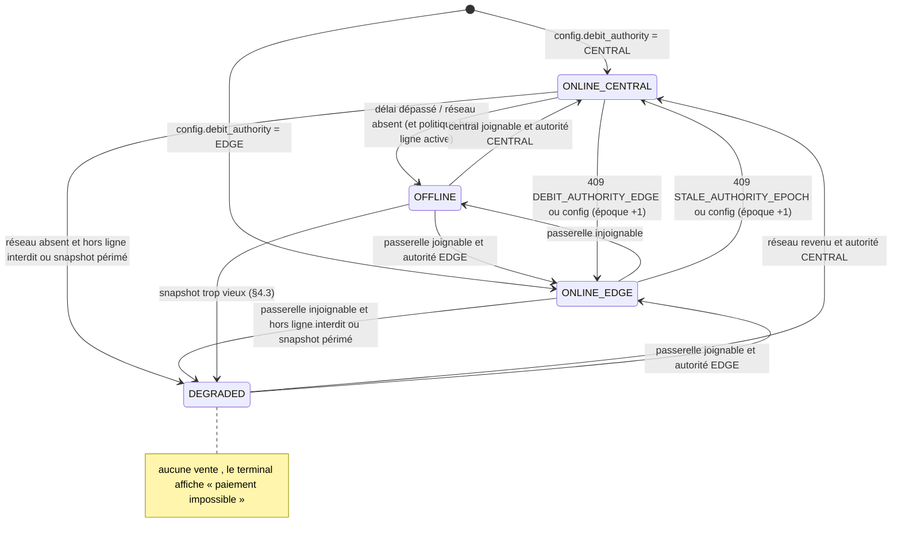
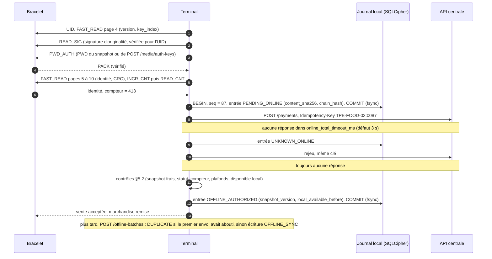
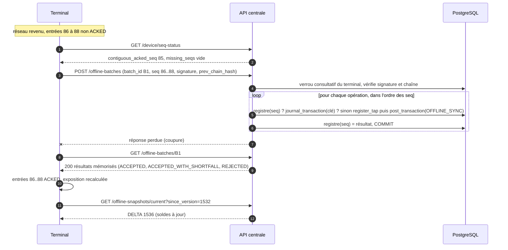
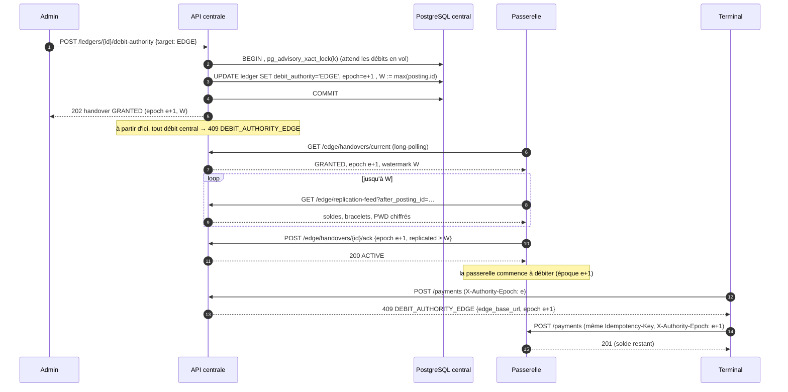
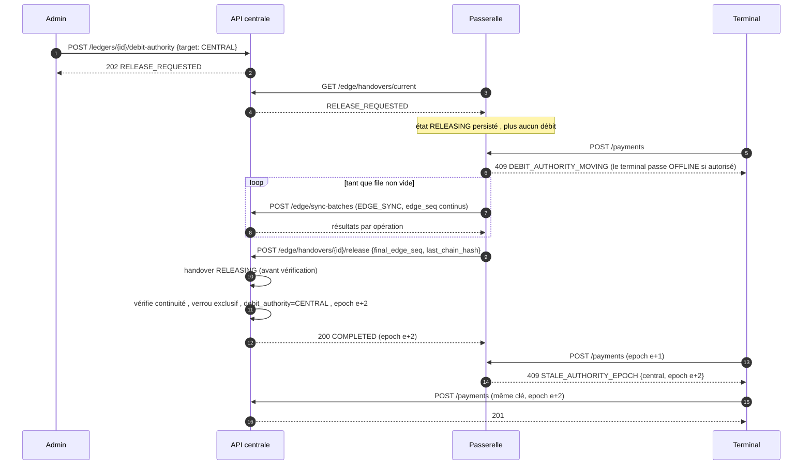
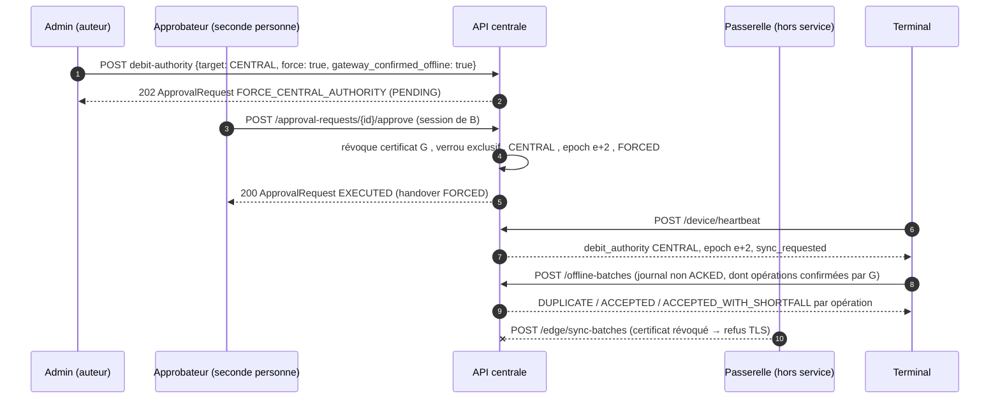

# Protocole de synchronisation hors ligne et passerelle locale — v1

Statut : **NORMATIF**. Ce document fait foi pour les terminaux (Flutter/Android), l'API centrale (NestJS) et la
passerelle locale (NestJS/Docker). Il complète `openapi.yaml` (formats) et `schema_grand_livre_cashless.sql` (grand livre).
Toute divergence entre une implémentation et ce document est un défaut de l'implémentation.

## 0. Conventions

| Terme | Sens (RFC 2119 / RFC 8174) |
|---|---|
| **DOIT** / **NE DOIT PAS** | exigence absolue (MUST / MUST NOT) |
| **DEVRAIT** / **NE DEVRAIT PAS** | recommandation forte ; s'en écarter exige une raison documentée (SHOULD) |
| **PEUT** | facultatif (MAY) |

Autres conventions :

- *Terminal* : application Flutter enrôlée (`device`), identifiée par `device.serial` (ex. `TPE-FOOD-02`).
- *Autorité* : le composant qui a le droit de **débiter** un portefeuille d'un grand livre à un instant donné :
  le central (`ledger.debit_authority = CENTRAL`) ou une passerelle (`EDGE`, `ledger.edge_gateway_id`).
- *Clé d'opération* : `<device.serial>:<seq>`, seq en décimal complété à gauche par des zéros sur **au moins
  4 chiffres** (`TPE-FOOD-02:0087`, `TPE-FOOD-02:12345`). C'est la valeur exacte de
  `journal_transaction.idempotency_key` (cf. `scenario_reference.json`, transactions 4, 10, 22).
- *Heure de confiance* (`t_trusted`) : voir §7.4.
- *JCS* : sérialisation JSON canonique RFC 8785. *H(x)* : SHA-256.
- Montants : entiers en unités mineures, devise unique de l'événement.

## 1. Invariants

Les règles de ce document existent pour garantir les invariants suivants. Une implémentation qui les
respecte à la lettre mais viole un invariant est fausse.

| # | Invariant |
|---|---|
| **I1** | Une opération d'un terminal est écrite **au plus une fois** dans le grand livre (unicité `(ledger_id, idempotency_key)`), quel que soit le chemin (en ligne, lot hors ligne, passerelle, rejeu). |
| **I2** | Une opération d'un terminal n'est **jamais perdue silencieusement** : chaque numéro de séquence consommé aboutit à un résultat final (écrite, sans effet, rejetée) ou à une anomalie `SEQ_GAP` levée par deux personnes. |
| **I3** | À tout instant, **une seule autorité** accepte des débits de portefeuille en temps réel pour un grand livre donné (§9). |
| **I4** | Le commerçant est **garanti** pour toute vente hors ligne autorisée par un terminal **conforme** à ce protocole : il est crédité du montant total, même si le portefeuille ne couvre pas tout. |
| **I5** | Le festivalier n'est **jamais débité au-delà de son solde** ni pour un usage postérieur au blocage de son bracelet (perte, clone) : la part non couverte va au compte d'attente (`SUSPENSE`, `S-ATTENTE`) avec une anomalie. |
| **I6** | L'exposition au risque d'un terminal isolé est **bornée** par la politique hors ligne effective (§5.2 et §8). |

## 2. Modes du terminal



Un terminal en `OFFLINE` dont le snapshot devient trop vieux (§4.3) passe en `DEGRADED` ; il ne revient en
`OFFLINE` qu'après avoir reçu un snapshot frais, donc après un passage par un mode en ligne.

- **ONLINE_CENTRAL** : toutes les opérations vont à l'API centrale.
- **ONLINE_EDGE** : toutes les opérations marquées `x-edge-available` vont à `debit_authority.edge_base_url`
  (LAN). Les autres (recharge PSP, QR payé par l'app, remboursement…) restent au central et, pour celles qui
  débitent, sont indisponibles (§9.6).
- **OFFLINE** : autorisation locale sur snapshot signé (§4, §5), journal local, synchronisation différée.
- **DEGRADED** : ni réseau ni hors ligne autorisé : le terminal NE DOIT PAS vendre.

Le terminal DOIT choisir son mode à partir de la **dernière configuration reçue** (`GET /device/config`) et
des réponses du serveur ; il NE DOIT PAS « deviner » l'autorité.

## 3. Numérotation des opérations (seq)

### 3.1 Attribution

1. Chaque terminal DOIT maintenir un compteur `seq` **unique, strictement croissant de 1 en 1**, propre au
   terminal, commençant à `next_seq` reçu à l'enrôlement (1 pour un terminal neuf).
2. Un numéro DOIT être consommé pour **toute** opération envoyée avec un en-tête `Idempotency-Key`
   (vente, annulation, recharge espèces, activation, caution, restitution, remplacement, rendu d'espèces
   dues, QR commerçant, recharge PSP initiée au guichet), **en ligne comme hors ligne**, AVANT tout envoi
   réseau. Les lectures (`POST /taps`, `GET …`), heartbeat, snapshot et lots NE consomment PAS de numéro.
3. L'incrément du compteur et l'écriture de l'entrée de journal (§3.3) DOIVENT être faits dans **la même
   transaction locale** (SQLite/SQLCipher, `synchronous = FULL`). Un numéro ne DOIT jamais être réutilisé,
   y compris après un plantage, une mise à jour de l'application ou un redémarrage.
4. Au démarrage et à chaque configuration reçue, le terminal DOIT poser
   `seq_suivant = max(seq_local + 1, config.seq.next_seq_floor)`.
5. Si le stockage local est perdu (réinitialisation, remplacement de l'appareil), le terminal DOIT être
   **ré-enrôlé** ; le serveur fournit alors `next_seq = max_seen_seq + 1` pour ce `serial`, et les numéros
   perdus deviennent des trous (§6.3). Un terminal NE DOIT PAS inventer un numéro de départ.
6. Deux terminaux NE DOIVENT JAMAIS partager un `serial`. Le serveur DOIT refuser l'enrôlement d'un
   `serial` déjà `ACTIVE` sur une autre clé publique (sauf révocation préalable de l'ancien).

### 3.2 Registre serveur des numéros

Le serveur DOIT tenir, par terminal, un **registre des numéros consommés** : `(device_id, seq)` → empreinte
du contenu (`content_sha256`), résultat final, `transaction_id` éventuel, canal (ONLINE / BATCH / EDGE),
date. Toute réponse **finale** d'une API en ligne (succès 2xx ou refus métier 4xx) qui porte une clé
`<serial>:<seq>` DOIT y être enregistrée, **dans la même transaction SQL** que l'écriture comptable
éventuelle. Ce registre (table `device_seq_registry`, fonction `record_device_seq`, schéma section 18) est la
source de vérité pour l'idempotence des lots et la détection des trous. La fonction tient
`device.contiguous_acked_seq` (plus grand numéro N tel que 1..N ont tous un résultat final) et `device.last_seq`
(plus grand numéro reçu, `max_seen_seq`). Un numéro renvoyé après avoir été signalé manquant clôt son anomalie
`SEQ_GAP`.

> Pourquoi un registre distinct de `journal_transaction` : certaines opérations consomment un numéro sans
> écrire (refus, abandon) ou écrivent sous une autre clé (`take_deposit` utilise `deposit:<media>:<n>`).

### 3.3 Journal local et chaînage

Chaque entrée du journal local contient les **champs chaînés** (immuables après création) :
`seq, type, occurred_at, amount, currency, tap, lines, reverses_seq, reverses_transaction_id,
online_operation, void_reason` (champs absents = omis), et les **champs d'état** (mutables) :
`online_status, online_transaction_id, online_tap_id, snapshot_version, config_id, local_available_before, clock, état_local`
(`online_tap_id` = `tap_id` reçu de `POST /taps` pour cette lecture, s'il a été reçu ; ADR-50)
(`config_id` = configuration détenue au moment de l'autorisation, présent pour toute opération autorisée hors
ligne). Comme `snapshot_version`, `config_id` est posé ou changé au passage hors ligne d'une entrée créée en
ligne : il NE DOIT PAS entrer dans `content_sha256`, sinon une vente déjà écrite en ligne ne serait plus
reconnue comme doublon à la synchronisation (§7.1 étape 2).

- `content_sha256 = H(JCS(champs chaînés))`.
- `chain_hash(n) = H( chain_hash(n−1) ‖ content_sha256(n) )` (concaténation d'octets bruts), avec
  `chain_hash(0) = H("CASHLESS/CHAIN/v1" ‖ device_id)` pour le premier numéro du terminal (`device_id` : les
  16 octets bruts de l'UUID ; fonction `device_chain_genesis`). Après un ré-enrôlement, le serveur pose
  `last_chain_seq = next_seq_floor − 1` et `last_chain_hash = device_chain_genesis` : la chaîne repart de l'origine.
- Le serveur DOIT conserver le dernier `chain_hash` accepté par terminal et vérifier que
  `header.prev_chain_hash` du lot suivant lui est égal (sinon `409 CHAIN_BROKEN` + anomalie ; le lot n'est
  pas traité ; examen manuel). Règle exacte (fonction `open_offline_batch`) : le serveur recalcule la chaîne
  du lot depuis `prev_chain_hash` ; elle DOIT aboutir à `last_chain_hash`. Le raccord se fait au dernier numéro
  dont le central connaît l'empreinte (`device.last_chain_seq`) : lot qui le suit ou le chevauche → vérifié à ce
  point ; lot qui suit un trou → traité, vérifié plus tard à l'arrivée du lot manquant ; lot entièrement déjà
  couvert → contenu contrôlé opération par opération par le registre ; chaîne qui suit un numéro levé
  (`waiveSeqGap`) → invérifiable, signalé. Une rupture constatée après coup ouvre une anomalie `CHAIN_BROKEN`.
- Le serveur DOIT calculer le même `content_sha256` pour les requêtes en ligne, afin de comparer une entrée
  de lot à l'opération en ligne de même clé (§7.1).

### 3.4 États locaux d'une entrée

| État local | Signification | Transmise dans un lot ? |
|---|---|---|
| `PENDING_ONLINE` | requête en ligne en vol | non (attendre l'issue) |
| `CONFIRMED_ONLINE` | réponse 2xx reçue | **oui** (`online_status = CONFIRMED`) → attendu `DUPLICATE` |
| `REJECTED_ONLINE` | refus 4xx métier reçu | **oui**, en `VOID` (`void_reason = ONLINE_REJECTED`) |
| `UNKNOWN_ONLINE` | délai / coupure, issue inconnue | **oui**, avec `online_status = UNKNOWN` |
| `OFFLINE_AUTHORIZED` | autorisée localement (§5) | **oui** |
| `VOID` | numéro consommé sans opération (abandon avant envoi, échec NFC) | **oui** |
| `SENT` | incluse dans un lot en vol | — |
| `ACKED` | résultat final reçu **du central** (directement ou relayé, §9.5) | non |

Une entrée DOIT rester dans le journal jusqu'à `ACKED`, puis DEVRAIT être conservée `local_retention_days`
jours (réglage de l'événement, défaut 7) pour l'audit avant purge.

## 4. Snapshot hors ligne

Le snapshot n'est PAS requis pour un terminal qui n'a pas le droit au hors ligne (`offline_enabled = false`
dans sa politique effective, dont tout téléphone personnel : pas de MDM, ADR-69). Un tel terminal travaille
toujours en ligne ; il obtient le PWD par `POST /media/auth-keys`, et le chemin « un seul aller-retour »
(lecture embarquée `tap`) ne l'exige pas. `GET /offline-snapshots/current` lui répond
`403 OFFLINE_NOT_ALLOWED`.

### 4.1 Contenu et signature

1. Le snapshot DOIT contenir, pour le grand livre de l'événement du terminal, une entrée par bracelet
   (vue `offline_snapshot_rows`) : `token_hash`, `nfc_uid`, `key_index`, `originality_sig_sha256` (SHA-256
   de la signature d'originalité enregistrée, ou null ; ADR-59), `status` (bracelet),
   `batch_event_id`, `batch_status`, `wallet_status`, `spendable` (solde disponible), `last_counter`, et le
   PWD||PACK chiffré, rechiffré pour le snapshot (`pwd_pack_enc`, §4.1-4). Taille : environ 6 Mo pour
   50 000 bracelets (≈ 120 octets par entrée).
2. L'en-tête (`SnapshotHeader`) DOIT porter `format, kind, operator_id, ledger_id, event_id, currency,
   version, base_version, generated_at, valid_until, entries, removed, content_sha256, authority_epoch,
   key_id` (`entries` et `removed` : nombres d'entrées et de retraits du contenu), et DOIT être signé sur
   `JCS(header)` avec l'algorithme indiqué par `key_id` (`ECDSA_P256_SHA256` par défaut, Ed25519 si le KMS le
   permet : POINTS_OUVERTS OP-N13). La signature porte ainsi sur tout l'en-tête : un snapshot d'un autre
   grand livre ou un vieux snapshot ne peut pas être rejoué.
3. `content_sha256 = H(JCS({entries sans pwd_pack_enc, removed_token_hashes}))` (ici `entries` désigne la
   liste des entrées du contenu).
4. `pwd_pack_enc` DOIT être chiffré en AES-256-GCM avec une **clé de contenu propre à la version**, AAD =
   `"CASHLESS/SNAPPWD/v1" ‖ ledger_id ‖ version ‖ token_hash ‖ nfc_uid`. La clé de contenu est enveloppée
   pour chaque terminal (`pwd_pack_key`, ECDH-ES P-256 sur sa clé d'accord). Un terminal révoqué ne reçoit
   plus de nouvelle clé de contenu.
5. La clé privée de signature du central DOIT résider dans le KMS/HSM. Exception : les snapshots produits par
   une passerelle (§9.4-3) sont signés par une clé propre à cette passerelle, hors KMS, conservée dans son
   stockage matériel, avec un `key_id` distinct (`snapshot_signing_key.owner = EDGE`). La rotation se fait
   par `key_id`, avec au plus deux clés publiques valides simultanément **par signataire** (le central, chaque
   passerelle) dans `config.snapshot_keys`.

### 4.2 Versions et deltas

1. `version` DOIT être strictement croissante par grand livre. Le serveur DEVRAIT générer une nouvelle
   version toutes les 60 s s'il y a eu un changement, et DOIT la générer IMMÉDIATEMENT (≤ 5 s) après un
   changement de statut bloquant (bracelet `SUSPENDED`, `BLACKLISTED`, `REPLACED`, `RETIRED` ; lot non
   `ACTIVE` ; portefeuille `BLOCKED`).
2. Un `DELTA` DOIT porter `base_version` ; le terminal NE DOIT l'appliquer que si `base_version` est égale à
   sa version locale, sinon il DOIT demander un `FULL` (sans `since_version`).
3. Le terminal DOIT rejeter tout snapshot : de signature invalide ; de `key_id` inconnu ; d'`operator_id`,
   `ledger_id`, `event_id` ou `currency` différents de sa configuration ; de `version` ≤ version locale
   (anti-retour arrière) ; d'`authority_epoch` inférieure à la plus grande époque connue.
4. Le terminal DOIT appliquer le snapshot de façon atomique (nouvelle table puis bascule), puis appeler
   `POST /offline-snapshots/ack`.
5. Le snapshot DOIT être stocké chiffré (§10) ; les PWD déchiffrés NE DOIVENT exister qu'en mémoire vive,
   le temps d'une authentification.

### 4.3 Fraîcheur

- `âge = t_trusted − header.generated_at`.
- `âge_max = min(policy.max_snapshot_age_seconds, header.valid_until − header.generated_at)`.
- Si `âge > âge_max`, le terminal DOIT refuser toute nouvelle opération hors ligne (**échec fermé**) et
  passer en `DEGRADED`, jusqu'à obtention d'un snapshot frais.
- Le terminal DEVRAIT rafraîchir le snapshot dès que `âge > âge_max / 2` quand le réseau le permet, et à
  chaque `heartbeat` indiquant `latest_snapshot_version` > version locale.

## 5. Autorisation hors ligne par le terminal

### 5.1 Quand passer hors ligne

1. Une vente en ligne DOIT utiliser les délais de l'événement reçus dans `DeviceConfig.terminal_settings` :
   délai de connexion `online_connect_timeout_ms` (défaut 2 s) et délai total `online_total_timeout_ms`
   (défaut 3 s).
2. En l'absence de réponse (délai, coupure, 5xx, 503), l'entrée passe `UNKNOWN_ONLINE`. Le terminal PEUT
   réessayer **la même requête avec la même clé** (au plus `online_retries` fois pendant l'interaction
   client, défaut 2).
3. Si l'issue reste inconnue et que la politique autorise le hors ligne, le terminal PEUT autoriser la même
   opération hors ligne **avec le même numéro et la même clé** (jamais un nouveau numéro) : elle sera écrite
   au plus une fois (I1). Il DOIT alors compter son montant dans l'exposition locale (§5.3).
4. Une réponse 4xx métier (`INSUFFICIENT_FUNDS`, `MEDIA_BLOCKED`, …) est **définitive** : le terminal NE
   DOIT PAS contourner un refus en ligne par une autorisation hors ligne.
5. Une réponse `409 DEBIT_AUTHORITY_EDGE` n'est pas un refus : le terminal DOIT rejouer la même requête
   (même clé) vers la passerelle indiquée (§9).
6. Une réponse `409 DEBIT_AUTHORITY_MOVING` (passerelle en cours de rendu, §9.3) ou `409 STALE_AUTHORITY_EPOCH`
   n'est pas non plus un refus définitif : rien n'a été écrit. Le terminal DOIT rejouer la même requête (même
   clé) vers l'autorité suivante dès qu'il la connaît (heartbeat, configuration) ; en attendant, il PEUT
   autoriser la même opération hors ligne (point 3) si la politique le permet.

La lecture NFC suit l'ordre de SPEC §7.6 (normatif) : UID et `FAST_READ` de la page 4 (version, `key_index`) ;
`READ_SIG` (signature d'originalité NXP, vérifiée pour l'UID, ADR-59) ; PWD et PACK pour (UID, `key_index`),
depuis le snapshot ou par `POST /media/auth-keys` ; `PWD_AUTH` et vérification du PACK ; `FAST_READ` des
pages 5 à 10 (identité, CRC) ; `INCR_CNT` puis `READ_CNT`. La signature lue est envoyée avec la lecture
(`originality_signature`) : en ligne, une signature absente alors que la puce en a une donne
`SIGNATURE_MISSING` et le terminal DOIT relire le bracelet.



### 5.2 Contrôles obligatoires avant d'autoriser une vente hors ligne

Le terminal DOIT vérifier, **dans cet ordre**, et refuser au premier échec :

| # | Contrôle | Refus affiché |
|---|---|---|
| 1 | `policy.offline_enabled = true` (et `cash_topup_offline = true` pour une recharge espèces) | hors ligne interdit |
| 2 | snapshot présent, signature valide, frais (§4.3) | snapshot périmé |
| 3 | lecture NFC réussie, dans l'ordre de SPEC §7.6 : UID et page 4 (version, `key_index`), `READ_SIG` avec signature d'originalité NXP valide pour l'UID (ADR-59), PWD_AUTH avec le PWD du snapshot pour (UID, `key_index`) — absent du snapshot : refus —, **PACK égal** au PACK attendu, lecture de l'identité (pages 5 à 10, CRC), `INCR_CNT` puis `READ_CNT` ; `token_hash = H(identité)` | bracelet illisible |
| 4 | entrée trouvée par `token_hash` ; `nfc_uid` et `key_index` égaux à ceux lus ; SHA-256 de la signature lue égal à `originality_sig_sha256` de l'entrée (ADR-59) | bracelet inconnu / bracelet suspect |
| 5 | `status = ACTIVE` ; `batch_status = ACTIVE` ; `batch_event_id` nul ou égal à l'événement du terminal | bracelet bloqué / mauvais événement |
| 6 | compteur lu > `max(entry.last_counter, dernier compteur vu localement pour ce token_hash)` | bracelet suspect |
| 7 | `amount ≤ max_per_sale` | montant trop élevé hors ligne |
| 8 | `amount ≤ disponible_local(token_hash)` (§5.3) | solde insuffisant |
| 9 | `exposition_bracelet(token_hash) + amount ≤ max_per_media_per_device` | plafond bracelet atteint |
| 10 | `exposition_totale + amount ≤ max_total_per_device` | plafond terminal atteint |
| 11 | espace libre du journal ≥ 5 % | stockage plein |

Une valeur de politique égale à 0 signifie **interdit**. Les valeurs utilisées DOIVENT être celles de la
dernière configuration reçue (`offline_policy`, déjà bornée par le plafond prestataire).

Si tout passe, le terminal DOIT écrire l'entrée (`OFFLINE_AUTHORIZED`, avec `snapshot_version` et
`local_available_before`) et la rendre durable (**fsync**) **avant** d'afficher le succès ou de remettre la
marchandise.

### 5.3 Calculs locaux

Une opération hors ligne est *non acquittée* tant que son résultat central n'est pas reçu ; elle est
*reflétée* dès que le terminal applique un snapshot de version ≥ `next_snapshot_version` renvoyé avec son
résultat.

- `débits_locaux(t)` = Σ montants des ventes hors ligne de ce terminal sur `t`, **non reflétées**,
  moins les annulations hors ligne correspondantes.
- `disponible_local(t) = entry.spendable − débits_locaux(t)`.
- `exposition_bracelet(t)` = Σ ventes hors ligne **non acquittées** sur `t`.
- `exposition_totale` = Σ ventes hors ligne non acquittées, tous bracelets.
- Une recharge espèces hors ligne NE DOIT PAS augmenter `disponible_local` (elle ne devient dépensable
  qu'une fois reflétée dans un snapshot).
- Une vente `UNKNOWN_ONLINE` autorisée hors ligne compte dans les trois sommes.

### 5.4 Opérations permises hors ligne

| Opération | Hors ligne |
|---|---|
| Vente `PURCHASE` (bracelet NFC) | oui, §5.2 |
| Annulation `REVERSAL` | oui, uniquement d'une vente **de ce terminal**, non déjà annulée, dans la fenêtre d'annulation `reversal_window_minutes` (défaut 15 min) ; `reverses_seq` (ou `reverses_transaction_id` si la vente a été confirmée en ligne) |
| Recharge espèces `TOPUP_CASH` | seulement si `cash_topup_offline`, montant ≤ `max_per_sale` |
| Paiement par QR (MERCHANT_QR, CUSTOMER_QR), intention POS tiers (V2, hors périmètre V1) | **non** (toujours en ligne) |
| Activation, caution, restitution, remplacement, remboursement, rendu d'espèces dues | **non** |

## 6. Transmission des lots

### 6.1 Déclenchement et ordre

1. Le terminal DOIT tenter une synchronisation : dès le retour du réseau ; puis toutes les
   `pending_sync_seconds` (défaut 30 s) tant qu'il reste des entrées non `ACKED` ; à la demande du serveur
   (`sync_requested`) ; avant une extinction programmée ; et au moins toutes les `reconcile_sync_seconds`
   (défaut 5 min) même en ligne (réconciliation des entrées `CONFIRMED_ONLINE`). Le battement de cœur part
   toutes les `heartbeat_seconds` (défaut 60 s).
2. Un lot DOIT contenir des entrées de numéros **continus** : `seq_from` = plus petit numéro non `ACKED`,
   puis chaque numéro suivant **sans trou** jusqu'à `seq_to` ; au plus 500 entrées et 1 Mio. Il PEUT
   s'arrêter avant une entrée `PENDING_ONLINE`.
3. Un terminal NE DOIT avoir qu'**un seul lot en vol**. Le lot suivant NE DOIT être construit qu'après le
   résultat du précédent.
4. Le lot DOIT être envoyé à l'autorité courante (central si `CENTRAL`, passerelle si `EDGE`) ; en cas de
   `409 DEBIT_AUTHORITY_EDGE`, le terminal DOIT l'envoyer, **inchangé** (même `batch_id`), à la passerelle.
5. `Idempotency-Key` du lot = `header.batch_id` (UUID v4 généré à la construction, persisté avec la liste
   des numéros inclus).
6. **Bornes de séquence.** Le serveur refuse tout numéro, et tout lot dont le dernier numéro, au-delà de
   `contiguous_acked_seq + max_seq_jump` (10 000, fonction `max_seq_jump`) : `409 SEQ_OUT_OF_RANGE`
   (SQLSTATE `CL021`), rien n'est traité et aucune anomalie n'est ouverte (pas d'anomalies `SEQ_GAP` en masse).
   Le terminal NE DOIT PAS sauter de numéros ; ce refus signale un compteur corrompu : alerte, examen manuel,
   ré-enrôlement si besoin (§3.1-5).

### 6.2 Reprise après coupure

1. Si la réponse n'arrive pas, le terminal DOIT d'abord interroger `GET /offline-batches/{batch_id}` ; si
   `404`, renvoyer **le même lot** (même `batch_id`, même contenu). `202` = en cours : attendre
   `Retry-After`.
2. Le serveur DOIT traiter un lot **opération par opération, dans l'ordre des seq, chacune dans sa propre
   transaction SQL**, et persister le résultat de chaque opération dans le registre (§3.2) avant de passer à
   la suivante. Un lot interrompu par une panne serveur reprend donc là où il s'était arrêté ; les
   opérations déjà traitées renvoient le résultat mémorisé.
3. Le serveur DOIT sérialiser les lots d'un même terminal (verrou consultatif par `device_id`) ; un second
   lot concurrent reçoit `409 BATCH_IN_PROGRESS`.
4. Après une réponse, le terminal DOIT marquer `ACKED` chaque entrée de statut final (`ACCEPTED`,
   `DUPLICATE`, `ACCEPTED_WITH_SHORTFALL`, `REJECTED` avec `retryable = false`). Une entrée `REJECTED` avec
   `retryable = true` DOIT être renvoyée dans un lot ultérieur (même numéro, même contenu).
5. En mode EDGE, l'accusé de la passerelle est **provisoire** : l'entrée passe `ACKED` seulement quand le
   `contiguous_acked_seq` **du central** la couvre (§9.5).
6. **Lot abandonné.** Un lot resté `PROCESSING` plus de 15 min (traitement interrompu, terminal parti) est
   passé `REJECTED` (raison `ABANDONED`) à l'ouverture du lot suivant du même terminal (`open_offline_batch`).
   Ses opérations déjà traitées restent au registre ; les autres numéros redeviennent non acquittés.
   `GET /offline-batches/{batch_id}` répond alors `200` avec `abandoned = true` et les seuls résultats
   traités. Le terminal DOIT construire un nouveau lot (nouveau `batch_id`) depuis son plus petit numéro non
   `ACKED` ; les numéros déjà traités y reçoivent leur résultat mémorisé (§7.1 étape 2).



### 6.3 Trous de séquence

1. Un lot dont les numéros ne sont pas continus est invalide : l'API le refuse en entier, avant tout
   traitement (`400 SEQ_OUT_OF_ORDER`, sans SQLSTATE). Le même code sert, côté base, pour un `edge_seq` qui
   n'est pas le suivant attendu (SQLSTATE `CL016`, §9.5-1).
2. Si `seq_from > contiguous_acked_seq + 1`, le serveur DOIT **traiter quand même** le lot (I4), renvoyer
   les numéros manquants dans `missing_seqs` et ouvrir une anomalie `SEQ_GAP` (montant 0) par numéro manquant.
3. Le terminal qui possède les numéros manquants DOIT les renvoyer en priorité (un lot séparé, continu).
4. Un numéro définitivement perdu NE PEUT être levé que par `waiveSeqGap` (rôle `SUPERVISOR` + validation
   par une seconde personne : demande d'approbation `WAIVE_SEQ_GAP`, ADR-74), qui clôt l'anomalie à
   l'approbation ; `contiguous_acked_seq` avance alors.
5. Tant qu'un trou est ouvert depuis plus de 24 h, le serveur DEVRAIT alerter l'exploitation, et PEUT
   suspendre le mode hors ligne du terminal (politique `DEVICE`, `offline_enabled = false`).

## 7. Traitement serveur d'une opération de lot

### 7.1 Algorithme (normatif)

Pour chaque opération `op` du lot, dans l'ordre des seq :

```text
1. clé ← serial ‖ ":" ‖ seq en décimal, complété à gauche par des zéros jusqu'à 4 chiffres au moins,
         jamais tronqué (87 → "0087", 12345 → "12345")
2. SI registre(device, seq) existe :
      SI registre.content_sha256 = op.content_sha256  → renvoyer le résultat mémorisé (DUPLICATE si écrit)
      SINON → REJECTED(IDEMPOTENCY_KEY_REUSED), anomalie IDEMPOTENCY_CONFLICT, FIN
3. SI journal_transaction(ledger, clé) existe (écrite en ligne ou via la passerelle) :
      enregistrer au registre ; → DUPLICATE(transaction_id), FIN
4. SELON op.type :
      VOID       → registre ← (outcome VOID, sans transaction) ; résultat ACCEPTED, effect NONE ; FIN
      ONLINE_REF → l'opération en ligne n'a pas été exécutée (sinon étape 2/3) :
                   registre ← (outcome VOID, reason ONLINE_NOT_EXECUTED, sans transaction) ;
                   résultat ACCEPTED, effect NONE ; FIN
                   (le terminal DOIT afficher « opération non effectuée »)
      op.online_status = CONFIRMED mais introuvable → anomalie ONLINE_CONFIRMED_MISSING,
                   puis continuer comme une opération hors ligne (I4), SANS les contrôles de l'étape 5
5. SI op.online_status ≠ CONFIRMED : contrôles de conformité du terminal (§7.2) ;
      échec → REJECTED(raison), anomalie NON_COMPLIANT_OPERATION, FIN
   Pour toute opération : contrôles de période (§7.2, fin) ; échec → REJECTED(raison), anomalie, FIN
6. (résultat_tap, tap_id) ← register_tap(operator, token_hash, uid, counter, occurred_at_corrigé, device,
                                'OFFLINE', p_online_tap ← op.online_tap_id, p_signature ← tap.originality_signature)
   (une même lecture, même terminal, même compteur, même UID, jamais utilisée pour une écriture : réutilisée,
   pas de copie, quel que soit le délai, même sans online_tap_id ; ADR-50. Signature absente alors que la
   puce en a une : anomalie SIGNATURE_MISMATCH, opération gardée)
7. Déterminer (couvert, manque, raison) selon §7.3
8. lignes ← débit portefeuille `couvert` (réparti WALLET_PROMO / WALLET_PAID selon spend_order)
          + débit SUSPENSE `manque`
          + crédit commerçant `amount`
          + frais / commissions REALTIME calculés sur `amount` (montant total)
9. tx ← post_transaction(ledger, 'PURCHASE', clé, occurred_at_corrigé, 'OFFLINE_SYNC', lignes, event)
   SI SQLSTATE CL007 (solde insuffisant, débit concurrent) → reprendre en 7 (au plus 3 fois) ;
   au 4e CL007 consécutif → REJECTED(INSUFFICIENT_FUNDS_RETRY), retryable = true, rien n'est écrit
   au registre (le numéro reste non acquitté) ; FIN. Le terminal renvoie l'opération dans un lot
   ultérieur (§6.2-4).
10. SI tap_id n'est pas NULL : consume_tap(tap_id, tx) (passage enregistré en 6 ; un résultat de refus
    — CLONE_SUSPECTED, REPLACED, RELEASED… — n'a pas de tap_id et n'appelle pas consume_tap ; un passage sert à UNE écriture, sinon CL022
    TAP_UNUSABLE ; pas de délai pour une écriture OFFLINE_SYNC)
11. SI manque > 0 → anomaly(kind 'OFFLINE_SHORTFALL', amount manque, transaction_id tx)
12. registre ← (tx, statut) (record_device_seq : contiguous_acked_seq et last_seq à jour) ; COMMIT
```

Le type `REVERSAL` écrit les lignes **exactement opposées** à celles de la vente visée (y compris la part
`SUSPENSE`), avec `reverses_id`, et réduit d'autant l'anomalie `OFFLINE_SHORTFALL` liée. `TOPUP_CASH`
écrit `CASH_DESK` au débit et `WALLET_PAID` au crédit (§11, cas 22 pour le dépassement de plafond).

Référence : la transaction 22 du scénario (`TPE-FOOD-02:0087`, vente de 9 000, solde 6 000) produit
`L-WAL-W04-P +6000`, `S-ATTENTE +3000`, `L-MCH-FOOD −9000`, commission TTC sur 9 000.

### 7.2 Contrôles de conformité (terminal fautif ⇒ pas de garantie)

Ces contrôles s'appliquent aux opérations autorisées par le terminal (hors ligne, ou `UNKNOWN_ONLINE`
autorisée hors ligne). Les opérations `online_status = CONFIRMED` (confirmées par le central ou par la
passerelle) en sont **exemptées** : elles n'ont pas été autorisées sur snapshot et peuvent n'avoir ni
`config_id` ni `snapshot_version` ; si elles sont introuvables, elles sont traitées selon §7.3 (commerçant
garanti, §7.1 étape 4).

| Contrôle serveur | Raison de rejet |
|---|---|
| devise ≠ devise de l'événement | `CURRENCY_MISMATCH` |
| `offline_enabled` faux pour ce terminal à `occurred_at` (versions de politique) | `OFFLINE_NOT_ALLOWED` |
| `amount > max_per_sale`, ou cumul par bracelet / par terminal (recalculé sur les opérations non reflétées) au-delà des plafonds **en vigueur dans la configuration détenue par le terminal** | `POLICY_LIMIT_EXCEEDED` |
| `snapshot_version` inconnue pour ce grand livre | `SNAPSHOT_VERSION_UNKNOWN` |
| `occurred_at_corrigé − generated_at(snapshot_version) > âge_max + tolérance` | `SNAPSHOT_TOO_OLD` |
| `token_hash` absent du snapshot utilisé | `MEDIA_NOT_IN_SNAPSHOT` |
| le snapshot utilisé montrait déjà le bracelet / le lot non utilisable | `MEDIA_BLOCKED_IN_SNAPSHOT` |
| `batch_event_id` du snapshot ≠ événement du terminal | `MEDIA_WRONG_EVENT` |
| `pack_verified ≠ true` | `PACK_NOT_VERIFIED` |
| annulation sans vente cible valide | `REVERSAL_TARGET_NOT_FOUND` / `ALREADY_REVERSED` |

Un rejet pour non-conformité ouvre une anomalie `NON_COMPLIANT_OPERATION` ; la perte éventuelle est traitée
hors protocole (le commerçant n'est pas garanti par I4) ; la partie qui porte la perte dépend de qui a fourni le
terminal (SPECIFICATION §9.6, ADR-58). Le serveur DOIT conserver l'historique des politiques effectives et
des versions de configuration servies à chaque terminal pour appliquer la ligne « plafonds en vigueur » ;
une baisse de plafond ne rend pas fautives les opérations faites avant que le terminal ne la reçoive. Les
plafonds contrôlés sont ceux de `policy_in_force(terminal, op.config_id)` ; un `config_id` absent, inconnu ou
servi à un autre terminal → `POLICY_LIMIT_EXCEEDED` (pas de garantie).

**Contrôles de période** (toute opération, y compris `CONFIRMED` ; le terminal n'est **pas** fautif) :

| Contrôle serveur | Raison de rejet |
|---|---|
| `occurred_at_corrigé ≤ ledger.locked_until` | `PERIOD_CLOSED` |
| grand livre `LOCKED` | `LEDGER_LOCKED` |
| vente `PURCHASE` ou son `REVERSAL`, événement en `SETTLING` ou au-delà (synchronisation tardive, ADR-49 ; autres types : §7.5) | `SYNC_DEADLINE_PASSED` (anomalie `LATE_OFFLINE_SYNC` au lieu de `PERIOD_CLOSED_OPERATION` ; le commerçant reste garanti par une écriture du back-office) |

L'opération est rejetée (`retryable = false`, rien n'est écrit au grand livre) et une anomalie
`PERIOD_CLOSED_OPERATION` est ouverte.
Ce n'est pas une faute du terminal : la vente est traitée manuellement par le back-office (écriture à une
date ouverte, §11 cas 16).

### 7.3 Règles de conflit (terminal conforme ⇒ commerçant garanti)

`t_blocage` = date du passage du bracelet (ou du lot, ou du portefeuille) dans un état non utilisable
(`media_status_history.at`, `media_batch_status_history.at`) ; `tol` = tolérance d'horloge (120 s).

| Situation à la synchro | `couvert` | `manque` | Statut / raison |
|---|---|---|---|
| tap `OK`, solde ≥ montant | montant | 0 | `ACCEPTED` |
| tap `OK`, solde < montant | solde | montant − solde | `ACCEPTED_WITH_SHORTFALL` / `INSUFFICIENT_FUNDS` |
| tap `BLOCKED`/`REPLACED`/`RETIRED`/`RELEASED`/`BATCH_INACTIVE` et `occurred_at_corrigé < t_blocage + tol` | min(solde, montant) | reste | `ACCEPTED` ou `…_WITH_SHORTFALL` / `INSUFFICIENT_FUNDS` (l'usage est antérieur au blocage) |
| idem, `occurred_at_corrigé ≥ t_blocage + tol`, snapshot utilisé antérieur au blocage | 0 | montant | `ACCEPTED_WITH_SHORTFALL` / `MEDIA_BLOCKED_AFTER_SNAPSHOT` (le client déclaré ne paie pas l'usage frauduleux) |
| tap `CLONE_SUSPECTED` (compteur déjà vu) | 0 | montant | `ACCEPTED_WITH_SHORTFALL` / `MEDIA_CLONE_SUSPECTED` |
| tap `UID_MISMATCH` | 0 | montant | `ACCEPTED_WITH_SHORTFALL` / `MEDIA_UID_MISMATCH` |
| tap `SIGNATURE_MISMATCH` (signature lue différente de celle enregistrée ; bracelet mis en liste noire) | 0 | montant | `ACCEPTED_WITH_SHORTFALL` / `MEDIA_SIGNATURE_MISMATCH` |
| signature absente alors que la puce en a une (hors ligne : pas de `SIGNATURE_MISSING`) | comme ci-dessus | comme ci-dessus | statut inchangé, anomalie `SIGNATURE_MISMATCH` en plus |
| portefeuille `BLOCKED`/`CLOSED` | 0 | montant | `ACCEPTED_WITH_SHORTFALL` / `WALLET_BLOCKED` |
| tap `UNKNOWN` ou `NOT_ACTIVATED` | — | — | `REJECTED` / `MEDIA_NOT_IN_SNAPSHOT` (le terminal n'aurait pas dû autoriser) |
| tap `WRONG_EVENT` | — | — | `REJECTED` / `MEDIA_WRONG_EVENT` |

Les anomalies sont soldées par une transaction `ANOMALY_RESOLUTION` (back-office, deux personnes) au débit
du porteur de perte contractuel (`contract.offline_loss_bearer`), cf. scénario transaction 25.

### 7.4 Horodatage

`occurred_at` du terminal est l'heure réelle de l'opération ; `recorded_at` est l'heure serveur.

1. **Heure de confiance du terminal** : à chaque réponse du serveur, le terminal DOIT mémoriser
   `(server_time, monotonic_ms, boot_id)`. Hors ligne, il DOIT dater ses opérations par
   `t_trusted = server_time + (monotonic_now − monotonic_ms)` tant que `boot_id` n'a pas changé ; après un
   redémarrage sans réseau, il DOIT utiliser l'horloge système (NITZ/GNSS) et marquer `clock.offset_ms`
   comme inconnu. Il NE DOIT PAS dater avec une horloge modifiable par l'utilisateur quand `t_trusted` est
   disponible.
2. **Correction serveur** (`occurred_at_corrigé`) :
   - si `occurred_at > recorded_at + tol` (futur) → `occurred_at_corrigé = recorded_at`, anomalie
     `CLOCK_SKEW` ;
   - si `occurred_at < generated_at(snapshot utilisé) − tol` (antérieur au snapshot, impossible) →
     `occurred_at_corrigé = generated_at(snapshot)`, anomalie `CLOCK_SKEW` ;
   - sinon `occurred_at_corrigé = occurred_at`.
   L'`occurred_at` d'origine DOIT être conservé dans `journal_transaction.metadata.device_occurred_at`.
3. Au sein d'un terminal, `occurred_at` DEVRAIT être croissant avec `seq` à `tol` près ; une inversion ouvre
   `CLOCK_SKEW` sans changer le résultat.
4. La détection de clone par le temps (vue `counter_time_inversion`) utilise la même tolérance de 2 min.
5. Une configuration dont `server_time` diffère de l'horloge système de plus de `clock_tolerance_seconds`
   DOIT déclencher une alerte au back-office (pas de MDM, ADR-69) ; `CLOCK_SKEW_TOO_LARGE` (> 24 h) rend le terminal `DEGRADED`.

### 7.5 Synchronisations tardives autres que les ventes

Règle (revue 2) : l'argent a changé de main, l'écriture n'est jamais refusée pour retard.

- **Ventes et leurs annulations** : §7.2 (`SYNC_DEADLINE_PASSED` à partir de `SETTLING`, écriture par le
  back-office).
- **Recharge en espèces** (`TOPUP_CASH`, lot de terminal ou de passerelle) et **caution en espèces**
  (`DEPOSIT_CASH`, lot de passerelle) reçues en `SETTLING` ou `REFUND_WINDOW` : écrites normalement
  (`ACCEPTED`), avec une anomalie `LATE_OFFLINE_SYNC`. La caisse de la
  station est déjà fermée : l'écart qui en résulte est traité par le back-office avec cette anomalie.
- Seuls les contrôles de période restent bloquants : grand livre `LOCKED` (`LEDGER_LOCKED`) ou date dans une
  période close (`PERIOD_CLOSED`) ; rien n'est écrit, anomalie `PERIOD_CLOSED_OPERATION`, traitement manuel.
- Date limite de synchronisation (ADR-73) : fin de l'événement + `sync_deadline_hours` (72 h par défaut),
  contrôlée au passage à `SETTLING`. Avant elle, `SETTLING` attend que chaque terminal soit à jour
  (`event_device_sync_status`). Dès que la configuration servie indique l'événement en `CLOSING`, le terminal
  DOIT envoyer ses opérations en attente (lot) puis un signal de vie, même s'il n'a rien à envoyer.

## 8. Plafonds : récapitulatif des responsabilités

| Plafond | Appliqué par le terminal | Revérifié par le serveur | Effet d'un dépassement à la synchro |
|---|---|---|---|
| `max_per_sale` | oui (§5.2-7) | oui | `REJECTED POLICY_LIMIT_EXCEEDED` |
| `max_per_media_per_device` | oui (exposition non acquittée) | oui | idem |
| `max_total_per_device` | oui | oui | idem |
| `max_snapshot_age` | oui (échec fermé) | oui (`SNAPSHOT_TOO_OLD`) | idem |
| Solde disponible | oui (snapshot − débits locaux) | oui | `ACCEPTED_WITH_SHORTFALL` (normal : autres terminaux) |
| Plafonds réglementaires de solde / recharge (`check_wallet_limits`) | non | oui (`post_transaction`) | `TOPUP_CASH` : écrite en deux parts (portefeuille jusqu'à la marge `wallet_topup_headroom`, reste en `L-ESP-A-RENDRE`), `ACCEPTED` + anomalie `CASH_TOPUP_OVER_LIMIT` (§11 cas 22, ADR-63) |

Exposition maximale d'un terminal isolé : `max_total_per_device` ; d'un bracelet sur N terminaux isolés :
`N × max_per_media_per_device` au-delà de son solde. L'organisateur choisit ces valeurs en conséquence.

## 9. Autorité de débit : bascule CENTRAL ↔ EDGE

### 9.1 Principe d'exclusion

- Le grand livre porte `debit_authority` et une **époque** entière (`ledger.authority_epoch`, incrémentée
  à chaque bascule par les fonctions de bascule §9.2, §9.3, §9.7, qui appellent la fonction interne
  `set_debit_authority`). L'époque est un **jeton d'exclusion** : toute requête de débit porte
  `X-Authority-Epoch`, tout snapshot et tout lot portent l'époque.
- Côté central, **tout chemin de débit** (paiement, annulation qui débite, remboursement, caution
  `FROM_BALANCE`, lot hors ligne, intention capturée (V2), QR payé) DOIT, dans sa transaction SQL :
  1. prendre `pg_advisory_xact_lock_shared(k)` avec `k = hashtextextended('debit-authority:' ‖ ledger_id, 0)` ;
  2. relire `ledger.debit_authority` ; si `EDGE` → `409 DEBIT_AUTHORITY_EDGE` ;
  3. appeler `post_transaction` (qui refuse aussi, en défense en profondeur, tout débit de portefeuille
     de source ≠ `EDGE_SYNC` quand `EDGE`).
- La bascule prend `pg_advisory_xact_lock(k)` (**exclusif**) : elle attend la fin de tous les débits en vol,
  et aucun débit ne peut commencer avant sa validation. `post_transaction` prend lui-même le verrou partagé ;
  `set_debit_authority` prend le verrou exclusif.
- La passerelle NE DOIT débiter que si elle détient l'autorité **active** pour l'époque `e` et que la requête
  porte `X-Authority-Epoch = e` ; une requête portant une époque **supérieure** prouve que la passerelle est
  périmée : elle DOIT alors cesser immédiatement de débiter (`409 STALE_AUTHORITY_EPOCH`).
- Les crédits (recharge PSP, espèces, contre-passation d'une vente) restent acceptés par le central pendant
  `EDGE` et sont répliqués vers la passerelle (§9.4).

### 9.2 CENTRAL → EDGE

| Étape | Acteur | Action | Débits possibles au central | à la passerelle |
|---|---|---|---|---|
| 1 | Admin | `POST /ledgers/{id}/debit-authority {target: EDGE, edge_gateway_id}` | oui | non |
| 2 | Central | Tx SQL : verrou exclusif ; `debit_authority = EDGE`, `edge_gateway_id`, époque `e+1` ; filigrane `W = max(posting.id)` du grand livre ; handover `GRANTED` ; COMMIT | **non** (dès le COMMIT) | non |
| 3 | Passerelle | Reçoit `GRANTED` (canal de contrôle), tire le flux de réplication jusqu'à `W` inclus | non | non |
| 4 | Passerelle | `POST /edge/handovers/{id}/ack {epoch: e+1, replicated_posting_id ≥ W}` | non | non |
| 5 | Central | Vérifie époque et filigrane ; handover `ACTIVE` ; 200 | non | non |
| 6 | Passerelle | Après la réponse 200 seulement : accepte les débits (époque `e+1`) | non | **oui** |
| 7 | Terminaux | Apprennent l'autorité par heartbeat/config, ou par `409 DEBIT_AUTHORITY_EDGE` ; rejouent vers la passerelle avec la même clé | non | oui |

Entre 2 et 6, aucun débit en ligne n'est possible : les terminaux passent `OFFLINE` si la politique le
permet (leurs lots iront à la passerelle).



### 9.3 EDGE → CENTRAL (rendu normal)

| Étape | Acteur | Action | Central | Passerelle |
|---|---|---|---|---|
| 1 | Admin | `POST …/debit-authority {target: CENTRAL}` ; handover `RELEASE_REQUESTED` (le grand livre reste `EDGE`) | non | oui |
| 2 | Passerelle | Reçoit la demande ; persiste son état local de rendu (`RELEASING`) ; **cesse tout débit** (`409 DEBIT_AUTHORITY_MOVING`) ; refuse les nouveaux lots de terminaux | non | **non** |
| 3 | Passerelle | Vide sa file : `POST /edge/sync-batches` jusqu'à `final_edge_seq` ; attend tous les résultats | non | non |
| 4 | Passerelle | `POST /edge/handovers/{id}/release {epoch, final_edge_seq, last_chain_hash, operations_count}` | non | non |
| 5 | Central | À réception de la demande, **avant toute vérification**, passe le handover en `RELEASING`. Vérifie la continuité de `edge_seq` et la chaîne ; sinon `409 EDGE_NOT_CAUGHT_UP` (retour à 3). Puis tx SQL : verrou exclusif ; `debit_authority = CENTRAL`, `edge_gateway_id = NULL`, époque `e+2` ; handover `COMPLETED` | **oui** (après COMMIT) | non |
| 6 | Terminaux | Apprennent l'époque `e+2` (heartbeat/config, ou `409 STALE_AUTHORITY_EPOCH` de la passerelle) ; reviennent au central ; renvoient au central les lots refusés à l'étape 2 | oui | non |

Une passerelle en `RELEASING` NE DOIT JAMAIS reprendre les débits, même après redémarrage, sauf si le
central lui signale explicitement l'échec du handover (`FAILED`) pour la même époque.



### 9.4 Réplication central → passerelle

1. La passerelle DOIT tirer `GET /edge/replication-feed` en continu quand le lien existe et mémoriser
   `edge_gateway.last_replicated_posting_id`. Le flux porte les soldes (paid, promo) des portefeuilles
   touchés, les statuts de bracelets / lots / portefeuilles, les nouveaux bracelets et leurs PWD chiffrés.
2. Pendant `EDGE`, le solde vu par la passerelle est **toujours ≤** le solde central réel (seuls des crédits
   sont possibles au central) : une décision de la passerelle ne peut donc pas mettre un portefeuille en
   négatif au central.
3. Les blocages (perte déclarée dans l'app) sont faits au central et répliqués ; la passerelle DOIT les
   appliquer dès réception et DEVRAIT produire elle-même un snapshot pour les terminaux du LAN, dans le
   format de §4.1. Ce snapshot est signé par une clé propre à la passerelle, hors KMS, conservée dans son
   stockage matériel (`snapshot_signing_key.owner = EDGE`), déclarée dans `config.snapshot_keys` avec un
   `key_id` distinct (exception à §4.1-5).

### 9.5 Resynchronisation passerelle → central (EDGE_SYNC)

La file contient les ventes, annulations et recharges en espèces décidées par la passerelle, les lots hors ligne
relayés, et les activations et cautions en espèces faites au guichet (§9.6, ADR-52).

1. La passerelle DOIT numéroter chaque opération qu'elle décide par un `edge_seq` continu, chaîné
   (`chain_hash(n) = H(chain_hash(n−1) ‖ content_sha256(n))`, `chain_hash(0) = H("CASHLESS/EDGE-CHAIN/v1" ‖
   gateway_id)`), persistant, et conserver pour chacune la clé d'origine du terminal (`<serial>:<seq>`). Le
   central reçoit les `edge_seq` strictement dans l'ordre (`record_edge_seq`, sinon `SEQ_OUT_OF_ORDER`, SQLSTATE `CL016`), recalcule
   la chaîne et la compare, au retour, à `last_chain_hash` déclaré (sinon `CHAIN_BROKEN`).
2. Quand le lien est rétabli (état `ISOLATED` → `CATCHING_UP`), elle DOIT envoyer ses opérations par
   `POST /edge/sync-batches` dans l'ordre des `edge_seq`, un lot en vol à la fois (au plus 500 opérations
   et 1 Mio par lot), en continuant de servir
   les terminaux. Quand la file est vide : `ACTIVE`.
3. Le central écrit chaque opération avec `source = EDGE_SYNC` et la clé d'origine, et porte dans
   `journal_transaction.metadata` : `origin_key` (clé `<serial>:<seq>`), `origin_occurred_at` (heure de
   l'opération chez la passerelle ou le terminal) et `origin_mode` (`ONLINE_EDGE` pour `EDGE_ONLINE`,
   `OFFLINE` pour `DEVICE_OFFLINE`). Il reprend la
   **décision** de la passerelle (`edge_decision` : part portefeuille, part compte d'attente, raison) et ne
   recalcule que frais et commissions. Une clé déjà présente (le terminal l'avait aussi envoyée au central,
   ou une tentative en ligne antérieure avait abouti) → `DUPLICATE` ; la passerelle corrige alors son solde
   local par la réplication.
4. La passerelle DOIT relayer aux terminaux le `contiguous_acked_seq` **du central** (réponse de
   `GET /device/seq-status` servie par la passerelle, calculée à partir des résultats EDGE_SYNC) : c'est lui,
   et non l'accusé provisoire de la passerelle, qui autorise un terminal à marquer ses entrées `ACKED`.
5. Les lots hors ligne des terminaux reçus par la passerelle (`authorized_mode = DEVICE_OFFLINE`) sont
   traités par elle selon §7 (avec ses soldes) puis transmis en EDGE_SYNC avec l'en-tête et la signature du
   lot d'origine du terminal (le terminal signe l'en-tête du lot, pas chaque opération).

### 9.6 Fonctions indisponibles pendant EDGE

**Servies par la passerelle** (ADR-52) : ventes et annulations, recharges en espèces, et au guichet :

- **activation** d'un bracelet (`activateMedia`), à condition qu'aucun frais d'activation ne soit prélevé sur le
  solde ; le canal DOIT être autorisé par l'événement ;
- **caution payée en espèces** (`takeDeposit`, mode `SEPARATE`, `payment.method = CASH`).

La passerelle transmet ces opérations au central dans la même file que les ventes (§9.5), types `ACTIVATION`
et `DEPOSIT_CASH`, avec la clé d'origine du terminal. Le central les rejoue par `activate_media` (avec
l'événement) et `take_deposit`, dans l'ordre des `edge_seq` ; une activation précède toujours les opérations
qui utilisent le bracelet.

**Rejeu impossible d'une `ACTIVATION` ou d'un `DEPOSIT_CASH`** (bracelet déjà actif ailleurs, lot non actif,
caution déjà `HELD`, `CL020`…). Le guichet a déjà agi et, pour une caution, encaissé des espèces. Règle :

1. le résultat est `REJECTED`, raison `EDGE_REPLAY_FAILED`, `detail` = code de l'échec ; il est enregistré
   au registre (`record_edge_seq`, `record_device_seq`) : l'opération n'est jamais rejouée ;
2. une anomalie `EDGE_REPLAY_FAILED` est ouverte (bracelet, terminal, clé d'origine ; `transaction_id` =
   l'écriture d'attente ci-dessous s'il y en a une) ;
3. les espèces encaissées (caution `SEPARATE`) vont au compte d'attente : écriture `DEPOSIT_TAKEN`, source
   `EDGE_SYNC`, clé d'origine, débit de la caisse de la station, crédit `SUSPENSE`,
   `metadata.replay_failed = true`. Le résultat `REJECTED` ne porte PAS de `transaction_id` (le registre
   l'interdit) : l'écriture est reliée par l'anomalie (`anomaly.transaction_id`). Le
   back-office résout l'anomalie (`ANOMALY_RESOLUTION`, deux personnes : rendre l'argent au festivalier ou le
   rattacher au bon bracelet). Une activation sans espèces n'écrit rien.

Les opérations suivantes du même bracelet sont traitées normalement (§7.3 : bracelet inconnu ou non activé
→ `REJECTED MEDIA_NOT_IN_SNAPSHOT`).

**Indisponibles pendant EDGE**, refus `409 DEBIT_AUTHORITY_EDGE` : tout prélèvement sur le solde autre qu'une
vente (caution `FROM_BALANCE`, frais d'activation prélevés sur le solde), remboursement du solde
(`WALLET_REFUND` ; le rendu d'espèces dues, `refundCashDue`, ne débite aucun portefeuille et reste servi par
le central),
restitution d'un bracelet (elle peut exiger un remboursement ou une expiration de crédits offerts), paiement
d'un QR commerçant par l'app, QR client, capture d'intention POS tiers (V2, hors périmètre V1). L'app client
DOIT afficher un solde « provisoire » (`pending_offline_notice`).

### 9.7 Reprise forcée (passerelle perdue)

À n'utiliser que si la passerelle est **détruite, éteinte ou physiquement débranchée** (constat sur site).

1. `POST …/debit-authority {target: CENTRAL, force: true, gateway_confirmed_offline: true}` par un
   `OPERATOR_ADMIN` : crée une demande d'approbation `FORCE_CENTRAL_AUTHORITY` (`202`, ADR-74). Une seconde
   personne `OPERATOR_ADMIN`, connectée avec sa propre session, l'approuve
   (`POST /approval-requests/{id}/approve`) ; le central exécute alors la reprise une seule fois, avec elle
   comme valideur. Aucun valideur n'est pris dans le corps de la requête.
2. Le central : révoque le certificat de la passerelle (`edge_gateway.status = REVOKED`), bascule
   `CENTRAL` avec l'époque `e+2` sous verrou exclusif, handover `FORCED`.
3. Les terminaux reçoivent l'époque `e+2` ; ils renvoient au central **tout leur journal non `ACKED`**,
   y compris les opérations confirmées par la passerelle (`online_status = CONFIRMED`) : le central les
   traite en `OFFLINE_SYNC` selon §7, **sans** les contrôles de conformité de §7.2 dont elles sont
   exemptées (§7.1 étapes 4 et 5), donc selon §7.3 (commerçant garanti, manques en compte d'attente). Grâce à la clé
   d'origine (I1), une opération que la passerelle aurait aussi réussi à transmettre avant sa perte n'est
   écrite qu'une fois.
4. Risque résiduel accepté et documenté : si la passerelle était en réalité vivante et isolée avec des
   terminaux qui n'ont pas reçu l'époque `e+2`, elle continue de débiter sur ses soldes répliqués ; les deux
   autorités peuvent alors accepter des débits sur le même portefeuille. I1 reste garanti (clés uniques) ;
   I5 est préservé par la règle du compte d'attente à la synchro ; la perte éventuelle est bornée par les
   débits de la passerelle zombie et imputée selon le contrat. C'est pourquoi l'étape 1 exige le constat
   physique.



### 9.8 Passerelle de secours (STANDBY)

Une passerelle `STANDBY` NE DOIT PAS débiter. Sa promotion exige soit un handover normal (EDGE → CENTRAL →
EDGE), soit, site isolé, que son journal soit répliqué **de façon synchrone** depuis la PRIMARY (aucune
opération acquittée aux terminaux sans être écrite sur les deux) ET que la PRIMARY soit mise hors tension
(isolement physique) avant promotion ; la STANDBY reprend alors l'identité d'autorité (même époque,
`edge_seq` continus). À défaut, appliquer §9.7.

## 10. Stockage local et sécurité du terminal

1. Le journal, le snapshot, le compteur `seq` et l'état d'exposition DOIVENT être stockés dans une base
   SQLCipher (AES-256) dont la clé est générée aléatoirement et **enveloppée par une clé AES-GCM de
   l'Android Keystore** (non exportable, StrongBox si disponible, liée à l'application).
2. La base DOIT être ouverte en `journal_mode = WAL`, `synchronous = FULL` ; toute écriture d'entrée
   DOIT être validée (COMMIT durable) avant l'effet visible (§5.2).
3. Le terminal DOIT signer chaque lot (ECDSA P-256 de la clé Keystore) ; le serveur DOIT vérifier la
   signature avec `device.public_key` (`BATCH_SIGNATURE_INVALID` sinon, lot non traité).
4. Les PWD de bracelets NE DOIVENT JAMAIS être écrits en clair sur disque ni journalisés ; en mémoire, ils
   DOIVENT être effacés après usage (tableau d'octets remis à zéro).
5. Une application désinstallée, un appareil rooté ou une attestation invalide DOIVENT entraîner la
   révocation (`device.status = REVOKED`) ; un terminal `SUSPENDED` PEUT encore envoyer ses lots
   (ses opérations antérieures restent dues au commerçant) mais NE DOIT plus autoriser d'opération.
6. Journal plein à 80 % → alerte ; à 95 % → refus des opérations hors ligne (§5.2-11).

## 11. Cas limites

| # | Cas | Comportement normatif |
|---|---|---|
| 1 | Réponse en ligne perdue alors que le central a écrit la vente | Entrée `UNKNOWN_ONLINE` ; rejeu même clé → réponse mémorisée (`Idempotency-Replayed`) ; ou autorisation hors ligne même clé → `DUPLICATE` à la synchro. Jamais de double débit (I1). |
| 2 | Vente `UNKNOWN_ONLINE` abandonnée par l'opérateur (marchandise non remise) | Entrée transmise en `VOID` avec `online_status = UNKNOWN`. Si la clé existe au central → résultat `DUPLICATE` + anomalie `VOID_CONFLICT` ; le terminal DOIT proposer une annulation (`REVERSAL`, nouveau numéro) validée par un superviseur. |
| 3 | Même clé, contenu différent (bogue, fraude) | `REJECTED IDEMPOTENCY_KEY_REUSED` + anomalie `IDEMPOTENCY_CONFLICT` ; la première écriture fait foi. |
| 4 | Lot renvoyé après coupure pendant la réponse | `GET /offline-batches/{id}` ou renvoi du même lot : résultats mémorisés, aucune double écriture. |
| 5 | Panne serveur au milieu d'un lot | Traitement opération par opération (§6.2-2) ; le rejeu reprend à la première opération non traitée. |
| 6 | Deux lots concurrents du même terminal | Le second reçoit `409 BATCH_IN_PROGRESS`. |
| 7 | Trou de séquence (entrée perdue) | Lot traité, `missing_seqs`, anomalie `SEQ_GAP` ; renvoi si possible, sinon `waiveSeqGap` à deux personnes. |
| 8 | Terminal réinitialisé / remplacé | Ré-enrôlement obligatoire ; `next_seq = max_seen_seq + 1` ; les numéros non transmis deviennent des trous (cas 7). |
| 9 | Solde insuffisant à la synchro (dépenses sur d'autres terminaux) | `ACCEPTED_WITH_SHORTFALL`, part non couverte en `SUSPENSE`, anomalie `OFFLINE_SHORTFALL` (scénario tx 22). |
| 10 | Bracelet déclaré perdu, ventes hors ligne ultérieures sur snapshot antérieur | Part après `t_blocage + tol` intégralement en `SUSPENSE` (`MEDIA_BLOCKED_AFTER_SNAPSHOT`) ; le client n'est pas débité. |
| 11 | Terminal a vendu alors que son snapshot montrait déjà le blocage | `REJECTED MEDIA_BLOCKED_IN_SNAPSHOT` + anomalie `NON_COMPLIANT_OPERATION` : terminal non conforme, pas de garantie. |
| 12 | Même compteur NFC vu deux fois (clone, ou ré-envoi d'un tap) | Renvoi réseau de la même lecture (même terminal, même UID, reçu dans `tap_replay_window_seconds`) → même résultat, sans anomalie (ADR-50). Sinon, le deuxième passage → `CLONE_SUSPECTED`, bracelet `BLACKLISTED`, vente en `SUSPENSE` ; un ré-envoi d'une MÊME opération est intercepté avant (`DUPLICATE`, register_tap non rappelé). |
| 13 | Compteur plus petit à une date plus récente | Vue `counter_time_inversion` (tolérance 2 min) → enquête ; résultat de la vente inchangé. |
| 14 | Horloge du terminal dans le futur | `occurred_at_corrigé = recorded_at`, anomalie `CLOCK_SKEW`, original en `metadata`. |
| 15 | Horloge du terminal avant la génération du snapshot utilisé | `occurred_at_corrigé = generated_at`, anomalie `CLOCK_SKEW`. |
| 16 | Opération datée dans une période close (`locked_until`) | `REJECTED PERIOD_CLOSED` + anomalie ; le terminal n'est pas fautif ; écriture manuelle back-office à une date ouverte (§7.2, contrôles de période). |
| 17 | Événement en clôture | Ventes `OFFLINE_SYNC` / `EDGE_SYNC` acceptées en `CLOSING` et `RECONCILING`. À partir de `SETTLING` : `REJECTED SYNC_DEADLINE_PASSED` + anomalie `LATE_OFFLINE_SYNC` ; le commerçant reste garanti, la vente est écrite par le back-office (SPECIFICATION §12.1, ADR-49). Recharges et cautions en espèces : écrites avec `LATE_OFFLINE_SYNC` (§7.5). En `LOCKED` : `REJECTED LEDGER_LOCKED`. |
| 18 | Snapshot périmé, réseau absent | Échec fermé : `DEGRADED`, aucune vente. |
| 19 | Delta reçu pour une autre version de base | Ignoré ; demande d'un `FULL`. |
| 20 | Snapshot plus ancien que la version locale (rejeu) | Rejeté (anti-retour arrière). |
| 21 | Plafond abaissé pendant l'isolement du terminal | Opérations conformes à la configuration détenue → acceptées ; le serveur conserve les versions de politique. |
| 22 | Recharge espèces hors ligne dépassant un plafond réglementaire | Écrite en deux parts : le portefeuille reçoit la marge restante (`wallet_topup_headroom`, plafond de solde et plafond mensuel), le reste est crédité sur `L-ESP-A-RENDRE` ; `ACCEPTED` + anomalie `CASH_TOPUP_OVER_LIMIT`. La caisse est juste ; le client récupère le reste au guichet sur présentation du bracelet (ADR-63). |
| 23 | Annulation hors ligne d'une vente elle-même `ACCEPTED_WITH_SHORTFALL` | Lignes exactement opposées (portefeuille et `SUSPENSE`) ; l'anomalie liée est réduite d'autant. |
| 24 | Annulation hors ligne d'une vente d'un autre terminal | Interdite au terminal ; si reçue : `REJECTED REVERSAL_TARGET_NOT_FOUND`. |
| 25 | Terminal en ligne sur le central pendant `EDGE` | `409 DEBIT_AUTHORITY_EDGE` ; rejeu même clé vers la passerelle. |
| 26 | Lot hors ligne envoyé au central pendant `EDGE` | `409 DEBIT_AUTHORITY_EDGE` pour tout le lot ; renvoi inchangé à la passerelle. |
| 27 | Terminal avec une époque plus récente que la passerelle | La passerelle est périmée : `409 STALE_AUTHORITY_EPOCH`, elle cesse de débiter. |
| 28 | Coupure du lien pendant `RELEASING` | Aucun débit en ligne (ni central ni passerelle) ; terminaux en `OFFLINE` ; la passerelle reprend la vidange au retour du lien. |
| 29 | Passerelle perdue | Reprise forcée §9.7 ; les terminaux renvoient au central tout leur journal non `ACKED`. |
| 30 | Opération confirmée par la passerelle puis passerelle perdue avant EDGE_SYNC | Renvoyée par le terminal (§9.7-3) → écrite en `OFFLINE_SYNC` ; commerçant garanti. |
| 31 | Webhook PSP (recharge) pendant `EDGE` | Crédit accepté au central (source `PSP_WEBHOOK`), répliqué à la passerelle. |
| 32 | Remboursement demandé pendant `EDGE` | Refusé (`409 DEBIT_AUTHORITY_EDGE`) jusqu'au retour à `CENTRAL`. |
| 33 | Terminal `SUSPENDED` avec des opérations en attente | Il PEUT envoyer ses lots ; il ne peut plus autoriser. `REVOKED` : lots refusés ; un superviseur exporte le journal depuis l'application du terminal (export signé par la clé Keystore), puis le back-office l'importe à deux personnes (`importDeviceJournal`). Pas de MDM (ADR-69) : sans export possible, les numéros deviennent des trous (`waiveSeqGap`). |
| 34 | Bracelet d'un lot `POOL` réattribué, ancienne identité utilisée hors ligne | Absente du snapshot → le terminal refuse ; si reçue : `register_tap` → `CLONE_SUSPECTED` (identité historique). |
| 35 | Bracelet multi-devises | Le terminal ne voit que le portefeuille de la devise de son événement (`media_wallet`). |
| 36 | Numéro ou lot au-delà de `contiguous_acked_seq + 10 000` | `409 SEQ_OUT_OF_RANGE` (`CL021`), rien n'est traité, aucune anomalie (§6.1-6). |
| 37 | Lot resté en traitement plus de 15 min | Abandonné (`ABANDONED`) à l'ouverture du lot suivant ; le terminal renvoie les numéros non traités dans un nouveau lot (§6.2-6). |
| 38 | Rejeu EDGE d'une activation ou d'une caution en espèces impossible | `REJECTED EDGE_REPLAY_FAILED`, anomalie `EDGE_REPLAY_FAILED`, espèces en `SUSPENSE` (§9.6). |
| 39 | Recharge espèces hors ligne synchronisée après `SETTLING` | Écrite, anomalie `LATE_OFFLINE_SYNC` (§7.5). |
| 40 | Même lecture citée par un lot sans `online_tap_id` | Lecture réutilisée (même terminal, compteur, UID, jamais utilisée) : pas de liste noire ; elle ne sert qu'à une écriture (`consume_tap`). |

## 12. Valeurs par défaut

Les réglages « événement » sont des colonnes de `event`, bornées par la base, et partent dans `DeviceConfig.terminal_settings` ; une modification produit une nouvelle configuration servie (nouveau `config_id`) et s'applique au battement de cœur suivant, jamais au milieu d'une vente (ADR-61).

| Paramètre | Défaut | Réglable par |
|---|---|---|
| Délai de connexion / total d'une vente en ligne | 2 s / 3 s (connexion 1 à 5 s ; total 2 à 6 s) | événement, prestataire (`online_connect_timeout_ms`, `online_total_timeout_ms`) |
| Rejeux en ligne pendant l'interaction | 2 (0 à 3) | événement, prestataire (`online_retries`) |
| Validité d'un `tap_id` pour une écriture en ligne (`consume_tap`) | `tap_replay_window_seconds`, 120 s | événement |
| Délai de reconnaissance d'un renvoi de lecture | 120 s (0 à 600 s) | événement (`tap_replay_window_seconds`) |
| Tolérance d'horloge `tol` | 120 s | plateforme |
| `max_snapshot_age` si non défini (API : `max_snapshot_age_seconds`) | 15 min (900 s) | cascade DEVICE > EVENT > ORGANIZER, plafond prestataire |
| Plafonds hors ligne si non définis | 0 (interdit) ; `offline_enabled = false` | idem |
| Génération de snapshot | 60 s si changement ; ≤ 5 s après un blocage | plateforme |
| Taille de lot (terminal ; passerelle → central) | 500 opérations / 1 Mio | plateforme |
| Saut maximal de numéro (`max_seq_jump`) | 10 000 | plateforme (schéma) |
| Abandon d'un lot en traitement | 15 min | plateforme (schéma) |
| Période de synchronisation (entrées en attente) | 30 s (10 à 300 s) | événement, prestataire (`pending_sync_seconds`) |
| Synchronisation de réconciliation, même en ligne (§6.1-1) | 5 min (1 à 30 min) | événement, prestataire (`reconcile_sync_seconds`) |
| Heartbeat | 60 s (30 à 300 s) | événement, prestataire (`heartbeat_seconds`) |
| Fenêtre d'annulation par le terminal | 15 min (0 à 60 min) | événement, organisateur (`reversal_window_minutes`) |
| Rétention locale après `ACKED` | 7 jours (7 à 30) | événement, prestataire (`local_retention_days`) |
| Durée de vie d'un QR | 60 s | plateforme |

## 13. Conformité — tests minimaux

Une implémentation DOIT passer au minimum :

1. Rejouer 100 fois le même lot (et le même paiement) : une seule écriture par clé.
2. Couper le serveur au milieu d'un lot de 500 opérations puis rejouer : résultats identiques, aucune
   écriture en double, `contiguous_acked_seq` correct.
3. Scénario de référence, transaction 22 : écritures identiques à `scenario_reference.json`.
4. Bascule CENTRAL → EDGE sous charge (100 débits/s en vol) : aucune transaction de débit de portefeuille
   de source ≠ `EDGE_SYNC` avec `recorded_at` postérieur à la bascule ; aucune perte.
5. Bascule EDGE → CENTRAL avec 10 000 opérations en file : continuité `edge_seq` vérifiée, aucun débit
   passerelle après `RELEASING`.
6. Terminal avec horloge à +2 h, puis −2 h : corrections §7.4 et anomalies `CLOCK_SKEW`.
7. Bracelet bloqué pendant qu'un terminal est isolé : ventes antérieures débitées, postérieures en
   `SUSPENSE`.

## Éléments de schéma utilisés par ce protocole

Tous dans `schema_grand_livre_cashless.sql` (section 18 pour les compléments ; ADR-47), avec leurs tests pgTAP :

| Élément | Rôle | Paragraphe |
|---|---|---|
| `device` : `contiguous_acked_seq`, `last_seq`, `next_seq_floor`, `last_chain_seq`, `last_chain_hash`, `agreement_public_key`, `cert_sha256`, `personal_phone` | État de numérotation, chaîne, clé d'accord ECDH | §3, §4 |
| `device_seq_registry`, `record_device_seq`, `device_missing_seqs`, `waive_seq_gap` | Registre des numéros, trous, levée à deux personnes | §3.2, §6.3 |
| `offline_batch`, `open_offline_batch`, `complete_offline_batch` | Lots : idempotence, un lot en cours, chaînage, anomalies `SEQ_GAP` | §6 |
| `offline_snapshot` (en-tête complet), `snapshot_signing_key`, vue `offline_snapshot_rows` | Snapshots signés, clés, contenu par rattachement et par devise | §4 |
| `offline_policy_history`, `device_config_served`, `record_config_served`, `policy_in_force` | Plafonds en vigueur dans la configuration détenue | §7.2 |
| `ledger.authority_epoch`, `set_debit_authority`, verrou partagé dans `post_transaction` | Une seule autorité de débit | §9 |
| `register_tap` (renvoie `result` et `tap_id`), `consume_tap` | Lecture du bracelet, un passage pour une écriture | §5.1, §7.1 |
| `max_seq_jump`, abandon des lots dans `open_offline_batch` | Bornes de séquence, lots abandonnés | §6.1-6, §6.2-6 |
| `debit_authority_handover`, `grant_edge_authority`, `ack_edge_handover`, `fail_edge_grant`, `request_edge_release`, `complete_edge_release`, `force_central_authority` | Bascules et reprise forcée | §9.2, §9.3, §9.7 |
| `edge_gateway` : `contiguous_edge_seq`, `last_chain_hash`, `agreement_public_key`, `lan_url` ; `edge_sync_registry`, `record_edge_seq` | Numérotation et registre de la passerelle | §9.5 |

L'application NE DOIT PAS appeler `set_debit_authority` directement : seules les fonctions de bascule le font.
