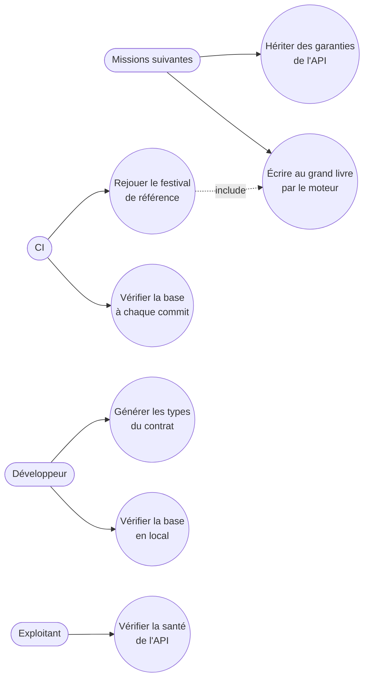

# Cas d'usage — mission fondations-grand-livre-01M4AY8M

> État : **implémentée** — 14/14 WP approuvés (2026-10-08), recalée sur le code après la review. Écarts au plan :
> `research.md` R-13.

Mission de fondation : ses acteurs sont l'équipe de développement, la CI et les missions suivantes, qui
s'appuient sur le grand livre et sur les garanties transverses de l'API. Aucun acteur terrain ni du back-office
n'a encore de route à appeler (seule une route de santé est publiée).

## Cas d'usage propres à cette mission

| Cas d'usage | Ce qui le prouve |
|---|---|
| Vérifier la base en local | 505 assertions pgTAP vertes (400 + 64 + 41 S21) sur le cluster privé (port 5433), sans admin ni Docker |
| Vérifier la base à chaque commit | Job CI `ledger-tests` (12 étapes) répété en local en 152 s ; pas encore exécuté sur GitHub |
| Écrire au grand livre par le moteur | 26 constructeurs, 19 cas normatifs, refus selon le statut de l'événement |
| Rejouer le festival de référence | 48 transactions identiques ligne à ligne ; soldes exacts après T23 et en fin de clôture ; `CLOSED`/`LOCKED` ; second rejeu sur grand livre verrouillé = 0 transaction, 0 ligne |
| Hériter des garanties de l'API | Idempotence S21, problem+json, `X-Request-Id`, `Accept-Language`, cloisonnement par prestataire |
| Générer les types du contrat | `openapi-typescript` → `packages/contracts/generated/` ; contrôle CI |
| Vérifier la santé de l'API | `GET /v1/health` (seule route publiée) |

## Lien avec la synthèse globale

Contribue à : `docs/02-use-case-diagram.md`, domaine **« Grand livre et moteur d'écritures »** (socle technique,
pas de cas d'usage terrain nouveau dans le diagramme global ; ligne ajoutée au tableau « Détail par mission »).

## Nécessaire pour cette mission ? Oui — la mission introduit des cas d'usage (pour l'équipe, la CI et les missions suivantes), même s'ils ne sont pas des cas d'usage terrain.
## Complet ? Oui — recalé sur l'implémentation (2026-10-08).
## Validé par : agent, par délégation du porteur du projet (08/10/2026)
