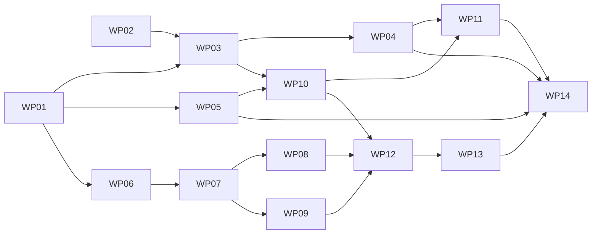

# Tasks — Fondations du grand livre et de l'API

Mission `fondations-grand-livre-01M4AY8M` · branche `feat/fondations-grand-livre` (planification et merge).
Sources : [spec.md](spec.md), [plan.md](plan.md), [research.md](research.md), [data-model.md](data-model.md),
[contracts/](contracts/), [quickstart.md](quickstart.md).

Le suivi d'avancement est **événementiel** (`spec-kitty agent tasks mark-status Txxx --status done`) : les lignes
`Txxx` ci-dessous sont des références, pas des cases à cocher.

## Subtask Index

| ID | Description | WP | Parallel |
|---|---|---|---|
| T001 | Racine npm workspaces et scripts | WP01 | |
| T002 | TypeScript strict partagé | WP01 | |
| T003 | Dépendances exactes, lockfile, `--ignore-scripts` | WP01 | |
| T004 | ESLint (dont règles « pas de flottant » dans `ledger/`) | WP01 | |
| T005 | Jest + SWC et test fumée | WP01 | |
| T006 | Copie relocalisable de PostgreSQL 17 | WP02 | [P] |
| T007 | Construction de l'extension pgTAP sans make | WP02 | |
| T008 | `pg_prove` via CPAN `local::lib` | WP02 | [P] |
| T009 | Cluster privé 5433, start/stop | WP02 | |
| T010 | README et `.env.test` d'exemple | WP02 | |
| T011 | Exécuteur de migrations | WP03 | |
| T012 | Migration 0001 (schéma de référence) | WP03 | |
| T013 | Rejeu de `roles.sql` et mot de passe local | WP03 | |
| T014 | `reset-db.sh` et `test:pgtap` | WP03 | |
| T015 | Contrôle des fichiers générés | WP03 | |
| T016 | Migration 0002 `api_idempotency` | WP04 | |
| T017 | Garde d'immuabilité et RLS forcée | WP04 | |
| T018 | Tests pgTAP S21 | WP04 | |
| T019 | Intégration à `test:pgtap` | WP04 | |
| T020 | Génération des types (`openapi-typescript`) | WP05 | [P] |
| T021 | Point d'entrée `@cashless/contracts` (`ProblemCode`) | WP05 | |
| T022 | Script `check` (types à jour) | WP05 | |
| T023 | `roundHalfAwayFromZero` | WP06 | [P] |
| T024 | `fee` (taux, fixe, min, max) | WP06 | |
| T025 | Extraction de taxe et regroupement | WP06 | |
| T026 | Partage | WP06 | |
| T027 | Répartition offerts / payés (en ligne, hors ligne) | WP06 | |
| T028 | 19 cas normatifs | WP06 | |
| T029 | Types du moteur (commande, lignes, contexte) | WP07 | |
| T030 | `TOPUP`, `TOPUP_CASH` | WP07 | |
| T031 | `PROMO_CREDIT`, `PROMO_EXPIRY`, `ACTIVATION_FEE` | WP07 | |
| T032 | `PURCHASE` (en ligne et hors ligne) | WP07 | |
| T033 | `REVERSAL` | WP07 | |
| T034 | `WALLET_REFUND`, `CHARGEBACK` | WP07 | |
| T035 | Tests des constructeurs « festival » | WP07 | |
| T036 | `PITCH_FEE`, `MERCHANT_DEBT_TRANSFER` | WP08 | [P] |
| T037 | `OPERATOR_FEE`, `PLATFORM_FEE` | WP08 | |
| T038 | `CASH_CLOSE`, `CASH_DEPOSIT`, `PSP_SETTLEMENT` | WP08 | |
| T039 | `ANOMALY_RESOLUTION`, `ADJUSTMENT`, `BREAKAGE`, `BREAKAGE_REVERSAL` | WP08 | |
| T040 | `PAYOUT_INITIATED`, `PAYOUT_CONFIRMED`, `PAYOUT_FAILED` | WP08 | |
| T041 | Registre des 26 types | WP08 | |
| T042 | Tests des constructeurs « clôture » | WP08 | |
| T043 | Matrice statut → types acceptés | WP09 | [P] |
| T044 | Tests cellule par cellule | WP09 | |
| T045 | Port `ConfigResolver` | WP09 | |
| T046 | Port de résolution des comptes | WP09 | |
| T047 | Amorçage NestJS et configuration | WP10 | |
| T048 | Pool `pg`, `int8` → `BigInt`, `withTenantTx` | WP10 | |
| T049 | Port `TenantContext` et fournisseur de test | WP10 | |
| T050 | `X-Request-Id` et journal structuré | WP10 | |
| T051 | `Accept-Language` et catalogue fr/en | WP10 | |
| T052 | Filtre problem+json et table SQLSTATE | WP10 | |
| T053 | Route de santé et outillage de test d'intégration | WP10 | |
| T054 | Dépôt S21 (réserver, compléter, relâcher) | WP11 | |
| T055 | Empreinte JCS | WP11 | [P] |
| T056 | Intercepteur et décorateur `@Idempotent()` | WP11 | |
| T057 | Module de route de test (non publié) | WP11 | |
| T058 | Tests d'intégration de l'idempotence | WP11 | |
| T059 | Tests d'isolation, durées, absence de fuite SQL | WP11 | |
| T060 | `LedgerEngineService` | WP12 | |
| T061 | Délégation aux 5 fonctions SQL | WP12 | |
| T062 | Lecture des soldes pour la répartition | WP12 | |
| T063 | Résultat nouveau / rejoué, erreurs | WP12 | |
| T064 | Tests d'intégration du moteur | WP12 | |
| T065 | Fixture du scénario (rôle propriétaire) | WP13 | |
| T066 | Table des 48 commandes (bps depuis le texte) | WP13 | |
| T067 | Comparaison ligne à ligne | WP13 | |
| T068 | Passages de statut intercalés | WP13 | |
| T069 | Soldes après T23 et fin de clôture, `CLOSED`/`LOCKED` | WP13 | |
| T070 | Second rejeu sans effet | WP13 | |
| T071 | Consignation des contradictions | WP13 | |
| T072 | Réécriture de `ledger-tests.yml` | WP14 | |
| T073 | Répétition locale des étapes du job | WP14 | |
| T074 | Documentation de la CI | WP14 | |
| T075 | Contrôle final des critères 1 à 3 | WP14 | |

---

## Phase 1 — Mise en place

### WP01 — Monorepo et outillage TypeScript · [tasks/WP01-monorepo-outillage.md](tasks/WP01-monorepo-outillage.md)

- **Goal**: racine npm workspaces, TypeScript strict, ESLint, Jest/SWC, toutes les dépendances de la mission installées avec versions exactes.
- **Priority**: P1 (bloquant). **Independent test**: `npm ci --ignore-scripts && npm run lint && npm test` passe (test fumée).
- **Subtasks**:
T001 Racine npm workspaces et scripts (WP01)
T002 TypeScript strict partagé (WP01)
T003 Dépendances exactes, lockfile, `--ignore-scripts` (WP01)
T004 ESLint (dont règles « pas de flottant » dans `ledger/`) (WP01)
T005 Jest + SWC et test fumée (WP01)
- **Dependencies**: none. **Risks**: binaire `@swc/core` sans script d'installation. **Size**: ~260 lignes.

### WP02 — Base locale : cluster PostgreSQL 17 privé avec pgTAP · [tasks/WP02-base-locale-pgtap.md](tasks/WP02-base-locale-pgtap.md)

- **Goal**: `tools/dev-db/` installe un cluster privé (5433) avec l'extension pgTAP et `pg_prove`, sans admin ni Docker.
- **Priority**: P1. **Independent test**: `setup.sh && start.sh` puis `psql -p 5433 -c "CREATE EXTENSION pgtap"` réussit et `pg_prove --version` répond.
- **Subtasks**:
T006 Copie relocalisable de PostgreSQL 17 (WP02)
T007 Construction de l'extension pgTAP sans make (WP02)
T008 `pg_prove` via CPAN `local::lib` (WP02)
T009 Cluster privé 5433, start/stop (WP02)
T010 README et `.env.test` d'exemple (WP02)
- **Dependencies**: none (parallèle à WP01). **Risks**: relocalisation des binaires Windows ; substitutions de `pgtap.sql.in`. **Size**: ~280 lignes.

## Phase 2 — Base de données

### WP03 — Migrations et suites pgTAP de référence · [tasks/WP03-migrations-pgtap.md](tasks/WP03-migrations-pgtap.md)

- **Goal**: base créée par migrations (0001 = schéma de référence) + `roles.sql` ; 400 + 64 assertions vertes en local.
- **Priority**: P1. **Independent test**: `reset-db.sh && npm run test:pgtap -w @cashless/ledger-sql` → 464 OK.
- **Subtasks**:
T011 Exécuteur de migrations (WP03)
T012 Migration 0001 (schéma de référence) (WP03)
T013 Rejeu de `roles.sql` et mot de passe local (WP03)
T014 `reset-db.sh` et `test:pgtap` (WP03)
T015 Contrôle des fichiers générés (WP03)
- **Dependencies**: WP01, WP02. **Risks**: suites qui supposent un superutilisateur ; `\i` relatif. **Size**: ~300 lignes.

### WP04 — Table d'idempotence S21 · [tasks/WP04-table-idempotence-s21.md](tasks/WP04-table-idempotence-s21.md)

- **Goal**: migration 0002 `api_idempotency` (RLS forcée, contraintes, garde) et ses tests pgTAP.
- **Priority**: P1. **Independent test**: `npm run test:pgtap` inclut `tests_api_idempotency.sql`, vert.
- **Subtasks**:
T016 Migration 0002 `api_idempotency` (WP04)
T017 Garde d'immuabilité et RLS forcée (WP04)
T018 Tests pgTAP S21 (WP04)
T019 Intégration à `test:pgtap` (WP04)
- **Dependencies**: WP03. **Size**: ~240 lignes.

### WP05 — Types générés depuis le contrat · [tasks/WP05-types-contrat.md](tasks/WP05-types-contrat.md)

- **Goal**: `packages/contracts/generated/openapi.ts` produit par `openapi-typescript`, export `ProblemCode`, contrôle « à jour ».
- **Priority**: P2. **Independent test**: `npm run generate -w @cashless/contracts && npm run check -w @cashless/contracts`.
- **Subtasks**:
T020 Génération des types (`openapi-typescript`) (WP05)
T021 Point d'entrée `@cashless/contracts` (`ProblemCode`) (WP05)
T022 Script `check` (types à jour) (WP05)
- **Dependencies**: WP01. **Size**: ~180 lignes.

## Phase 3 — Moteur d'écritures (pur)

### WP06 — Calculs monétaires et 19 cas normatifs · [tasks/WP06-calculs-19-cas.md](tasks/WP06-calculs-19-cas.md)

- **Goal**: fonctions `bigint` pures identiques à `moteur_ecritures_reference.py` ; 19 cas en tests.
- **Priority**: P1. **Independent test**: `npm test -- money` → 19 cas verts.
- **Subtasks**:
T023 `roundHalfAwayFromZero` (WP06)
T024 `fee` (taux, fixe, min, max) (WP06)
T025 Extraction de taxe et regroupement (WP06)
T026 Partage (WP06)
T027 Répartition offerts / payés (en ligne, hors ligne) (WP06)
T028 19 cas normatifs (WP06)
- **Dependencies**: WP01. **Size**: ~300 lignes.

### WP07 — Constructeurs « festival » · [tasks/WP07-constructeurs-festival.md](tasks/WP07-constructeurs-festival.md)

- **Goal**: types du moteur + constructeurs purs des types émis pendant le festival.
- **Priority**: P1. **Independent test**: chaque constructeur reproduit les lignes des transactions correspondantes du scénario.
- **Subtasks**:
T029 Types du moteur (commande, lignes, contexte) (WP07)
T030 `TOPUP`, `TOPUP_CASH` (WP07)
T031 `PROMO_CREDIT`, `PROMO_EXPIRY`, `ACTIVATION_FEE` (WP07)
T032 `PURCHASE` (en ligne et hors ligne) (WP07)
T033 `REVERSAL` (WP07)
T034 `WALLET_REFUND`, `CHARGEBACK` (WP07)
T035 Tests des constructeurs « festival » (WP07)
- **Dependencies**: WP06. **Size**: ~420 lignes.

### WP08 — Constructeurs « clôture et back-office » et registre · [tasks/WP08-constructeurs-cloture.md](tasks/WP08-constructeurs-cloture.md)

- **Goal**: constructeurs purs des types de clôture et de back-office ; registre complet des 26 types (dont les 5 délégués).
- **Priority**: P1. **Independent test**: registre = 26 types exactement (comparé à la contrainte `CHECK` du schéma) ; lignes du scénario reproduites.
- **Subtasks**:
T036 `PITCH_FEE`, `MERCHANT_DEBT_TRANSFER` (WP08)
T037 `OPERATOR_FEE`, `PLATFORM_FEE` (WP08)
T038 `CASH_CLOSE`, `CASH_DEPOSIT`, `PSP_SETTLEMENT` (WP08)
T039 `ANOMALY_RESOLUTION`, `ADJUSTMENT`, `BREAKAGE`, `BREAKAGE_REVERSAL` (WP08)
T040 `PAYOUT_INITIATED`, `PAYOUT_CONFIRMED`, `PAYOUT_FAILED` (WP08)
T041 Registre des 26 types (WP08)
T042 Tests des constructeurs « clôture » (WP08)
- **Dependencies**: WP07. **Size**: ~420 lignes.

### WP09 — Matrice des statuts et ports du moteur · [tasks/WP09-matrice-statuts-ports.md](tasks/WP09-matrice-statuts-ports.md)

- **Goal**: matrice statut d'événement / grand livre → types acceptés ([contracts/status-type-matrix.md](contracts/status-type-matrix.md)) ; ports `ConfigResolver` et résolution des comptes.
- **Priority**: P1. **Independent test**: une assertion par cellule de la matrice.
- **Subtasks**:
T043 Matrice statut → types acceptés (WP09)
T044 Tests cellule par cellule (WP09)
T045 Port `ConfigResolver` (WP09)
T046 Port de résolution des comptes (WP09)
- **Dependencies**: WP07. **Size**: ~250 lignes.

## Phase 4 — API

### WP10 — Squelette NestJS et garanties transverses · [tasks/WP10-squelette-api.md](tasks/WP10-squelette-api.md)

- **Goal**: application NestJS, accès base par `withTenantTx`, `TenantContext`, `X-Request-Id`, `Accept-Language`, problem+json, santé.
- **Priority**: P1. **Independent test**: `GET /v1/health` 200 ; tests de traduction SQLSTATE ; test d'architecture (pool non exporté).
- **Subtasks**:
T047 Amorçage NestJS et configuration (WP10)
T048 Pool `pg`, `int8` → `BigInt`, `withTenantTx` (WP10)
T049 Port `TenantContext` et fournisseur de test (WP10)
T050 `X-Request-Id` et journal structuré (WP10)
T051 `Accept-Language` et catalogue fr/en (WP10)
T052 Filtre problem+json et table SQLSTATE (WP10)
T053 Route de santé et outillage de test d'intégration (WP10)
- **Dependencies**: WP03, WP05. **Size**: ~480 lignes.

### WP11 — Idempotence applicative et preuves transverses · [tasks/WP11-idempotence-api.md](tasks/WP11-idempotence-api.md)

- **Goal**: protocole S21 complet ([contracts/idempotency.md](contracts/idempotency.md)) et tests d'intégration des garanties (isolation, durées, aucune fuite SQL).
- **Priority**: P1. **Independent test**: suite `test/integration/transverse` verte.
- **Subtasks**:
T054 Dépôt S21 (réserver, compléter, relâcher) (WP11)
T055 Empreinte JCS (WP11)
T056 Intercepteur et décorateur `@Idempotent()` (WP11)
T057 Module de route de test (non publié) (WP11)
T058 Tests d'intégration de l'idempotence (WP11)
T059 Tests d'isolation, durées, absence de fuite SQL (WP11)
- **Dependencies**: WP04, WP10. **Size**: ~450 lignes.

### WP12 — Service du moteur d'écritures · [tasks/WP12-service-moteur.md](tasks/WP12-service-moteur.md)

- **Goal**: `LedgerEngineService` : matrice, constructeur, `post_transaction`, délégation SQL, résultat nouveau / rejoué.
- **Priority**: P1. **Independent test**: tests d'intégration sur une petite fixture (vente, refus, rejeu, délégation de caution).
- **Subtasks**:
T060 `LedgerEngineService` (WP12)
T061 Délégation aux 5 fonctions SQL (WP12)
T062 Lecture des soldes pour la répartition (WP12)
T063 Résultat nouveau / rejoué, erreurs (WP12)
T064 Tests d'intégration du moteur (WP12)
- **Dependencies**: WP08, WP09, WP10. **Size**: ~380 lignes.

## Phase 5 — Preuve de bout en bout et CI

### WP13 — Rejeu du scénario de référence · [tasks/WP13-rejeu-scenario.md](tasks/WP13-rejeu-scenario.md)

- **Goal**: rejouer les 48 transactions par les constructeurs, soldes exacts, `CLOSED`/`LOCKED`, second rejeu nul.
- **Priority**: P1 (critère V1 n° 3). **Independent test**: `npm test -- scenario`.
- **Subtasks**:
T065 Fixture du scénario (rôle propriétaire) (WP13)
T066 Table des 48 commandes (bps depuis le texte) (WP13)
T067 Comparaison ligne à ligne (WP13)
T068 Passages de statut intercalés (WP13)
T069 Soldes après T23 et fin de clôture, `CLOSED`/`LOCKED` (WP13)
T070 Second rejeu sans effet (WP13)
T071 Consignation des contradictions (WP13)
- **Dependencies**: WP12. **Size**: ~450 lignes.

### WP14 — Intégration continue · [tasks/WP14-integration-continue.md](tasks/WP14-integration-continue.md)

- **Goal**: `.github/workflows/ledger-tests.yml` couvre migrations, pgTAP (3 fichiers), générateurs, moteur Python, lint, tests TS, types générés.
- **Priority**: P1. **Independent test**: répétition locale de chaque étape du job, toutes vertes.
- **Subtasks**:
T072 Réécriture de `ledger-tests.yml` (WP14)
T073 Répétition locale des étapes du job (WP14)
T074 Documentation de la CI (WP14)
T075 Contrôle final des critères 1 à 3 (WP14)
- **Dependencies**: WP04, WP05, WP11, WP13. **Size**: ~220 lignes.

## Dépendances (résumé)

Parallélisme : WP01 ∥ WP02 ; puis WP03 ∥ WP05 ∥ WP06 ; WP07 → (WP08 ∥ WP09) ∥ WP10 ; WP11 ∥ WP12.
MVP : WP01 → WP02 → WP03 (critère V1 n° 1 en local).
