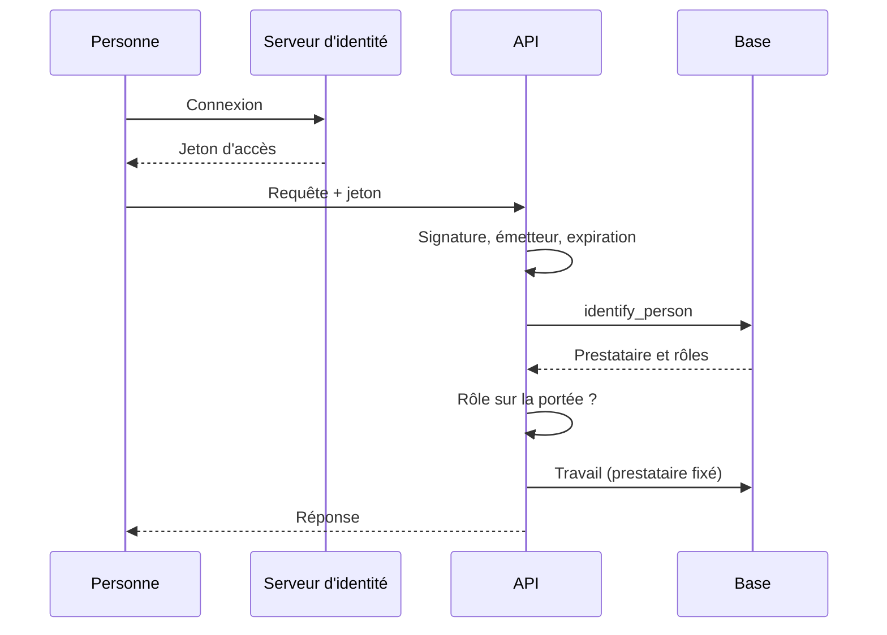
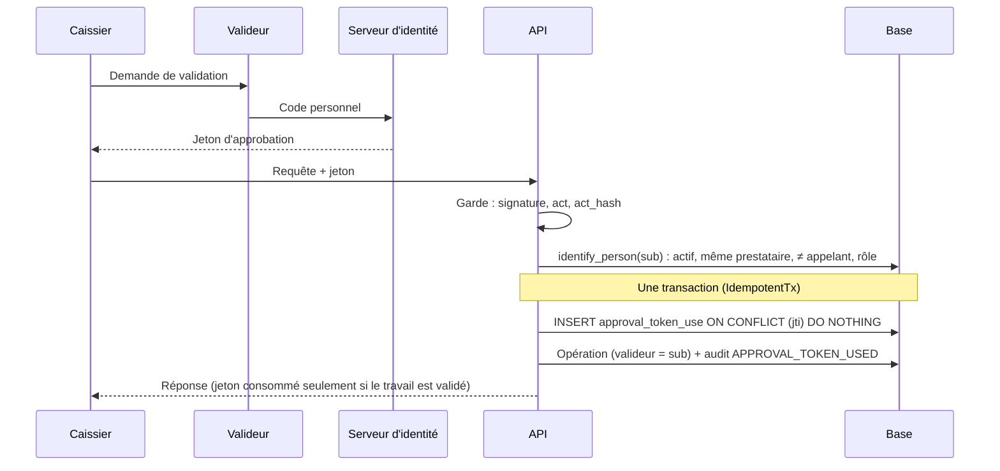

# Séquences — mission identite-roles-double-validation-01M4DNDN

> État : **review terminée** (2026-10-09), recalé sur le code livré. Source : `contracts/`, `apps/api/src/`.

## Flux internes propres à cette mission

### Requête authentifiée

### Validation sur place au guichet

La demande puis approbation au back-office suit le flux global « Double validation au back-office »
(`docs/05-sequence-diagrams.md`), précisé ici : décision, exécution et journal dans la même transaction ;
échec de l'action → `ROLLBACK TO SAVEPOINT`, `FAILED` sans écriture partielle ; demande échue → `EXPIRED` validé
(`CommittedProblem`) puis `409`.

## Flux transverses auxquels cette mission participe (référence, pas dupliqué)

Voir `docs/05-sequence-diagrams.md`, flux **« Double validation au back-office »** (implémenté par cette mission
pour le mécanisme générique ; actions métier branchées par les missions suivantes).

## Nécessaire pour cette mission ? Oui — interactions personne, serveur d'identité, API, base.
## Complet ? Oui — vérifié contre le code (garde, consommation dans la transaction, point de sauvegarde).
## Validé par : agent, par délégation du porteur du projet (09/10/2026)
