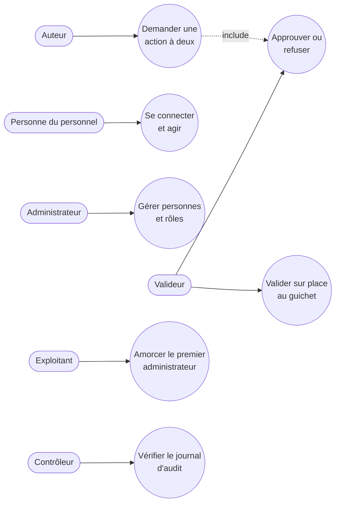

# Cas d'usage — mission identite-roles-double-validation-01M4DNDN

> État : **plan finalisé** (2026-10-08), avant implémentation. À recaler après la review.

## Cas d'usage propres à cette mission

| Cas d'usage | Ce qui le prouve |
|---|---|
| Se connecter et agir | Jeton d'accès vérifié ; prestataire et rôles tirés de la base ; refus `401` de chaque défaut ; isolation à deux prestataires |
| Gérer personnes et rôles | Routes ajoutées au contrat ; règles « qui peut donner quoi » ; chaque action dans le journal d'audit |
| Demander une action à deux | `202 Accepted`, demande `PENDING` figée (action de démonstration en test) |
| Approuver ou refuser | Rôle sur la même portée ; auteur refusé `409` ; exécution unique ; `EXECUTED` / `FAILED` / `REJECTED` |
| Valider sur place au guichet | `X-Approval-Token` : `APPROVAL_REQUIRED` / `APPROVAL_INVALID`, usage unique, lié à la requête |
| Amorcer le premier administrateur | Commande idempotente et journalisée |
| Vérifier le journal d'audit | Chaîne d'empreintes et scellements ; altérations détectées (copie externe : mission 9) |

## Lien avec la synthèse globale

Contribue à : `docs/02-use-case-diagram.md`, vue **« administration (back-office) »** (gestion des personnes et des
rôles, double validation) ; ligne ajoutée au tableau « Détail par mission ».

## Nécessaire pour cette mission ? Oui — la mission introduit des cas d'usage du personnel et de l'administration.
## Complet ? Partiel — reflète le plan ; à confronter à l'implémentation réelle à la review.
## Validé par : agent, par délégation du porteur du projet (08/10/2026)
